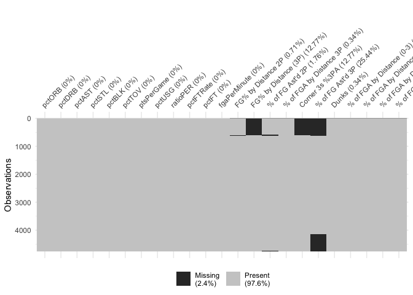

Thesis Work
================
Noah Edwards-Thro

9/21/21 - Downloaded Basketball Reference Data and set up github

603 rows of traded players, 39 double traded, 1 triple traded 603+39+1
643 +4762

5512 in the original Sloan Article. there are 5405 in ours. In data that
matters (players with more than 30 games), we have slightly 68 more
observations, likely again due to the traded feature, but working the
opposite direction now. Say a player plays 25 games with one team and 25
games with another. The Sloan article won’t pick that player up because
he didn’t play more than 30 games for either team. We will pick that
player up because it will show up as 50 games for us.

Because of the data structure (our data having one line per season even
if the player is traded vs. their data likely having multiple lines per
season if the player is traded), our density plots will be different.

Update 10/6 below

See new Geom\_density with scraped data

Used Mclust Also useful mclustBIC and mclustBICupdate mclustModel

Potentially looking into doing dimension reduction in the future?

``` r
library(tidyverse)
library(nbastatR)
library(mclust)
```

``` r
Sys.setenv("VROOM_CONNECTION_SIZE" = 131072*2)

bref_stats <- bref_players_stats(
  seasons = 2009:2018,
  tables = c("totals", "per_game", "advanced", "per_minute", "per_poss")
  )
write_csv(bref_stats, file = "bref_stats.csv")
```

``` r
bref_stats <- read_csv("bref_stats.csv")
```

``` r
Shooting_Scrape <- read_csv("Basketball Reference Scrape.csv")
```

    ## Rows: 6008 Columns: 29

    ## ── Column specification ────────────────────────────────────────────────────────
    ## Delimiter: ","
    ## chr  (4): Player, Pos, Tm, Year
    ## dbl (25): Age, G, MP, FG%, Dist., % of FGA by Distance 2P, % of FGA by Dista...

    ## 
    ## ℹ Use `spec()` to retrieve the full column specification for this data.
    ## ℹ Specify the column types or set `show_col_types = FALSE` to quiet this message.

``` r
Shooting_Scrape <- Shooting_Scrape %>%
  separate(Player, c("Player_Name", "Player_ID"), sep = "\\\\")
```

``` r
Shooting_Scrape$yearSeason <- as.double(Shooting_Scrape$Year %>%
                                          str_extract(pattern = "[^-]+$"))
```

``` r
Shooting_Scrape <- Shooting_Scrape %>%
  group_by(Player_Name, Age) %>%
  filter(G == max(G))
```

# Evaluate if we have the correct number of players)

``` r
not_traded <- bref_stats %>%
  filter(slugTeamBREF != "TOT")
traded <- bref_stats %>%
  filter(slugTeamBREF == "TOT")
traded_twice <- traded %>%
  filter(nchar(slugTeamsBREF) >9)
traded_thrice <- traded_twice %>%
  filter(nchar(slugTeamsBREF) > 15)
Count_Games <- bref_stats %>%
  filter(countGames > 30)
#Filter1<-game_data%>%filter(gp>30)
```

### Density Chart

``` r
plot1 <- ggplot(Shooting_Scrape, aes(x = G)) +
  geom_density()
plot2 <- ggplot(bref_stats, aes(x = countGames)) +
  geom_density()
plot1
```

<!-- -->

``` r
order<-c(54,55,57,58,59,60,47,61,50,53,9,73,101,106,107,100,111,108,109,96,97,98,99)
order2<-c(2,1,3,11,12)
```

``` r
master<-inner_join(
  bref_stats, 
  Shooting_Scrape, 
  by = c("yearSeason" = "yearSeason", "slugPlayerBREF" = "Player_ID")
)
nums <- unlist(lapply(master, is.numeric))
master2 <- master[nums]
master3 <- master2[order]
master4 <- master3 %>%
  na.omit()
master5 <- master3 %>%
  mutate(across(everything(), .fns = ~replace_na(., 0)))
master6 <- master[order2]
```

``` r
library(visdat)
vis_miss(master3, cluster = TRUE)
```

<!-- -->

``` r
start_time <- Sys.time()
BIC <- mclustBIC(master5)
m <- Mclust(master5)
end_time <- Sys.time()
end_time - start_time
```

    ## Time difference of 11.05287 hours

``` r
table(m$classification)
```

    ## 
    ##   1   2   3   4   5   6   7   8   9 
    ##  62 910 772 516 394 325 631 735 415

``` r
master7 <- master5
master7$group <- m$classification
master7 <- cbind(master6, master7)
Group1 <- master7%>%filter(group == 1)
Group2 <- master7%>%filter(group == 2)
Group3 <- master7%>%filter(group == 3)
Group4 <- master7%>%filter(group == 4)
Group5 <- master7%>%filter(group == 5)
Group6 <- master7%>%filter(group == 6)
Group7 <- master7%>%filter(group == 7)
Group8 <- master7%>%filter(group == 8)
Group9 <- master7%>%filter(group == 9)
```
