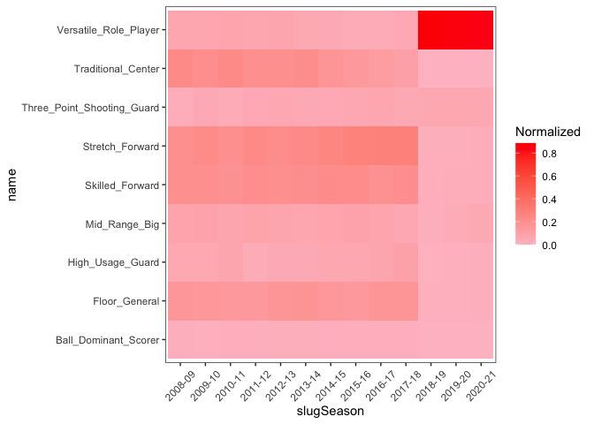

Thesis Work
================
Noah Edwards-Thro

``` r
library(tidyverse)
library(nbastatR)
library(mclust)
library(mlr)
library(rsample)
library(tidymodels)
library(kknn)
options(scipen = 99)
```

``` r
combined_standings <- read_csv("~/Documents/Sports Analytics Work/OKC Thunder Application/combined_standings.csv")
bref_stats <- read_csv("bref_stats.csv")
bref_stats_new <- read_csv("bref_stats_new.csv")

columns<-list("c","c","i","c","i","i","d","d","c","d","d","d","d","d","d","d","d","d","d","d","d","d","d","d", "d", "d", "d", "d", "d")
Shooting_Scrape <- read_csv("Basketball Reference Scrape.csv", col_types = columns)
Shooting_Scrape_New <- read_csv("~/Desktop/Fall 2021/Honors Thesis Work/Basketball Reference Scrape2.csv", col_types = columns)
Player_Profile <- read_csv("Player_Profile.csv")
```

``` r
Shooting_Scrape <- Shooting_Scrape %>%
  separate(Player, c("Player_Name", "Player_ID"), sep = "\\\\")
Shooting_Scrape$yearSeason <- as.double(Shooting_Scrape$Year %>%
                                          str_extract(pattern = "[^-]+$"))
Shooting_Scrape <- Shooting_Scrape %>%
  group_by(Player_Name, Age) %>%
  filter(G == max(G))

Shooting_Scrape_New <- Shooting_Scrape_New %>%
  separate(Player, c("Player_Name", "Player_ID"), sep = "\\\\")
Shooting_Scrape_New$yearSeason <- as.double(Shooting_Scrape_New$Year %>%
                                          str_extract(pattern = "[^-]+$"))
Shooting_Scrape_New <- Shooting_Scrape_New %>%
  group_by(Player_Name, Age) %>%
  filter(G == max(G))
Shooting_Scrape_Total <- rbind(Shooting_Scrape, Shooting_Scrape_New)
```

    ## Warning: One or more parsing issues, see `problems()` for details

### Density Chart

``` r
plot1 <- ggplot(Shooting_Scrape, aes(x = G)) +
  geom_density()
plot2 <- ggplot(bref_stats, aes(x = countGames)) +
  geom_density()
plot2
```

``` r
order<-c(115,54,55,57,58,59,60,47,61,50,53,9,73,101,106,107,100,111,108,109,96,97,98,99)
order2<-c(2,1,3,11,12,109)
```

``` r
master<-inner_join(
  bref_stats, 
  Shooting_Scrape, 
  by = c("yearSeason" = "yearSeason", "slugPlayerBREF"= "Player_ID"))
master <- left_join(master, Player_Profile, by = c("idPlayerNBA" = "idPlayer"))
master<-master%>%
  mutate(heightInches = case_when(
    namePlayer.x == "Andres Nocioni" ~ 79,
    namePlayer.x == "Anthony Randolph" ~ 82,
    namePlayer.x == "David Andersen" ~ 83,
    namePlayer.x == "Dionte Christmas" ~ 77,
    namePlayer.x == "Frank Mason III" ~ 71,
    namePlayer.x == "Gustavo Ayon" ~ 82,
    namePlayer.x == "Jeff Adrien" ~ 79,
    namePlayer.x == "Joey Dorsey" ~ 80,
    namePlayer.x == "Rudy Fernandez" ~ 78,
    namePlayer.x == "Samardo Samuels" ~ 81,
    namePlayer.x == "TJ Leaf" ~ 82,
    namePlayer.x == "Tobias Harris" ~ 80,
    namePlayer.x == "Tyler Hansbrough" ~ 81,
    namePlayer.x == "Victor Claver" ~ 81,
    namePlayer.x == "Vitor Luiz Faverani" ~ 83,
    TRUE ~ heightInches
  ))
nums <- unlist(lapply(master, is.numeric))
master_data <- master[nums]%>%
  filter(countGames >= 30)%>%
  select(order)%>%
  mutate(across(everything(), .fns = ~replace_na(., 0)))
```

    ## Note: Using an external vector in selections is ambiguous.
    ## ℹ Use `all_of(order)` instead of `order` to silence this message.
    ## ℹ See <https://tidyselect.r-lib.org/reference/faq-external-vector.html>.
    ## This message is displayed once per session.

``` r
scaled_master_data <- data.frame(scale(master_data))
scaled_master_labels <- master%>%
  filter(countGames >= 30)%>%
  select(all_of(order2))
```

``` r
summary(master_data)
summary(new_master_data)
```

``` r
new_master<-inner_join(
  bref_stats_new, 
  Shooting_Scrape_New, 
  by = c("yearSeason" = "yearSeason", "slugPlayerBREF"= "Player_ID")
)
new_master <- left_join(new_master, Player_Profile, by = c('idPlayerNBA' = "idPlayer"))
new_master<-new_master%>%
  mutate(heightInches = case_when(
    namePlayer.x == "Frank Mason III" ~ 71,
    namePlayer.x == "Landry Shamet" ~ 82,
    namePlayer.x == "Nicolas Claxton" ~ 79,
    namePlayer.x == "PJ Dozier" ~ 80,
    namePlayer.x == "TJ Leaf" ~ 82,
    namePlayer.x == "Tobias Harris" ~ 80,
    TRUE ~ heightInches
  ))
new_master_data <- new_master[nums]%>%
  filter(countGames >= 30)%>%
  select(order)%>%
  mutate(across(everything(), .fns = ~replace_na(., 0)))
scaled_new_master_data <- data.frame(scale(new_master_data))
scaled_combined_data<- rbind(scaled_master_data, scaled_new_master_data)
scaled_new_master_labels <- new_master[order2]%>%filter(countGames >= 30)
combined_master_labels <- rbind(scaled_master_labels, scaled_new_master_labels)
```

``` r
library(visdat)
vis_miss(new_master_data, cluster = TRUE)
```

``` r
set.seed(20)
start_time <- Sys.time()
scaled_m <- Mclust(scaled_master_data, G = 9)
end_time <- Sys.time()
end_time - start_time
```

    ## Time difference of 24.67887 secs

``` r
set.seed(21)
start_time <- Sys.time()
scaled_m2 <- Mclust(scaled_combined_data, G = 9)
end_time <- Sys.time()
end_time - start_time
```

    ## Time difference of 34.82518 secs

``` r
scaled_new_predictions <- predict(scaled_m, newdata = scaled_new_master_data)
original_pred <- c(scaled_m$classification, scaled_new_predictions$classification)
new_pred <- scaled_m2$classification
scaled_combined_preds <- cbind(original_pred, new_pred, combined_master_labels, scaled_combined_data)
scaled_d <- purrr::map(1:9, ~ scaled_combined_preds%>%select_if(is.numeric) %>% filter(original_pred == {{.x}}))
cbind(scaled_new_predictions$classification, scaled_new_master_data)%>%
  group_by(scaled_new_predictions$classification)%>%
  count()
```

    ## # A tibble: 7 × 2
    ## # Groups:   scaled_new_predictions$classification [7]
    ##   `scaled_new_predictions$classification`     n
    ##                                     <int> <int>
    ## 1                                       1     9
    ## 2                                       2    21
    ## 3                                       3    33
    ## 4                                       6   984
    ## 5                                       7     7
    ## 6                                       8    29
    ## 7                                       9    62

``` r
scaled_combined_preds <- scaled_combined_preds%>%
  mutate(First_Prediction = case_when(
    original_pred == 1 ~ "Floor General",
    original_pred == 2 ~ "Stretch Forward",
    original_pred == 3 ~ "Mid Range Big",
    original_pred == 4 ~ "Traditional Center",
    original_pred == 5 ~ "Ball Dominant Scorer",
    original_pred == 6 ~ "Versatile Role Player",
    original_pred == 7 ~ "High Usage Guard",
    original_pred == 8 ~ "Skilled Forward",
    original_pred == 9 ~ "Three Point Shooting Guard"))
scaled_combined_preds <- scaled_combined_preds%>%
  mutate(New_Prediction = case_when(
    new_pred == 1 ~ "Mid Range Big",
    new_pred == 2 ~ "Stretch Forward",
    new_pred == 3 ~ "Skilled Forward",
    new_pred == 4 ~ "High Usage Guard",
    new_pred == 5 ~ "Ball Dominant Scorer",
    new_pred == 6 ~ "Traditional Center",
    new_pred == 7 ~ "Versatile Role Player",
    new_pred == 8 ~ "Floor General",
    new_pred == 9 ~ "Three Point Shooting Guard"))
```

``` r
zvalues <- rbind(scaled_m$z, scaled_new_predictions$z)
zvalues <- cbind(combined_master_labels, zvalues)
zvalues <- zvalues%>%
  rename("Floor General" = `1`,
         "Stretch Forward" = `2`,
         "Mid Range Big" = `3`,
         "Traditional Center" = `4`,
         "Ball Dominant Scorer" = `5`,
         "Versatile Role Player" = `6`,
         "High Usage Guard" = `7`,
         "Skilled Forward" = `8`,
         "Three Point Shooting Guard" = `9`)


Teams<-zvalues%>%
  group_by(Tm, slugSeason)%>%
  summarize(Floor_General = sum(`Floor General`),
            Stretch_Forward = sum(`Stretch Forward`),
            Mid_Range_Big = sum(`Mid Range Big`), 
            Traditional_Center = sum(`Traditional Center`),
            Ball_Dominant_Scorer = sum(`Ball Dominant Scorer`),
            Versatile_Role_Player = sum(`Versatile Role Player`),
            High_Usage_Guard = sum(`High Usage Guard`),
            Skilled_Forward = sum(`Skilled Forward`), 
            Three_Point_Shooting_Guard = sum(`Three Point Shooting Guard`))%>%
  ungroup()
```

    ## `summarise()` has grouped output by 'Tm'. You can override using the `.groups` argument.

``` r
Teams_Total <- Teams%>%
  mutate(Totals = rowSums(Teams%>%select(3:11)))%>%
  mutate(Season = as.numeric(str_sub(slugSeason, start = 1, end = 4))+1)

Standings <- combined_standings%>%
  select(season, team_short, win_pct)
Teams_Total<-inner_join(Standings, Teams_Total, by = c("season" = "Season", "team_short" = "Tm"))
  
Teams2<-Teams%>%
  pivot_longer(cols = c(3:11))%>%
  group_by(Tm, slugSeason)%>%
  summarize(name = name, 
            value = value,
            Normalized = value/sum(value))%>%
  ungroup()
```

    ## `summarise()` has grouped output by 'Tm', 'slugSeason'. You can override using the `.groups` argument.

``` r
Teams_Total <- Teams_Total%>%
  mutate_at(.vars = c(5:13), funs(. / Totals))
```

    ## Warning: `funs()` was deprecated in dplyr 0.8.0.
    ## Please use a list of either functions or lambdas: 
    ## 
    ##   # Simple named list: 
    ##   list(mean = mean, median = median)
    ## 
    ##   # Auto named with `tibble::lst()`: 
    ##   tibble::lst(mean, median)
    ## 
    ##   # Using lambdas
    ##   list(~ mean(., trim = .2), ~ median(., na.rm = TRUE))

``` r
High_Wins <- Teams_Total%>%
  filter(win_pct >= .6)
Low_Wins <- Teams_Total%>%
  filter(win_pct <= .4)
Medium_Wins <- Teams_Total%>%
  filter(win_pct > .4 & win_pct < .6)
High_Wins <- High_Wins %>%
  pivot_longer(cols = c(5:13))%>%
  group_by(season,name)%>%
  summarize(Norm = mean(value))
```

    ## `summarise()` has grouped output by 'season'. You can override using the `.groups` argument.

``` r
Low_Wins <- Low_Wins %>%
  pivot_longer(cols = c(5:13))%>%
  group_by(season,name)%>%
  summarize(Norm = mean(value))
```

    ## `summarise()` has grouped output by 'season'. You can override using the `.groups` argument.

``` r
Medium_Wins <- Medium_Wins %>%
  pivot_longer(cols = c(5:13))%>%
  group_by(season,name)%>%
  summarize(Norm = mean(value))
```

    ## `summarise()` has grouped output by 'season'. You can override using the `.groups` argument.

``` r
Seasons <- zvalues%>%
  group_by(slugSeason)%>%
  summarize(Floor_General = sum(`Floor General`),
            Stretch_Forward = sum(`Stretch Forward`),
            Mid_Range_Big = sum(`Mid Range Big`), 
            Traditional_Center = sum(`Traditional Center`),
            Ball_Dominant_Scorer = sum(`Ball Dominant Scorer`),
            Versatile_Role_Player = sum(`Versatile Role Player`),
            High_Usage_Guard = sum(`High Usage Guard`),
            Skilled_Forward = sum(`Skilled Forward`), 
            Three_Point_Shooting_Guard = sum(`Three Point Shooting Guard`))%>%
  pivot_longer(cols = c(2:10))%>%
  group_by(slugSeason)%>%
  summarize(slugSeason = slugSeason,
            name = name,
            value = value, 
            Normalized = value/sum(value))
```

    ## `summarise()` has grouped output by 'slugSeason'. You can override using the `.groups` argument.

``` r
pred_1_median<-map_df(d, ~ .x %>% summarise(across(everything(), median)))
pred_1_mean<-map_df(d, ~ .x %>% summarise(across(everything(), mean)))
pred_2_median<-map_df(d2, ~ .x %>% summarise(across(everything(), median)))
pred_2_mean<-map_df(d2, ~ .x %>% summarise(across(everything(), mean)))
```

``` r
ggplot(Teams2%>%filter(Tm == "GSW"), aes(x = slugSeason, y = name, fill = Normalized)) +
  geom_tile()+
  scale_fill_gradient(low="pink", high="red")+
  theme_bw()+
  theme(panel.grid.major = element_blank(), panel.grid.minor = element_blank(), axis.text.x = element_text(angle = 45, vjust = .5))
```

<!-- -->

``` r
ggplot(Seasons, aes(x = slugSeason, y = name, fill = Normalized)) +
  geom_tile()+
  scale_fill_gradient(low="pink", high="red")+
  theme_bw()+
  theme(panel.grid.major = element_blank(), panel.grid.minor = element_blank(), axis.text.x = element_text(angle = 45, vjust = .5))
```

<!-- -->

``` r
p1 <- ggplot(Medium_Wins, aes(x = season, y = name, fill = Norm)) +
  geom_tile()+
  scale_fill_gradient(low="pink", high="red")+
  theme_bw()+
  theme(panel.grid.major = element_blank(), panel.grid.minor = element_blank(), axis.text.x = element_text(angle = 45, vjust = .5))
p2 <- ggplot(Low_Wins, aes(x = season, y = name, fill = Norm)) +
  geom_tile()+
  scale_fill_gradient(low="pink", high="red")+
  theme_bw()+
  theme(panel.grid.major = element_blank(), panel.grid.minor = element_blank(), axis.text.x = element_text(angle = 45, vjust = .5))
p3 <- ggplot(High_Wins, aes(x = season, y = name, fill = Norm)) +
  geom_tile()+
  scale_fill_gradient(low="pink", high="red")+
  theme_bw()+
  theme(panel.grid.major = element_blank(), panel.grid.minor = element_blank(), axis.text.x = element_text(angle = 45, vjust = .5))
```

# Data with Dimension Reduction

``` r
reduced_data <- master[nums]%>%
  filter(countGames >= 30 & minutesPerGame >=15)%>%
  select(order)%>%
  mutate(across(everything(), .fns = ~replace_na(., 0)))
reduced_data_labels <- master%>%
  filter(countGames >= 30 & minutesPerGame >=15)%>%
  select(order2)
```

    ## Note: Using an external vector in selections is ambiguous.
    ## ℹ Use `all_of(order2)` instead of `order2` to silence this message.
    ## ℹ See <https://tidyselect.r-lib.org/reference/faq-external-vector.html>.
    ## This message is displayed once per session.

``` r
reduced_data <- reduced_data%>%
  mutate(Short_Range_Perc = `% of FGA by Distance (0-3)` + `% of FGA by Distance (3-10)`,
         Mid_Range_Perc = `% of FGA by Distance (10-16)` + `% of FGA by Distance (10-16)`)%>%
 select(1,2,3,4,7,8,9,11,14,15,17,25,26)
scaled_reduced_data <- data.frame(scale(reduced_data))
```

``` r
reduced_new_data <- new_master[nums]%>%
  filter(countGames >= 30 & minutesPerGame >=15)%>%
  select(order)%>%
  mutate(across(everything(), .fns = ~replace_na(., 0)))
reduced_new_data_labels <- new_master%>%
  filter(countGames >= 30 & minutesPerGame >=15)%>%
  select(order2)
reduced_new_data <- reduced_new_data%>%
  mutate(Short_Range_Perc = `% of FGA by Distance (0-3)` + `% of FGA by Distance (3-10)`,
         Mid_Range_Perc = `% of FGA by Distance (10-16)` + `% of FGA by Distance (10-16)`)%>%
 select(1,2,3,4,7,8,9,11,14,15,17,25,26)
scaled_reduced_new_data <- data.frame(scale(reduced_new_data))
```

``` r
set.seed(21)
start_time <- Sys.time()
reduced_m <- Mclust(scaled_reduced_data, G = 6)
end_time <- Sys.time()
end_time - start_time
```

    ## Time difference of 6.878915 secs

``` r
reduced_predictions <- reduced_m$classification
reduced_new_predictions <- predict(reduced_m, newdata = reduced_new_data)
reduced_preds <- cbind(reduced_predictions, reduced_data)
reduced_preds%>%
  group_by(reduced_predictions)%>%
  summarize(count = n())
```

    ## # A tibble: 6 × 2
    ##   reduced_predictions count
    ##                 <dbl> <int>
    ## 1                   1   415
    ## 2                   2   612
    ## 3                   3   756
    ## 4                   4   965
    ## 5                   5    79
    ## 6                   6   116

``` r
reduced_new_preds <- cbind(reduced_new_predictions$classification, reduced_new_data)
reduced_new_preds%>%
  group_by(reduced_new_predictions$classification)%>%
  summarize(count = n())
```

    ## # A tibble: 1 × 2
    ##   `reduced_new_predictions$classification` count
    ##                                      <int> <int>
    ## 1                                        4   946
