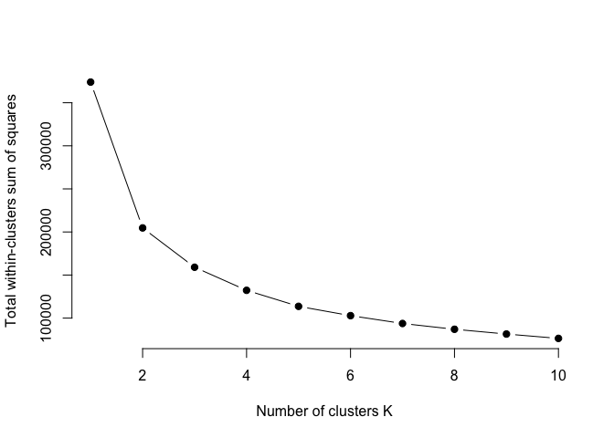
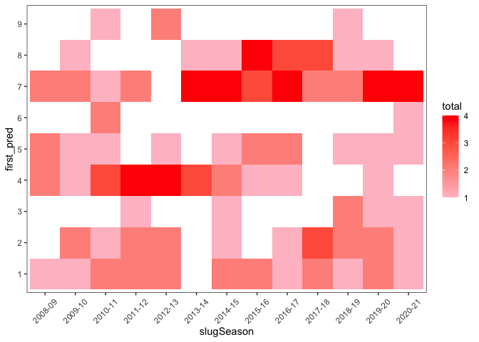

Thesis Work
================
Noah Edwards-Thro

9/21/21 - Downloaded Basketball Reference Data and set up github

603 rows of traded players, 39 double traded, 1 triple traded 603+39+1
643 +4762

5512 in the original Sloan Article. there are 5405 in ours. In data that
matters (players with more than 30 games), we have slightly 68 more
observations, likely again due to the traded feature, but working the
opposite direction now. Say a player plays 25 games with one team and 25
games with another. The Sloan article won’t pick that player up because
he didn’t play more than 30 games for either team. We will pick that
player up because it will show up as 50 games for us.

Because of the data structure (our data having one line per season even
if the player is traded vs. their data likely having multiple lines per
season if the player is traded), our density plots will be different.

Update 10/6 below

See new Geom\_density with scraped data

Used Mclust Also useful mclustBIC and mclustBICupdate mclustModel

Potentially looking into doing dimension reduction in the future?

11/9/21

Initial model and second model don’t really match. Even my initial model
doesn’t really match the output from the Sloan paper. Heat map seemed to
relatively work. I messed around a little bit with a k means model just
for the heck of it. Things to look at for next week are more heat map
stuff and also how certain we are each player is in a certain group? Is
that how our analysis can be a little bit different? Sum across teams
and that way players with multiple parts show up?

``` r
library(tidyverse)
library(nbastatR)
library(mclust)
```

``` r
Sys.setenv("VROOM_CONNECTION_SIZE" = 131072*2)

bref_stats <- bref_players_stats(
  seasons = 2009:2018,
  tables = c("totals", "per_game", "advanced", "per_minute", "per_poss")
  )

write_csv(bref_stats, file = "bref_stats.csv")

bref_stats_new <- bref_players_stats(
  seasons = 2019:2021,
  tables = c("totals", "per_game", "advanced", "per_minute", "per_poss")
  )

write_csv(bref_stats_new, file = "bref_stats_new.csv")
```

``` r
bref_stats <- read_csv("bref_stats.csv")
bref_stats_new <- read_csv("bref_stats_new.csv")
```

``` r
columns<-list("c","c","i","c","i","i","d","d","c","d","d","d","d","d","d","d","d","d","d","d","d","d","d","d", "d", "d", "d", "d", "d")
Shooting_Scrape <- read_csv("Basketball Reference Scrape.csv", col_types = columns)
Shooting_Scrape_New <- read_csv("~/Desktop/Fall 2021/Honors Thesis Work/Basketball Reference Scrape2.csv", col_types = columns)
```

``` r
Shooting_Scrape <- Shooting_Scrape %>%
  separate(Player, c("Player_Name", "Player_ID"), sep = "\\\\")
Shooting_Scrape$yearSeason <- as.double(Shooting_Scrape$Year %>%
                                          str_extract(pattern = "[^-]+$"))
Shooting_Scrape <- Shooting_Scrape %>%
  group_by(Player_Name, Age) %>%
  filter(G == max(G))

Shooting_Scrape_New <- Shooting_Scrape_New %>%
  separate(Player, c("Player_Name", "Player_ID"), sep = "\\\\")
Shooting_Scrape_New$yearSeason <- as.double(Shooting_Scrape_New$Year %>%
                                          str_extract(pattern = "[^-]+$"))
Shooting_Scrape_New <- Shooting_Scrape_New %>%
  group_by(Player_Name, Age) %>%
  filter(G == max(G))

Player_Profile <- read_csv("Player_Profile.csv")
```

    ## Rows: 1487 Columns: 3

    ## ── Column specification ────────────────────────────────────────────────────────
    ## Delimiter: ","
    ## chr (1): namePlayer
    ## dbl (2): idPlayer, heightInches

    ## 
    ## ℹ Use `spec()` to retrieve the full column specification for this data.
    ## ℹ Specify the column types or set `show_col_types = FALSE` to quiet this message.

``` r
Shooting_Scrape_Total <- rbind(Shooting_Scrape, Shooting_Scrape_New)
bref_stats_total <- rbind(bref_stats, bref_stats_new)
player_IDS <- bref_stats_total%>%select(idPlayerNBA)%>%unique()
player_IDS <- player_IDS[1281:1509,]

for (i in 1:length(player_IDS$idPlayerNBA)){
  player = player_profiles(player_ids = player_IDS$idPlayerNBA[i])
  player = player%>%select(idPlayer, namePlayer, heightInches)
  Player_Profile <- rbind(Player_Profile, player)
  print(i)
}
Player_Profile <- Player_Profile%>%unique()
write_csv(Player_Profile, "Player_Profile.csv")
```

# Evaluate if we have the correct number of players)

``` r
not_traded <- bref_stats %>%
  filter(slugTeamBREF != "TOT")
traded <- bref_stats %>%
  filter(slugTeamBREF == "TOT")
traded_twice <- traded %>%
  filter(nchar(slugTeamsBREF) >9)
traded_thrice <- traded_twice %>%
  filter(nchar(slugTeamsBREF) > 15)
Count_Games <- bref_stats %>%
  filter(countGames > 30)
```

### Density Chart

``` r
plot1 <- ggplot(Shooting_Scrape, aes(x = G)) +
  geom_density()
plot2 <- ggplot(bref_stats, aes(x = countGames)) +
  geom_density()
plot1
```

``` r
order<-c(115,54,55,57,58,59,60,47,61,50,53,9,73,101,106,107,100,111,108,109,96,97,98,99)
order2<-c(2,1,3,11,12,109)
```

``` r
master<-inner_join(
  bref_stats, 
  Shooting_Scrape, 
  by = c("yearSeason" = "yearSeason", "slugPlayerBREF"= "Player_ID"))
master <- left_join(master, Player_Profile, by = c("idPlayerNBA" = "idPlayer"))
master<-master%>%
  mutate(heightInches = case_when(
    namePlayer.x == "Andres Nocioni" ~ 79,
    namePlayer.x == "Anthony Randolph" ~ 82,
    namePlayer.x == "David Andersen" ~ 83,
    namePlayer.x == "Dionte Christmas" ~ 77,
    namePlayer.x == "Frank Mason III" ~ 71,
    namePlayer.x == "Gustavo Ayon" ~ 82,
    namePlayer.x == "Jeff Adrien" ~ 79,
    namePlayer.x == "Joey Dorsey" ~ 80,
    namePlayer.x == "Rudy Fernandez" ~ 78,
    namePlayer.x == "Samardo Samuels" ~ 81,
    namePlayer.x == "TJ Leaf" ~ 82,
    namePlayer.x == "Tobias Harris" ~ 80,
    namePlayer.x == "Tyler Hansbrough" ~ 81,
    namePlayer.x == "Victor Claver" ~ 81,
    namePlayer.x == "Vitor Luiz Faverani" ~ 83,
    TRUE ~ heightInches
  ))
nums <- unlist(lapply(master, is.numeric))
master2 <- master[nums]
master2 <- master2%>%
  filter(countGames >= 30)
master3 <- master2[order]
master5 <- master3 %>%
  mutate(across(everything(), .fns = ~replace_na(., 0)))
master6 <- master%>%
  filter(countGames >= 30)%>%
  select(all_of(order2))
```

``` r
new_master<-inner_join(
  bref_stats_new, 
  Shooting_Scrape_New, 
  by = c("yearSeason" = "yearSeason", "slugPlayerBREF"= "Player_ID")
)
new_master <- left_join(new_master, Player_Profile, by = c('idPlayerNBA' = "idPlayer"))
new_master<-new_master%>%
  mutate(heightInches = case_when(
    namePlayer.x == "Frank Mason III" ~ 71,
    namePlayer.x == "Landry Shamet" ~ 82,
    namePlayer.x == "Nicolas Claxton" ~ 79,
    namePlayer.x == "PJ Dozier" ~ 80,
    namePlayer.x == "TJ Leaf" ~ 82,
    namePlayer.x == "Tobias Harris" ~ 80,
    TRUE ~ heightInches
  ))
new_master2 <- new_master%>%
  filter(countGames >= 30)
new_master3 <- new_master2[nums]
new_master4 <- new_master3[order]
new_master5 <- new_master4 %>%
  mutate(across(everything(), .fns = ~replace_na(., 0)))
```

    ## Warning: One or more parsing issues, see `problems()` for details

``` r
new_master5 <- rbind(master5, new_master5)
new_master6 <- new_master2[order2]
new_master6 <- rbind(master6, new_master6)
```

``` r
library(visdat)
vis_miss(new_master5, cluster = TRUE)
```

``` r
set.seed(21)
start_time <- Sys.time()
m <- Mclust(master5, G = 9)
end_time <- Sys.time()
end_time - start_time
```

    ## Time difference of 5.303455 mins

``` r
master7 <- master5
master7$first_pred <- m$classification
master7 <- cbind(master6, master7)
d <- purrr::map(1:9, ~ master7%>%select_if(is.numeric) %>% filter(first_pred == {{.x}}))
```

``` r
set.seed(23)
start_time <- Sys.time()
m2 <- Mclust(new_master5, G = 9)
end_time <- Sys.time()
end_time - start_time
```

    ## Time difference of 9.385853 mins

``` r
new_predictions <- predict(m, newdata = new_master5[3711:4855,])
new_master7 <- new_master5
first_pred <- c(m$classification, new_predictions$classification)
new_master7$first_pred <- first_pred
new_master7$second_pred <- m2$classification
new_master7 <- cbind(new_master6, new_master7)
d2 <- purrr::map(1:9, ~ new_master7%>%select_if(is.numeric) %>% filter(second_pred == {{.x}}))
prop.table(table(new_master7$first_pred))
```

    ## 
    ##          1          2          3          4          5          6          7 
    ## 0.15818744 0.17981462 0.08074150 0.11719876 0.08321318 0.03316169 0.22100927 
    ##          8          9 
    ## 0.09577755 0.03089598

``` r
new_master7 <- new_master7%>%
  mutate(First_Prediction = case_when(
    first_pred == 1 ~ "Floor General",
    first_pred == 2 ~ "Stretch Forward",
    first_pred == 3 ~ "Mid Range Big",
    first_pred == 4 ~ "Traditional Center",
    first_pred == 5 ~ "Ball Dominant Scorer",
    first_pred == 6 ~ "Versatile Role Player",
    first_pred == 7 ~ "High Usage Guard",
    first_pred == 8 ~ "Skilled Forward",
    first_pred == 9 ~ "Three Point Shooting Guard"))
new_master7 <- new_master7%>%
  mutate(Second_Prediction = case_when(
    second_pred == 1 ~ "Mid Range Big",
    second_pred == 2 ~ "Stretch Forward",
    second_pred == 3 ~ "Skilled Forward",
    second_pred == 4 ~ "High Usage Guard",
    second_pred == 5 ~ "Ball Dominant Scorer",
    second_pred == 6 ~ "Traditional Center",
    second_pred == 7 ~ "Versatile Role Player",
    second_pred == 8 ~ "Floor General",
    second_pred == 9 ~ "Three Point Shooting Guard"))
new_master7 <- new_master7%>%
  mutate(Match = (First_Prediction == Second_Prediction))
mean(new_master7$Match)
```

    ## [1] 0.5474768

``` r
new_master7%>%
  group_by(First_Prediction)%>%
  summarize(n = n())
```

    ## # A tibble: 9 × 2
    ##   First_Prediction               n
    ##   <chr>                      <int>
    ## 1 Ball Dominant Scorer         404
    ## 2 Floor General                768
    ## 3 High Usage Guard            1073
    ## 4 Mid Range Big                392
    ## 5 Skilled Forward              465
    ## 6 Stretch Forward              873
    ## 7 Three Point Shooting Guard   150
    ## 8 Traditional Center           569
    ## 9 Versatile Role Player        161

``` r
new_master7%>%
  group_by(Second_Prediction)%>%
  summarize(n = n())
```

    ## # A tibble: 9 × 2
    ##   Second_Prediction              n
    ##   <chr>                      <int>
    ## 1 Ball Dominant Scorer         103
    ## 2 Floor General               1110
    ## 3 High Usage Guard             613
    ## 4 Mid Range Big                346
    ## 5 Skilled Forward              323
    ## 6 Stretch Forward             1325
    ## 7 Three Point Shooting Guard   223
    ## 8 Traditional Center           762
    ## 9 Versatile Role Player         50

``` r
new_master7%>%
  filter(First_Prediction == "Ball Dominant Scorer" &
        Second_Prediction != "Ball Dominant Scorer")
```

    ##                namePlayer.x slugSeason groupPosition countGames
    ## 1         LaMarcus Aldridge    2008-09             F         81
    ## 2             Joe Alexander    2008-09             F         59
    ## 3           Carmelo Anthony    2008-09             F         66
    ## 4           Michael Beasley    2008-09             F         81
    ## 5            Andray Blatche    2008-09             C         71
    ## 6                Chris Bosh    2008-09             C         77
    ## 7             Ronnie Brewer    2008-09             F         81
    ## 8              Caron Butler    2008-09             G         67
    ## 9              Vince Carter    2008-09             G         80
    ## 10          Marquis Daniels    2008-09             F         54
    ## 11               Glen Davis    2008-09             C         76
    ## 12                Luol Deng    2008-09             F         49
    ## 13             Kevin Durant    2008-09             F         74
    ## 14            Kevin Garnett    2008-09             F         57
    ## 15                 Rudy Gay    2008-09             F         79
    ## 16              Joey Graham    2008-09             F         78
    ## 17            Danny Granger    2008-09             F         67
    ## 18         Richard Hamilton    2008-09             G         67
    ## 19              Josh Howard    2008-09             F         52
    ## 20           Andre Iguodala    2008-09             F         82
    ## 21           Antawn Jamison    2008-09             F         81
    ## 22        Richard Jefferson    2008-09             F         82
    ## 23         Andrei Kirilenko    2008-09             F         67
    ## 24             Shawn Marion    2008-09             F         69
    ## 25            Kenyon Martin    2008-09             F         66
    ## 26             Kevin Martin    2008-09             G         51
    ## 27            Dirk Nowitzki    2008-09             F         81
    ## 28              Mehmet Okur    2008-09             C         72
    ## 29              Paul Pierce    2008-09             F         81
    ## 30            Zach Randolph    2008-09             F         50
    ## 31              Brandon Roy    2008-09             G         78
    ## 32               Josh Smith    2008-09             F         69
    ## 33        Amar'e Stoudemire    2008-09             F         53
    ## 34             Tyrus Thomas    2008-09             F         79
    ## 35              Al Thornton    2008-09             F         71
    ## 36       Charlie Villanueva    2008-09             F         78
    ## 37        Russell Westbrook    2008-09             G         82
    ## 38        LaMarcus Aldridge    2009-10             F         78
    ## 39          Carmelo Anthony    2009-10             F         69
    ## 40           Gilbert Arenas    2009-10             G         32
    ## 41          Michael Beasley    2009-10             F         78
    ## 42           Andray Blatche    2009-10             F         81
    ## 43            Ronnie Brewer    2009-10             G         58
    ## 44              Kobe Bryant    2009-10             G         73
    ## 45             Caron Butler    2009-10             F         74
    ## 46          Wilson Chandler    2009-10             G         65
    ## 47                Luol Deng    2009-10             F         70
    ## 48                 Rudy Gay    2009-10             F         80
    ## 49              Drew Gooden    2009-10             C         70
    ## 50              Joey Graham    2009-10             F         63
    ## 51         Richard Hamilton    2009-10             G         46
    ## 52              Josh Howard    2009-10             F         35
    ## 53           Andre Iguodala    2009-10             F         82
    ## 54              Yi Jianlian    2009-10             F         52
    ## 55              Joe Johnson    2009-10             G         76
    ## 56         Andrei Kirilenko    2009-10             F         58
    ## 57              Carl Landry    2009-10             F         80
    ## 58               Kevin Love    2009-10             F         60
    ## 59            Kenyon Martin    2009-10             F         58
    ## 60            Dirk Nowitzki    2009-10             F         81
    ## 61               Lamar Odom    2009-10             F         82
    ## 62              Paul Pierce    2009-10             F         71
    ## 63          Tayshaun Prince    2009-10             F         49
    ## 64         Anthony Randolph    2009-10             C         33
    ## 65            Zach Randolph    2009-10             F         81
    ## 66              Brandon Roy    2009-10             G         65
    ## 67               Luis Scola    2009-10             F         82
    ## 68          James Singleton    2009-10             F         57
    ## 69          Darius Songaila    2009-10             C         75
    ## 70              Al Thornton    2009-10             F         75
    ## 71              Sonny Weems    2009-10             G         69
    ## 72               David West    2009-10             F         81
    ## 73           Damien Wilkins    2009-10             F         80
    ## 74                Sam Young    2009-10             F         80
    ## 75        LaMarcus Aldridge    2010-11             F         81
    ## 76          Carmelo Anthony    2010-11             F         77
    ## 77          Michael Beasley    2010-11             F         73
    ## 78               Chris Bosh    2010-11             F         77
    ## 79            Ronnie Brewer    2010-11             G         81
    ## 80         DeMarcus Cousins    2010-11             C         81
    ## 81            DeMar DeRozan    2010-11             G         82
    ## 82             Kevin Durant    2010-11             F         78
    ## 83                 Rudy Gay    2010-11             F         54
    ## 84              Drew Gooden    2010-11             F         35
    ## 85         Richard Hamilton    2010-11             G         55
    ## 86         Gerald Henderson    2010-11             G         68
    ## 87               Al Horford    2010-11             C         77
    ## 88           Andre Iguodala    2010-11             F         67
    ## 89              Joe Johnson    2010-11             G         72
    ## 90         Andrei Kirilenko    2010-11             F         64
    ## 91                David Lee    2010-11             F         73
    ## 92             Kevin Martin    2010-11             G         80
    ## 93              Troy Murphy    2010-11             F         35
    ## 94              Paul Pierce    2010-11             F         80
    ## 95            Zach Randolph    2010-11             F         75
    ## 96               Josh Smith    2010-11             F         77
    ## 97        Amar'e Stoudemire    2010-11             C         78
    ## 98              Al Thornton    2010-11             F         71
    ## 99           Gerald Wallace    2010-11             F         71
    ## 100              David West    2010-11             F         70
    ## 101          Thaddeus Young    2010-11             F         82
    ## 102       LaMarcus Aldridge    2011-12             F         55
    ## 103         Carmelo Anthony    2011-12             F         55
    ## 104              Chris Bosh    2011-12             F         57
    ## 105           Derrick Brown    2011-12             F         65
    ## 106             Kobe Bryant    2011-12             G         58
    ## 107        DeMarcus Cousins    2011-12             C         64
    ## 108           DeMar DeRozan    2011-12             G         63
    ## 109           Kevin Garnett    2011-12             C         60
    ## 110                Rudy Gay    2011-12             F         65
    ## 111        Gerald Henderson    2011-12             G         55
    ## 112             Josh Howard    2011-12             F         43
    ## 113            Al Jefferson    2011-12             C         61
    ## 114            Amir Johnson    2011-12             F         64
    ## 115               Jon Leuer    2011-12             F         46
    ## 116              Kevin Love    2011-12             F         55
    ## 117            Paul Millsap    2011-12             F         64
    ## 118           Dirk Nowitzki    2011-12             F         62
    ## 119             Paul Pierce    2011-12             F         61
    ## 120              Josh Smith    2011-12             F         66
    ## 121       Amar'e Stoudemire    2011-12             F         47
    ## 122              David West    2011-12             F         66
    ## 123          Thaddeus Young    2011-12             F         63
    ## 124       LaMarcus Aldridge    2012-13             F         74
    ## 125         Carmelo Anthony    2012-13             F         67
    ## 126          Darrell Arthur    2012-13             F         59
    ## 127         Andrea Bargnani    2012-13             F         35
    ## 128          Andray Blatche    2012-13             C         82
    ## 129              Chris Bosh    2012-13             C         74
    ## 130             Kobe Bryant    2012-13             G         78
    ## 131        DeMarcus Cousins    2012-13             C         75
    ## 132           DeMar DeRozan    2012-13             G         82
    ## 133                Rudy Gay    2012-13             F         75
    ## 134        Richard Hamilton    2012-13             G         50
    ## 135           Tobias Harris    2012-13             F         55
    ## 136              Al Horford    2012-13             C         74
    ## 137            Al Jefferson    2012-13             C         78
    ## 138  Michael Kidd-Gilchrist    2012-13             F         78
    ## 139        Andrei Kirilenko    2012-13             F         64
    ## 140            Paul Millsap    2012-13             F         78
    ## 141           Dirk Nowitzki    2012-13             F         53
    ## 142             Paul Pierce    2012-13             F         77
    ## 143           Zach Randolph    2012-13             F         76
    ## 144              Luis Scola    2012-13             F         82
    ## 145              Josh Smith    2012-13             F         76
    ## 146              David West    2012-13             F         73
    ## 147       LaMarcus Aldridge    2013-14             F         69
    ## 148   Giannis Antetokounmpo    2013-14             F         77
    ## 149         Carmelo Anthony    2013-14             F         77
    ## 150          Andray Blatche    2013-14             F         73
    ## 151              Chris Bosh    2013-14             C         79
    ## 152           Anthony Davis    2013-14             F         67
    ## 153              Glen Davis    2013-14             F         68
    ## 154               Luol Deng    2013-14             F         63
    ## 155           DeMar DeRozan    2013-14             G         79
    ## 156              Marc Gasol    2013-14             C         59
    ## 157                Rudy Gay    2013-14             F         73
    ## 158           Blake Griffin    2013-14             F         80
    ## 159           Tobias Harris    2013-14             F         61
    ## 160            Al Jefferson    2013-14             C         73
    ## 161            Amir Johnson    2013-14             F         77
    ## 162          Terrence Jones    2013-14             F         76
    ## 163              Kevin Love    2013-14             F         77
    ## 164            Paul Millsap    2013-14             F         74
    ## 165         Markieff Morris    2013-14             F         81
    ## 166           Dirk Nowitzki    2013-14             F         80
    ## 167             Paul Pierce    2013-14             F         75
    ## 168         Otto Porter Jr.    2013-14             F         37
    ## 169           Zach Randolph    2013-14             F         79
    ## 170              Luis Scola    2013-14             F         82
    ## 171             Dwyane Wade    2013-14             G         54
    ## 172              David West    2013-14             F         80
    ## 173        Derrick Williams    2013-14             F         78
    ## 174       LaMarcus Aldridge    2014-15             F         71
    ## 175   Giannis Antetokounmpo    2014-15             G         81
    ## 176         Carmelo Anthony    2014-15             F         40
    ## 177              Chris Bosh    2014-15             C         44
    ## 178             Kobe Bryant    2014-15             G         35
    ## 179            Jimmy Butler    2014-15             G         65
    ## 180        DeMarcus Cousins    2014-15             C         59
    ## 181           Anthony Davis    2014-15             F         68
    ## 182           DeMar DeRozan    2014-15             G         60
    ## 183              Marc Gasol    2014-15             C         81
    ## 184                Rudy Gay    2014-15             F         68
    ## 185           Blake Griffin    2014-15             F         67
    ## 186              Al Horford    2014-15             C         76
    ## 187            Al Jefferson    2014-15             C         65
    ## 188           Kawhi Leonard    2014-15             F         64
    ## 189               Jon Leuer    2014-15             F         63
    ## 190             Brook Lopez    2014-15             C         72
    ## 191            Paul Millsap    2014-15             F         73
    ## 192         Markieff Morris    2014-15             F         82
    ## 193           Zach Randolph    2014-15             F         71
    ## 194              Luis Scola    2014-15             F         81
    ## 195              Henry Sims    2014-15             C         73
    ## 196          Nikola Vucevic    2014-15             C         74
    ## 197             Dwyane Wade    2014-15             G         62
    ## 198             Travis Wear    2014-15             F         51
    ## 199          Andrew Wiggins    2014-15             F         82
    ## 200   Giannis Antetokounmpo    2015-16             G         80
    ## 201         Carmelo Anthony    2015-16             F         72
    ## 202              Chris Bosh    2015-16             F         53
    ## 203        DeMarcus Cousins    2015-16             C         65
    ## 204           Anthony Davis    2015-16             C         61
    ## 205           DeMar DeRozan    2015-16             G         78
    ## 206        Danilo Gallinari    2015-16             F         53
    ## 207                Rudy Gay    2015-16             F         70
    ## 208           Blake Griffin    2015-16             F         35
    ## 209           Kawhi Leonard    2015-16             F         72
    ## 210               Jon Leuer    2015-16             F         67
    ## 211             Brook Lopez    2015-16             C         73
    ## 212            Paul Millsap    2015-16             F         81
    ## 213         Markieff Morris    2015-16             F         64
    ## 214           Dirk Nowitzki    2015-16             F         75
    ## 215            Kyle O'Quinn    2015-16             F         65
    ## 216           Jabari Parker    2015-16             F         76
    ## 217            Bobby Portis    2015-16             F         62
    ## 218      Kristaps Porzingis    2015-16             F         72
    ## 219           Julius Randle    2015-16             F         81
    ## 220           Zach Randolph    2015-16             F         68
    ## 221         Jared Sullinger    2015-16             F         81
    ## 222      Karl-Anthony Towns    2015-16             C         82
    ## 223          Nikola Vucevic    2015-16             C         65
    ## 224             Dwyane Wade    2015-16             G         74
    ## 225             T.J. Warren    2015-16             F         47
    ## 226          Andrew Wiggins    2015-16             F         81
    ## 227          Thaddeus Young    2015-16             F         73
    ## 228       LaMarcus Aldridge    2016-17             F         72
    ## 229   Giannis Antetokounmpo    2016-17             F         80
    ## 230           Trevor Booker    2016-17             F         71
    ## 231            Jimmy Butler    2016-17             F         76
    ## 232        DeMarcus Cousins    2016-17             C         72
    ## 233           Anthony Davis    2016-17             C         75
    ## 234           DeMar DeRozan    2016-17             G         74
    ## 235             Joel Embiid    2016-17             C         31
    ## 236              Marc Gasol    2016-17             C         74
    ## 237                Rudy Gay    2016-17             F         30
    ## 238              Taj Gibson    2016-17             F         78
    ## 239            Aaron Gordon    2016-17             F         80
    ## 240           Blake Griffin    2016-17             F         61
    ## 241 Rondae Hollis-Jefferson    2016-17             F         78
    ## 242              Al Horford    2016-17             C         68
    ## 243            Paul Millsap    2016-17             F         69
    ## 244         Markieff Morris    2016-17             F         76
    ## 245           Dirk Nowitzki    2016-17             F         54
    ## 246           Jabari Parker    2016-17             F         51
    ## 247      Kristaps Porzingis    2016-17             F         66
    ## 248           Zach Randolph    2016-17             F         73
    ## 249            Myles Turner    2016-17             C         81
    ## 250             Noah Vonleh    2016-17             F         74
    ## 251          Nikola Vucevic    2016-17             C         75
    ## 252             Dwyane Wade    2016-17             G         60
    ## 253             T.J. Warren    2016-17             F         66
    ## 254   Giannis Antetokounmpo    2017-18             F         75
    ## 255         Michael Beasley    2017-18             F         74
    ## 256        DeMarcus Cousins    2017-18             C         48
    ## 257           Anthony Davis    2017-18             F         75
    ## 258           DeMar DeRozan    2017-18             G         80
    ## 259            Gorgui Dieng    2017-18             C         79
    ## 260             Joel Embiid    2017-18             C         63
    ## 261              Marc Gasol    2017-18             C         73
    ## 262                Rudy Gay    2017-18             F         57
    ## 263            Aaron Gordon    2017-18             F         58
    ## 264            Nikola Jokic    2017-18             C         75
    ## 265           Dirk Nowitzki    2017-18             C         77
    ## 266     Johnny O'Bryant III    2017-18             F         36
    ## 267      Kristaps Porzingis    2017-18             F         48
    ## 268      Karl-Anthony Towns    2017-18             C         82
    ## 269            Myles Turner    2017-18             C         65
    ## 270          Nikola Vucevic    2017-18             C         57
    ## 271             Dwyane Wade    2017-18             G         67
    ## 272             T.J. Warren    2017-18             F         65
    ## 273              David West    2017-18             C         73
    ## 274             Bam Adebayo    2018-19             C         82
    ## 275   Giannis Antetokounmpo    2018-19             F         72
    ## 276       Marvin Bagley III    2018-19             F         62
    ## 277            Jimmy Butler    2018-19             F         65
    ## 278           Anthony Davis    2018-19             C         56
    ## 279           DeMar DeRozan    2018-19             G         77
    ## 280          Andre Drummond    2018-19             C         79
    ## 281             Joel Embiid    2018-19             C         64
    ## 282        Danilo Gallinari    2018-19             F         68
    ## 283              Marc Gasol    2018-19             C         79
    ## 284            Aaron Gordon    2018-19             F         78
    ## 285            Nikola Jokic    2018-19             C         80
    ## 286             Zach LaVine    2018-19             G         63
    ## 287            Kyle O'Quinn    2018-19             C         45
    ## 288          Victor Oladipo    2018-19             G         36
    ## 289            Bobby Portis    2018-19             F         50
    ## 290        D'Angelo Russell    2018-19             G         81
    ## 291      Karl-Anthony Towns    2018-19             C         77
    ## 292            Myles Turner    2018-19             C         74
    ## 293          Nikola Vucevic    2018-19             C         80
    ## 294             Dwyane Wade    2018-19             G         72
    ## 295             Bam Adebayo    2019-20             F         72
    ## 296       LaMarcus Aldridge    2019-20             C         53
    ## 297         Carmelo Anthony    2019-20             F         58
    ## 298           Deandre Ayton    2019-20             C         38
    ## 299            Bradley Beal    2019-20             G         57
    ## 300           Dillon Brooks    2019-20             G         73
    ## 301            John Collins    2019-20             F         41
    ## 302          Andre Drummond    2019-20             C         57
    ## 303            Aaron Gordon    2019-20             F         62
    ## 304           Rui Hachimura    2019-20             F         48
    ## 305          Brandon Ingram    2019-20             F         62
    ## 306          Jonathan Isaac    2019-20             F         34
    ## 307            Nikola Jokic    2019-20             C         73
    ## 308             Zach LaVine    2019-20             G         60
    ## 309            JaVale McGee    2019-20             C         68
    ## 310      Kristaps Porzingis    2019-20             C         57
    ## 311        D'Angelo Russell    2019-20             G         45
    ## 312             Ben Simmons    2019-20             G         57
    ## 313      Karl-Anthony Towns    2019-20             C         35
    ## 314          Nikola Vucevic    2019-20             C         62
    ## 315       Russell Westbrook    2019-20             G         57
    ## 316           Kyle Anderson    2020-21             F         69
    ## 317  Thanasis Antetokounmpo    2020-21             F         57
    ## 318             LaMelo Ball    2020-21             G         51
    ## 319           Dillon Brooks    2020-21             F         67
    ## 320      Wendell Carter Jr.    2020-21             C         54
    ## 321        DeMarcus Cousins    2020-21             C         41
    ## 322           Anthony Davis    2020-21             F         36
    ## 323             Paul George    2020-21             F         54
    ## 324            Aaron Gordon    2020-21             F         50
    ## 325           Rui Hachimura    2020-21             F         57
    ## 326          Gordon Hayward    2020-21             F         44
    ## 327          Brandon Ingram    2020-21             F         61
    ## 328            Nikola Jokic    2020-21             C         72
    ## 329           Kawhi Leonard    2020-21             F         52
    ## 330            Caris LeVert    2020-21             G         47
    ## 331         Dejounte Murray    2020-21             G         67
    ## 332            Jusuf Nurkic    2020-21             C         37
    ## 333          Victor Oladipo    2020-21             G         33
    ## 334            Bobby Portis    2020-21             C         66
    ## 335        D'Angelo Russell    2020-21             G         42
    ## 336           Pascal Siakam    2020-21             F         56
    ## 337             Ben Simmons    2020-21             G         58
    ## 338      Karl-Anthony Towns    2020-21             C         50
    ## 339       Jonas Valanciunas    2020-21             C         62
    ## 340          Nikola Vucevic    2020-21             C         70
    ## 341          Thaddeus Young    2020-21             F         68
    ##     countGamesStarted  Tm heightInches pctORB pctDRB pctAST pctSTL pctBLK
    ## 1                  81 POR           83  0.095  0.156  0.093  0.014  0.020
    ## 2                   0 MIL           80  0.069  0.123  0.095  0.011  0.034
    ## 3                  66 DEN           79  0.056  0.170  0.181  0.017  0.800
    ## 4                  19 MIA           81  0.065  0.198  0.077  0.011  0.015
    ## 5                  36 WAS           83  0.085  0.179  0.118  0.016  0.035
    ## 6                  77 TOR           83  0.087  0.221  0.116  0.012  0.020
    ## 7                  80 UTA           79  0.046  0.091  0.109  0.027  0.900
    ## 8                  67 WAS           79  0.052  0.138  0.197  0.022  0.600
    ## 9                  80 NJN           78  0.030  0.138  0.237  0.015  0.011
    ## 10                 43 IND           78  0.051  0.110  0.107  0.018  0.011
    ## 11                 16 BOS           81  0.094  0.128  0.065  0.017  0.900
    ## 12                 46 CHI           81  0.055  0.147  0.090  0.019  0.011
    ## 13                 74 OKC           82  0.030  0.164  0.135  0.017  0.014
    ## 14                 57 BOS           83  0.056  0.267  0.147  0.019  0.031
    ## 15                 78 MEM           80  0.045  0.139  0.087  0.018  0.016
    ## 16                 10 TOR           79  0.073  0.149  0.050  0.012  0.600
    ## 17                 66 IND           81  0.022  0.134  0.131  0.014  0.030
    ## 18                 51 DET           79  0.023  0.086  0.239  0.010  0.100
    ## 19                 51 DAL           79  0.041  0.140  0.086  0.017  0.013
    ## 20                 82 PHI           78  0.033  0.140  0.224  0.021  0.900
    ## 21                 81 WAS           81  0.072  0.205  0.091  0.016  0.700
    ## 22                 82 MIL           79  0.022  0.133  0.117  0.012  0.400
    ## 23                 10 UTA           81  0.055  0.153  0.147  0.023  0.033
    ## 24                 68 TOT           79  0.086  0.197  0.093  0.019  0.021
    ## 25                 66 DEN           81  0.046  0.168  0.100  0.023  0.027
    ## 26                 46 SAC           79  0.017  0.093  0.123  0.016  0.300
    ## 27                 81 DAL           84  0.033  0.221  0.121  0.010  0.015
    ## 28                 72 UTA           83  0.061  0.215  0.081  0.012  0.017
    ## 29                 81 BOS           79  0.024  0.154  0.163  0.014  0.700
    ## 30                 45 TOT           81  0.099  0.232  0.115  0.013  0.700
    ## 31                 78 POR           78  0.044  0.116  0.254  0.017  0.600
    ## 32                 69 ATL           81  0.065  0.176  0.121  0.021  0.035
    ## 33                 53 PHO           82  0.072  0.181  0.083  0.013  0.021
    ## 34                 61 CHI           82  0.078  0.189  0.055  0.022  0.051
    ## 35                 67 LAC           80  0.052  0.110  0.069  0.012  0.017
    ## 36                 47 MIL           83  0.083  0.216  0.124  0.012  0.022
    ## 37                 65 OKC           75  0.076  0.097  0.275  0.021  0.400
    ## 38                 78 POR           83  0.081  0.186  0.099  0.013  0.013
    ## 39                 69 DEN           79  0.067  0.131  0.159  0.017  0.900
    ## 40                 32 WAS           76  0.016  0.116  0.363  0.018  0.600
    ## 41                 78 MIA           81  0.063  0.188  0.078  0.018  0.017
    ## 42                 36 WAS           83  0.079  0.182  0.138  0.020  0.024
    ## 43                 53 TOT           79  0.031  0.094  0.127  0.027  0.700
    ## 44                 73 LAL           78  0.031  0.122  0.238  0.021  0.500
    ## 45                 74 TOT           79  0.043  0.149  0.092  0.022  0.700
    ## 46                 64 NYK           80  0.045  0.127  0.098  0.010  0.016
    ## 47                 69 CHI           81  0.056  0.158  0.091  0.013  0.018
    ## 48                 80 MEM           80  0.042  0.132  0.078  0.019  0.015
    ## 49                 33 TOT           82  0.137  0.219  0.044  0.012  0.025
    ## 50                 18 DEN           79  0.060  0.127  0.045  0.015  0.700
    ## 51                 46 DET           79  0.022  0.077  0.235  0.010  0.200
    ## 52                 12 TOT           79  0.038  0.118  0.085  0.015  0.900
    ## 53                 82 PHI           78  0.030  0.168  0.237  0.023  0.014
    ## 54                 51 NJN           84  0.077  0.187  0.049  0.012  0.023
    ## 55                 76 ATL           79  0.030  0.114  0.220  0.015  0.100
    ## 56                 35 UTA           81  0.055  0.129  0.140  0.025  0.034
    ## 57                 29 TOT           81  0.085  0.134  0.046  0.011  0.019
    ## 58                 22 MIN           80  0.145  0.286  0.129  0.013  0.010
    ## 59                 58 DEN           81  0.083  0.233  0.085  0.018  0.023
    ## 60                 80 DAL           84  0.031  0.201  0.130  0.012  0.020
    ## 61                 38 LAL           82  0.080  0.265  0.156  0.015  0.017
    ## 62                 71 BOS           79  0.020  0.134  0.151  0.018  0.010
    ## 63                 49 DET           81  0.049  0.138  0.169  0.011  0.011
    ## 64                  8 GSW           82  0.107  0.214  0.085  0.018  0.049
    ## 65                 81 MEM           81  0.126  0.238  0.082  0.013  0.800
    ## 66                 65 POR           78  0.037  0.109  0.231  0.014  0.500
    ## 67                 82 HOU           81  0.072  0.236  0.111  0.012  0.700
    ## 68                  3 TOT           80  0.126  0.200  0.048  0.015  0.033
    ## 69                  1 NOH           81  0.048  0.147  0.079  0.023  0.800
    ## 70                 46 TOT           80  0.064  0.100  0.071  0.011  0.013
    ## 71                 19 TOR           78  0.037  0.126  0.116  0.015  0.014
    ## 72                 81 NOH           81  0.064  0.179  0.137  0.013  0.015
    ## 73                 31 MIN           78  0.050  0.127  0.125  0.021  0.012
    ## 74                  1 MEM           78  0.068  0.110  0.062  0.013  0.012
    ## 75                 81 POR           83  0.101  0.172  0.101  0.014  0.024
    ## 76                 77 TOT           79  0.050  0.183  0.147  0.012  0.013
    ## 77                 73 MIN           81  0.054  0.141  0.123  0.011  0.017
    ## 78                 77 MIA           83  0.064  0.200  0.089  0.011  0.014
    ## 79                  1 CHI           79  0.037  0.132  0.121  0.032  0.900
    ## 80                 62 SAC           82  0.104  0.244  0.147  0.019  0.021
    ## 81                 82 TOR           78  0.030  0.102  0.086  0.015  0.800
    ## 82                 78 OKC           82  0.023  0.177  0.132  0.015  0.018
    ## 83                 54 MEM           80  0.045  0.142  0.116  0.022  0.022
    ## 84                 18 MIL           82  0.096  0.229  0.103  0.013  0.016
    ## 85                 39 DET           79  0.019  0.087  0.198  0.014  0.200
    ## 86                 30 CHA           77  0.035  0.116  0.107  0.016  0.016
    ## 87                 77 ATL           81  0.082  0.237  0.175  0.012  0.023
    ## 88                 67 PHI           78  0.028  0.152  0.264  0.021  0.012
    ## 89                 72 ATL           79  0.028  0.109  0.240  0.010  0.200
    ## 90                 62 UTA           81  0.060  0.138  0.149  0.021  0.030
    ## 91                 73 GSW           81  0.091  0.219  0.140  0.014  0.900
    ## 92                 80 HOU           79  0.012  0.100  0.130  0.016  0.400
    ## 93                  4 TOT           83  0.058  0.234  0.076  0.017  0.500
    ## 94                 80 BOS           79  0.016  0.166  0.161  0.015  0.014
    ## 95                 74 MEM           81  0.142  0.260  0.102  0.012  0.700
    ## 96                 77 ATL           81  0.062  0.237  0.171  0.020  0.035
    ## 97                 78 NYK           82  0.078  0.176  0.132  0.012  0.038
    ## 98                 23 TOT           80  0.045  0.134  0.072  0.013  0.700
    ## 99                 63 TOT           79  0.049  0.210  0.109  0.021  0.019
    ## 100                70 NOH           81  0.076  0.187  0.127  0.015  0.021
    ## 101                 1 PHI           80  0.083  0.152  0.067  0.022  0.900
    ## 102                55 POR           83  0.086  0.175  0.132  0.013  0.017
    ## 103                55 NYK           79  0.054  0.159  0.210  0.017  0.010
    ## 104                57 MIA           83  0.058  0.205  0.091  0.013  0.018
    ## 105                17 CHA           80  0.073  0.116  0.085  0.018  0.600
    ## 106                58 LAL           78  0.035  0.118  0.237  0.016  0.600
    ## 107                62 SAC           82  0.142  0.259  0.095  0.024  0.028
    ## 108                63 TOR           78  0.021  0.090  0.108  0.012  0.600
    ## 109                60 BOS           83  0.044  0.258  0.179  0.016  0.025
    ## 110                65 MEM           80  0.061  0.141  0.108  0.021  0.018
    ## 111                55 CHA           77  0.039  0.105  0.135  0.014  0.800
    ## 112                18 UTA           79  0.045  0.139  0.079  0.017  0.800
    ## 113                61 UTA           82  0.073  0.253  0.121  0.012  0.039
    ## 114                43 TOR           81  0.114  0.194  0.087  0.011  0.036
    ## 115                12 MIL           82  0.087  0.153  0.073  0.013  0.023
    ## 116                55 MIN           80  0.116  0.264  0.100  0.011  0.900
    ## 117                62 UTA           79  0.097  0.212  0.124  0.029  0.020
    ## 118                62 DAL           84  0.025  0.199  0.126  0.011  0.012
    ## 119                61 BOS           79  0.022  0.152  0.243  0.018  0.010
    ## 120                66 ATL           81  0.069  0.248  0.206  0.021  0.038
    ## 121                47 NYK           82  0.079  0.198  0.063  0.013  0.023
    ## 122                66 IND           81  0.069  0.183  0.131  0.014  0.019
    ## 123                 1 PHI           80  0.086  0.120  0.073  0.020  0.018
    ## 124                74 POR           83  0.072  0.209  0.130  0.012  0.025
    ## 125                67 NYK           79  0.061  0.159  0.141  0.011  0.011
    ## 126                 3 MEM           81  0.081  0.125  0.059  0.013  0.028
    ## 127                25 TOR           84  0.030  0.123  0.066  0.011  0.018
    ## 128                 8 BRK           83  0.122  0.196  0.105  0.030  0.027
    ## 129                74 MIA           83  0.070  0.176  0.084  0.014  0.034
    ## 130                78 LAL           78  0.025  0.131  0.297  0.018  0.600
    ## 131                74 SAC           82  0.109  0.270  0.153  0.024  0.019
    ## 132                82 TOR           78  0.019  0.109  0.120  0.013  0.600
    ## 133                74 TOT           80  0.043  0.163  0.136  0.023  0.016
    ## 134                45 CHI           79  0.017  0.072  0.199  0.012  0.300
    ## 135                34 TOT           80  0.062  0.186  0.088  0.013  0.026
    ## 136                74 ATL           81  0.082  0.230  0.153  0.015  0.022
    ## 137                78 UTA           82  0.070  0.259  0.120  0.016  0.027
    ## 138                77 CHA           78  0.072  0.189  0.101  0.014  0.028
    ## 139                64 MIN           81  0.056  0.151  0.144  0.024  0.024
    ## 140                78 UTA           79  0.086  0.188  0.145  0.023  0.027
    ## 141                47 DAL           84  0.025  0.215  0.135  0.012  0.017
    ## 142                77 BOS           79  0.021  0.197  0.251  0.017  0.900
    ## 143                75 MEM           81  0.138  0.251  0.073  0.013  0.010
    ## 144                67 PHO           81  0.081  0.204  0.145  0.016  0.012
    ## 145                76 ATL           81  0.058  0.213  0.209  0.018  0.039
    ## 146                73 IND           81  0.068  0.188  0.168  0.016  0.021
    ## 147                69 POR           83  0.072  0.255  0.130  0.013  0.019
    ## 148                23 MIL           83  0.046  0.163  0.121  0.017  0.026
    ## 149                77 NYK           79  0.056  0.194  0.158  0.017  0.015
    ## 150                 7 BRK           83  0.089  0.199  0.128  0.024  0.020
    ## 151                79 MIA           83  0.051  0.203  0.058  0.017  0.027
    ## 152                66 NOP           82  0.100  0.233  0.080  0.020  0.067
    ## 153                44 TOT           81  0.074  0.164  0.078  0.018  0.014
    ## 154                63 TOT           81  0.050  0.134  0.146  0.015  0.300
    ## 155                79 TOR           78  0.020  0.113  0.189  0.015  0.700
    ## 156                59 MEM           83  0.050  0.205  0.177  0.016  0.032
    ## 157                73 TOT           80  0.050  0.148  0.151  0.019  0.018
    ## 158                80 LAC           81  0.077  0.212  0.192  0.016  0.014
    ## 159                36 ORL           80  0.054  0.206  0.077  0.011  0.010
    ## 160                73 CHA           82  0.069  0.283  0.128  0.014  0.024
    ## 161                72 TOR           81  0.090  0.176  0.087  0.013  0.032
    ## 162                71 HOU           81  0.092  0.185  0.070  0.013  0.035
    ## 163                77 MIN           80  0.085  0.295  0.214  0.010  0.010
    ## 164                73 ATL           79  0.072  0.219  0.162  0.026  0.025
    ## 165                 0 PHO           81  0.073  0.180  0.109  0.016  0.018
    ## 166                80 DAL           84  0.018  0.200  0.142  0.014  0.014
    ## 167                68 BRK           79  0.015  0.183  0.145  0.022  0.012
    ## 168                 0 WAS           80  0.075  0.133  0.046  0.013  0.300
    ## 169                79 MEM           81  0.116  0.233  0.127  0.011  0.700
    ## 170                 2 IND           81  0.072  0.234  0.104  0.010  0.900
    ## 171                53 MIA           76  0.044  0.123  0.255  0.023  0.014
    ## 172                80 IND           81  0.057  0.183  0.161  0.013  0.023
    ## 173                15 TOT           80  0.043  0.158  0.047  0.013  0.900
    ## 174                71 POR           83  0.077  0.229  0.092  0.010  0.019
    ## 175                71 MIL           83  0.045  0.197  0.131  0.015  0.028
    ## 176                40 NYK           79  0.057  0.160  0.180  0.015  0.010
    ## 177                44 MIA           83  0.036  0.200  0.120  0.014  0.014
    ## 178                35 LAL           78  0.023  0.165  0.299  0.020  0.500
    ## 179                65 CHI           79  0.051  0.112  0.144  0.023  0.010
    ## 180                59 SAC           82  0.108  0.306  0.204  0.023  0.040
    ## 181                68 NOP           82  0.080  0.241  0.116  0.021  0.062
    ## 182                60 TOR           78  0.023  0.129  0.170  0.018  0.400
    ## 183                81 MEM           83  0.049  0.218  0.197  0.014  0.040
    ## 184                67 SAC           80  0.048  0.137  0.190  0.015  0.013
    ## 185                67 LAC           81  0.061  0.179  0.262  0.014  0.012
    ## 186                76 ATL           81  0.067  0.198  0.186  0.015  0.035
    ## 187                61 CHO           82  0.053  0.255  0.116  0.012  0.033
    ## 188                64 SAS           79  0.048  0.206  0.130  0.037  0.018
    ## 189                 6 MEM           82  0.070  0.217  0.088  0.011  0.900
    ## 190                44 BRK           84  0.115  0.171  0.045  0.011  0.048
    ## 191                73 ATL           79  0.069  0.200  0.154  0.028  0.024
    ## 192                82 PHO           81  0.046  0.170  0.124  0.020  0.012
    ## 193                71 MEM           81  0.112  0.258  0.114  0.016  0.500
    ## 194                16 IND           81  0.093  0.256  0.110  0.015  0.800
    ## 195                32 PHI           82  0.089  0.194  0.107  0.014  0.017
    ## 196                74 ORL           82  0.104  0.260  0.110  0.011  0.017
    ## 197                62 MIA           76  0.036  0.096  0.321  0.020  0.900
    ## 198                 1 NYK           82  0.052  0.133  0.099  0.012  0.014
    ## 199                82 MIN           79  0.050  0.095  0.098  0.015  0.013
    ## 200                79 MIL           83  0.046  0.200  0.200  0.017  0.034
    ## 201                72 NYK           79  0.043  0.195  0.219  0.013  0.011
    ## 202                53 MIA           83  0.032  0.211  0.121  0.010  0.015
    ## 203                65 SAC           82  0.077  0.282  0.170  0.022  0.033
    ## 204                61 NOP           82  0.064  0.264  0.100  0.018  0.047
    ## 205                78 TOR           78  0.027  0.115  0.208  0.015  0.600
    ## 206                53 DEN           82  0.031  0.140  0.118  0.011  0.800
    ## 207                70 SAC           80  0.047  0.159  0.080  0.020  0.017
    ## 208                35 LAC           81  0.048  0.223  0.272  0.012  0.011
    ## 209                72 SAS           79  0.047  0.184  0.130  0.028  0.023
    ## 210                27 PHO           82  0.064  0.263  0.096  0.015  0.020
    ## 211                73 BRK           84  0.092  0.172  0.108  0.012  0.041
    ## 212                81 ATL           79  0.084  0.215  0.164  0.027  0.041
    ## 213                45 TOT           81  0.048  0.193  0.127  0.017  0.017
    ## 214                75 DAL           84  0.024  0.203  0.101  0.011  0.018
    ## 215                 1 NYK           81  0.110  0.245  0.159  0.013  0.049
    ## 216                72 MIL           79  0.059  0.128  0.089  0.015  0.010
    ## 217                 4 CHI           82  0.120  0.200  0.075  0.011  0.015
    ## 218                72 NYK           87  0.071  0.207  0.079  0.013  0.050
    ## 219                60 LAL           80  0.078  0.320  0.110  0.012  0.010
    ## 220                53 MEM           81  0.097  0.207  0.129  0.011  0.600
    ## 221                73 BOS           81  0.106  0.270  0.155  0.019  0.019
    ## 222                82 MIN           83  0.103  0.275  0.113  0.011  0.043
    ## 223                60 ORL           82  0.093  0.222  0.159  0.013  0.028
    ## 224                73 MIA           76  0.043  0.107  0.274  0.018  0.014
    ## 225                 4 PHO           80  0.057  0.093  0.072  0.017  0.012
    ## 226                81 MIN           79  0.043  0.075  0.101  0.014  0.013
    ## 227                73 BRK           80  0.081  0.230  0.096  0.023  0.012
    ## 228                72 SAS           83  0.085  0.166  0.099  0.010  0.030
    ## 229                80 MIL           83  0.059  0.226  0.266  0.023  0.047
    ## 230                43 BRK           80  0.087  0.255  0.129  0.020  0.012
    ## 231                75 CHI           79  0.049  0.132  0.248  0.026  0.900
    ## 232                72 TOT           82  0.070  0.292  0.258  0.020  0.034
    ## 233                75 NOP           82  0.067  0.279  0.111  0.017  0.051
    ## 234                74 TOR           78  0.030  0.136  0.206  0.015  0.400
    ## 235                31 PHI           84  0.085  0.256  0.160  0.017  0.077
    ## 236                74 MEM           83  0.026  0.188  0.248  0.014  0.037
    ## 237                30 SAC           80  0.040  0.175  0.141  0.022  0.023
    ## 238                71 TOT           81  0.086  0.179  0.059  0.010  0.026
    ## 239                72 ORL           80  0.053  0.141  0.105  0.014  0.014
    ## 240                61 LAC           81  0.062  0.202  0.245  0.014  0.900
    ## 241                50 BRK           78  0.058  0.211  0.134  0.022  0.019
    ## 242                68 BOS           81  0.049  0.186  0.244  0.012  0.032
    ## 243                67 ATL           79  0.053  0.195  0.179  0.019  0.023
    ## 244                76 WAS           81  0.051  0.182  0.078  0.017  0.015
    ## 245                54 DAL           84  0.018  0.283  0.106  0.011  0.024
    ## 246                50 MIL           79  0.054  0.157  0.143  0.015  0.011
    ## 247                65 NYK           87  0.055  0.182  0.073  0.011  0.049
    ## 248                 5 MEM           81  0.113  0.274  0.135  0.011  0.500
    ## 249                81 IND           83  0.062  0.196  0.066  0.015  0.059
    ## 250                41 POR           82  0.114  0.225  0.034  0.012  0.017
    ## 251                55 ORL           82  0.086  0.313  0.169  0.017  0.028
    ## 252                59 CHI           76  0.038  0.126  0.223  0.024  0.018
    ## 253                59 PHO           80  0.065  0.117  0.058  0.018  0.015
    ## 254                75 MIL           83  0.067  0.253  0.237  0.020  0.033
    ## 255                30 NYK           81  0.065  0.212  0.125  0.011  0.023
    ## 256                48 NOP           82  0.068  0.309  0.230  0.022  0.035
    ## 257                75 NOP           82  0.077  0.248  0.108  0.020  0.056
    ## 258                80 TOR           78  0.025  0.104  0.250  0.015  0.600
    ## 259                 0 MIN           82  0.091  0.222  0.075  0.017  0.026
    ## 260                63 PHI           84  0.084  0.297  0.180  0.010  0.048
    ## 261                73 MEM           83  0.037  0.253  0.217  0.011  0.039
    ## 262                 6 SAS           80  0.068  0.195  0.098  0.019  0.026
    ## 263                57 ORL           80  0.050  0.215  0.117  0.015  0.019
    ## 264                73 DEN           83  0.090  0.279  0.296  0.018  0.021
    ## 265                77 DAL           84  0.012  0.252  0.104  0.011  0.021
    ## 266                 0 CHO           81  0.081  0.186  0.059  0.012  0.013
    ## 267                48 NYK           87  0.044  0.181  0.062  0.011  0.064
    ## 268                82 MIN           83  0.093  0.309  0.108  0.011  0.035
    ## 269                62 IND           83  0.058  0.198  0.070  0.010  0.057
    ## 270                57 ORL           82  0.066  0.278  0.199  0.016  0.030
    ## 271                 3 TOT           76  0.037  0.146  0.235  0.020  0.026
    ## 272                65 PHO           80  0.061  0.105  0.072  0.015  0.015
    ## 273                 0 GSW           81  0.077  0.182  0.205  0.023  0.059
    ## 274                28 MIA           81  0.092  0.240  0.142  0.018  0.030
    ## 275                72 MIL           83  0.073  0.300  0.303  0.018  0.039
    ## 276                 4 SAC           83  0.104  0.208  0.059  0.010  0.032
    ## 277                65 TOT           79  0.060  0.105  0.180  0.027  0.014
    ## 278                56 NOP           82  0.099  0.275  0.190  0.022  0.060
    ## 279                77 SAS           78  0.022  0.164  0.276  0.016  0.011
    ## 280                79 DET           82  0.168  0.347  0.072  0.025  0.044
    ## 281                64 PHI           84  0.081  0.340  0.184  0.010  0.044
    ## 282                68 LAC           82  0.029  0.181  0.132  0.011  0.900
    ## 283                72 TOT           83  0.036  0.251  0.222  0.017  0.032
    ## 284                78 ORL           80  0.052  0.184  0.166  0.011  0.018
    ## 285                80 DEN           83  0.098  0.276  0.370  0.021  0.019
    ## 286                62 CHI           77  0.020  0.129  0.226  0.013  0.010
    ## 287                 3 IND           81  0.089  0.264  0.224  0.012  0.060
    ## 288                36 IND           76  0.021  0.171  0.252  0.026  0.900
    ## 289                28 TOT           82  0.090  0.249  0.088  0.013  0.013
    ## 290                81 BRK           76  0.023  0.112  0.413  0.019  0.600
    ## 291                77 MIN           83  0.109  0.293  0.172  0.013  0.042
    ## 292                74 IND           83  0.054  0.220  0.080  0.014  0.084
    ## 293                80 ORL           82  0.094  0.319  0.219  0.016  0.030
    ## 294                 2 MIA           76  0.039  0.122  0.265  0.015  0.018
    ## 295                72 MIA           81  0.085  0.249  0.242  0.017  0.038
    ## 296                53 SAS           83  0.063  0.178  0.114  0.010  0.044
    ## 297                58 POR           79  0.040  0.161  0.064  0.012  0.012
    ## 298                32 PHO           83  0.130  0.263  0.097  0.010  0.041
    ## 299                57 WAS           76  0.027  0.105  0.295  0.016  0.010
    ## 300                73 MEM           79  0.035  0.086  0.105  0.014  0.011
    ## 301                41 ATL           81  0.090  0.240  0.076  0.011  0.041
    ## 302                56 TOT           82  0.149  0.375  0.136  0.028  0.042
    ## 303                62 ORL           80  0.055  0.203  0.174  0.012  0.017
    ## 304                48 WAS           80  0.057  0.170  0.088  0.012  0.500
    ## 305                62 NOP           80  0.026  0.166  0.193  0.013  0.015
    ## 306                32 ORL           82  0.062  0.196  0.074  0.026  0.072
    ## 307                73 DEN           83  0.080  0.261  0.352  0.018  0.017
    ## 308                60 CHI           77  0.021  0.138  0.217  0.020  0.013
    ## 309                68 LAL           84  0.122  0.254  0.046  0.015  0.075
    ## 310                57 DAL           87  0.059  0.251  0.088  0.011  0.054
    ## 311                45 TOT           76  0.012  0.123  0.352  0.016  0.800
    ## 312                57 PHI           83  0.062  0.182  0.338  0.029  0.014
    ## 313                35 MIN           83  0.081  0.261  0.228  0.013  0.029
    ## 314                62 ORL           82  0.073  0.297  0.195  0.013  0.021
    ## 315                57 HOU           75  0.051  0.181  0.356  0.021  0.800
    ## 316                69 MEM           81  0.029  0.195  0.183  0.021  0.027
    ## 317                 3 MIL           78  0.107  0.129  0.103  0.019  0.016
    ## 318                31 CHO           79  0.046  0.179  0.339  0.027  0.012
    ## 319                67 MEM           79  0.028  0.077  0.117  0.019  0.012
    ## 320                44 TOT           82  0.102  0.246  0.112  0.012  0.027
    ## 321                11 TOT           82  0.080  0.327  0.163  0.023  0.030
    ## 322                36 LAL           82  0.060  0.215  0.164  0.019  0.045
    ## 323                54 LAC           80  0.029  0.189  0.246  0.017  0.012
    ## 324                50 TOT           80  0.060  0.164  0.178  0.012  0.023
    ## 325                57 WAS           80  0.029  0.155  0.063  0.011  0.300
    ## 326                44 CHO           79  0.026  0.163  0.195  0.017  0.900
    ## 327                61 NOP           80  0.018  0.137  0.224  0.010  0.016
    ## 328                72 DEN           83  0.094  0.261  0.404  0.019  0.019
    ## 329                52 LAC           79  0.036  0.174  0.249  0.023  0.011
    ## 330                39 TOT           78  0.025  0.131  0.254  0.021  0.017
    ## 331                67 SAS           76  0.028  0.211  0.259  0.023  0.300
    ## 332                37 POR           83  0.102  0.307  0.214  0.021  0.040
    ## 333                33 TOT           76  0.012  0.151  0.228  0.020  0.012
    ## 334                 7 MIL           82  0.099  0.253  0.074  0.018  0.017
    ## 335                26 MIN           76  0.014  0.089  0.336  0.018  0.013
    ## 336                56 TOR           80  0.050  0.176  0.205  0.015  0.018
    ## 337                58 PHI           83  0.056  0.187  0.313  0.024  0.017
    ## 338                50 MIN           83  0.082  0.264  0.226  0.011  0.029
    ## 339                61 MEM           83  0.151  0.319  0.100  0.010  0.029
    ## 340                70 TOT           82  0.065  0.309  0.213  0.013  0.018
    ## 341                23 CHI           80  0.114  0.169  0.271  0.022  0.021
    ##     pctTOV ptsPerGame pctUSG ratioPER pctFTRate pctFT fgaPerMinute
    ## 1    0.080       18.1  0.237     19.1     0.269 0.781         14.9
    ## 2    0.156        4.7  0.209     10.1     0.339 0.699         12.3
    ## 3    0.123       22.8  0.315     19.0     0.388 0.793         19.1
    ## 4    0.102       13.9  0.277     17.2     0.252 0.772         17.1
    ## 5    0.143       10.0  0.219     15.0     0.257 0.704         13.3
    ## 6    0.102       22.7  0.269     22.1     0.489 0.817         15.5
    ## 7    0.101       13.7  0.188     16.1     0.425 0.702         11.4
    ## 8    0.143       20.8  0.259     18.8     0.371 0.858         15.1
    ## 9    0.098       20.8  0.268     19.3     0.305 0.817         16.4
    ## 10   0.112       13.6  0.215     12.8     0.187 0.721         14.6
    ## 11   0.118        7.0  0.171     10.7     0.396 0.730          9.9
    ## 12   0.096       14.1  0.200     14.7     0.323 0.796         12.8
    ## 13   0.122       25.3  0.283     20.8     0.377 0.863         17.3
    ## 14   0.101       15.8  0.234     21.2     0.178 0.841         15.0
    ## 15   0.126       18.9  0.256     15.3     0.273 0.767         15.4
    ## 16   0.119        7.7  0.187     11.9     0.333 0.825         11.2
    ## 17   0.100       25.8  0.296     21.8     0.360 0.878         19.0
    ## 18   0.103       18.3  0.270     16.9     0.252 0.848         16.5
    ## 19   0.092       18.0  0.267     17.0     0.281 0.782         17.0
    ## 20   0.139       18.8  0.223     18.4     0.454 0.724         12.6
    ## 21   0.071       22.2  0.259     20.6     0.314 0.754         16.8
    ## 22   0.102       19.6  0.246     15.4     0.424 0.805         15.0
    ## 23   0.146       11.6  0.203     16.8     0.546 0.785         11.2
    ## 24   0.110       12.9  0.181     16.0     0.187 0.796         11.5
    ## 25   0.124       11.7  0.177     13.6     0.304 0.604         11.1
    ## 26   0.123       24.6  0.274     19.2     0.650 0.867         15.0
    ## 27   0.078       25.9  0.303     23.1     0.337 0.890         19.1
    ## 28   0.113       17.0  0.217     17.5     0.376 0.817         13.3
    ## 29   0.138       20.5  0.254     17.7     0.468 0.830         14.0
    ## 30   0.104       20.8  0.281     19.6     0.279 0.734         17.9
    ## 31   0.090       22.6  0.274     24.0     0.383 0.824         16.3
    ## 32   0.138       15.6  0.226     17.2     0.423 0.588         12.6
    ## 33   0.140       21.4  0.242     20.3     0.517 0.835         13.8
    ## 34   0.136       10.8  0.194     15.9     0.445 0.783         11.3
    ## 35   0.099       16.8  0.226     12.6     0.298 0.754         14.3
    ## 36   0.104       16.2  0.285     18.6     0.220 0.838         18.7
    ## 37   0.176       15.3  0.258     15.2     0.391 0.815         14.8
    ## 38   0.074       17.9  0.229     18.2     0.260 0.757         14.4
    ## 39   0.106       28.2  0.334     22.2     0.407 0.830         20.5
    ## 40   0.142       22.6  0.319     18.7     0.336 0.739         19.0
    ## 41   0.103       14.8  0.258     16.1     0.231 0.800         16.1
    ## 42   0.142       14.1  0.258     17.6     0.234 0.744         15.9
    ## 43   0.098        8.8  0.139     12.5     0.310 0.639          8.9
    ## 44   0.114       27.0  0.323     21.9     0.345 0.811         19.9
    ## 45   0.119       16.3  0.221     13.7     0.300 0.838         13.6
    ## 46   0.104       15.3  0.202     13.7     0.186 0.806         13.3
    ## 47   0.104       17.6  0.219     16.1     0.325 0.764         13.8
    ## 48   0.103       19.6  0.225     16.2     0.311 0.753         14.6
    ## 49   0.134       10.9  0.210     16.9     0.359 0.861         12.3
    ## 50   0.155        4.2  0.162     10.6     0.361 0.740          9.6
    ## 51   0.123       18.1  0.279     14.9     0.336 0.846         16.6
    ## 52   0.093       12.7  0.248     12.7     0.358 0.784         15.2
    ## 53   0.143       17.1  0.218     17.8     0.384 0.733         12.6
    ## 54   0.106       12.0  0.201     12.3     0.343 0.798         12.2
    ## 55   0.088       21.3  0.263     19.3     0.194 0.818         17.3
    ## 56   0.119       11.9  0.177     18.2     0.485 0.744         10.3
    ## 57   0.108       16.8  0.225     19.0     0.459 0.806         13.6
    ## 58   0.132       14.0  0.224     20.7     0.427 0.815         13.6
    ## 59   0.116       11.5  0.175     13.4     0.269 0.557         11.2
    ## 60   0.078       25.0  0.288     22.9     0.392 0.915         17.7
    ## 61   0.153       10.8  0.170     15.9     0.273 0.693         10.3
    ## 62   0.136       18.3  0.238     18.2     0.499 0.852         12.9
    ## 63   0.088       13.5  0.189     16.0     0.169 0.714         12.5
    ## 64   0.117       11.6  0.239     18.7     0.440 0.801         14.9
    ## 65   0.101       20.8  0.246     21.2     0.348 0.778         15.8
    ## 66   0.095       21.5  0.267     21.3     0.424 0.780         15.4
    ## 67   0.119       16.2  0.227     17.2     0.245 0.779         14.7
    ## 68   0.148        4.5  0.154     11.4     0.244 0.855          9.4
    ## 69   0.135        7.2  0.195     11.6     0.152 0.811         12.5
    ## 70   0.117       10.7  0.190     11.8     0.312 0.725         11.7
    ## 71   0.118        7.5  0.184     12.9     0.140 0.688         12.1
    ## 72   0.112       19.0  0.240     18.9     0.279 0.865         15.0
    ## 73   0.148        5.6  0.141     11.5     0.339 0.798          8.7
    ## 74   0.141        7.4  0.221     13.0     0.352 0.777         13.5
    ## 75   0.087       21.8  0.257     21.5     0.314 0.791         15.9
    ## 76   0.104       25.6  0.320     21.7     0.403 0.838         19.7
    ## 77   0.124       19.2  0.283     15.5     0.234 0.753         19.0
    ## 78   0.098       18.7  0.235     19.4     0.446 0.815         13.6
    ## 79   0.102        6.2  0.139     13.8     0.311 0.654          8.6
    ## 80   0.185       14.1  0.272     14.6     0.400 0.687         15.7
    ## 81   0.098       17.2  0.232     14.5     0.348 0.813         14.6
    ## 82   0.106       27.7  0.306     23.6     0.439 0.880         18.2
    ## 83   0.122       19.8  0.233     17.8     0.277 0.805         14.5
    ## 84   0.102       11.3  0.246     15.9     0.282 0.794         15.2
    ## 85   0.105       14.1  0.260     15.8     0.256 0.849         16.1
    ## 86   0.091        9.6  0.199     13.2     0.286 0.785         12.4
    ## 87   0.106       15.3  0.197     20.7     0.204 0.798         12.3
    ## 88   0.134       14.1  0.192     17.2     0.395 0.693         11.1
    ## 89   0.103       18.2  0.263     16.4     0.209 0.802         16.4
    ## 90   0.150       11.7  0.178     16.6     0.498 0.770          9.8
    ## 91   0.134       16.5  0.212     17.8     0.273 0.787         13.4
    ## 92   0.105       23.5  0.296     21.4     0.528 0.888         17.5
    ## 93   0.136        3.1  0.148      8.0     0.263 0.667          8.8
    ## 94   0.123       18.9  0.240     19.7     0.440 0.860         13.3
    ## 95   0.100       20.1  0.250     22.6     0.333 0.758         15.7
    ## 96   0.143       16.5  0.247     19.2     0.304 0.725         14.2
    ## 97   0.125       25.3  0.309     22.7     0.403 0.792         18.6
    ## 98   0.115        7.4  0.178     11.7     0.329 0.775         11.2
    ## 99   0.130       15.7  0.203     16.2     0.439 0.746         11.4
    ## 100  0.107       18.9  0.258     20.4     0.314 0.807         15.3
    ## 101  0.097       12.7  0.221     18.4     0.205 0.707         14.3
    ## 102  0.095       21.7  0.270     22.7     0.291 0.814         17.0
    ## 103  0.108       22.6  0.318     21.1     0.358 0.804         19.7
    ## 104  0.112       18.0  0.242     18.9     0.346 0.821         14.5
    ## 105  0.105        8.1  0.168     14.7     0.345 0.667         10.2
    ## 106  0.117       27.9  0.357     21.9     0.338 0.845         21.5
    ## 107  0.128       18.1  0.297     21.7     0.373 0.702         18.4
    ## 108  0.105       16.7  0.250     12.8     0.367 0.810         14.7
    ## 109  0.111       15.8  0.249     20.4     0.243 0.857         15.0
    ## 110  0.120       19.0  0.251     17.8     0.246 0.791         15.9
    ## 111  0.110       15.1  0.230     14.0     0.282 0.760         14.2
    ## 112  0.116        8.7  0.207     10.5     0.269 0.773         13.1
    ## 113  0.052       19.2  0.257     22.8     0.169 0.774         18.2
    ## 114  0.200        7.1  0.143     14.4     0.247 0.690          7.9
    ## 115  0.081        4.7  0.176     15.3     0.147 0.750         12.4
    ## 116  0.092       26.0  0.288     25.4     0.434 0.824         17.8
    ## 117  0.103       16.6  0.232     21.8     0.296 0.792         14.8
    ## 118  0.090       21.6  0.292     21.7     0.343 0.896         17.9
    ## 119  0.142       19.4  0.281     19.6     0.387 0.852         15.4
    ## 120  0.117       18.8  0.284     21.1     0.292 0.630         17.0
    ## 121  0.128       17.5  0.254     17.7     0.372 0.765         15.3
    ## 122  0.105       12.8  0.209     17.8     0.246 0.807         13.4
    ## 123  0.068       12.8  0.215     18.9     0.210 0.771         14.1
    ## 124  0.089       21.1  0.265     20.4     0.264 0.810         17.0
    ## 125  0.093       28.7  0.356     24.8     0.344 0.830         21.6
    ## 126  0.102        6.1  0.201     11.8     0.128 0.717         13.3
    ## 127  0.105       12.7  0.238     11.2     0.181 0.844         15.3
    ## 128  0.138       10.3  0.265     21.9     0.320 0.685         15.7
    ## 129  0.110       16.6  0.227     20.0     0.333 0.798         13.3
    ## 130  0.133       27.3  0.319     23.0     0.392 0.839         19.1
    ## 131  0.155       17.1  0.281     20.2     0.408 0.738         16.3
    ## 132  0.096       18.1  0.242     14.7     0.347 0.831         14.7
    ## 133  0.125       18.2  0.272     15.6     0.235 0.814         16.8
    ## 134  0.142        9.8  0.250     10.6     0.162 0.857         15.7
    ## 135  0.103       11.0  0.221     16.0     0.268 0.752         14.2
    ## 136  0.113       17.4  0.218     19.8     0.196 0.644         13.8
    ## 137  0.073       17.8  0.253     20.9     0.176 0.770         17.3
    ## 138  0.127        9.0  0.179     14.0     0.305 0.749         10.9
    ## 139  0.151       12.4  0.174     17.6     0.446 0.752          9.9
    ## 140  0.118       14.6  0.224     19.8     0.407 0.742         13.3
    ## 141  0.079       17.3  0.242     19.8     0.265 0.860         15.8
    ## 142  0.143       18.6  0.274     19.1     0.387 0.787         15.3
    ## 143  0.115       15.4  0.231     17.9     0.293 0.750         14.1
    ## 144  0.110       12.8  0.233     16.7     0.251 0.787         15.1
    ## 145  0.146       17.5  0.267     17.7     0.272 0.517         15.9
    ## 146  0.120       17.1  0.244     20.1     0.312 0.768         14.9
    ## 147  0.072       23.2  0.298     21.8     0.253 0.822         20.5
    ## 148  0.194        6.8  0.150     10.8     0.483 0.683          7.9
    ## 149  0.095       27.4  0.324     24.4     0.329 0.848         19.8
    ## 150  0.125       11.2  0.256     18.8     0.328 0.742         15.0
    ## 151  0.104       16.2  0.226     19.0     0.285 0.820         13.6
    ## 152  0.083       20.8  0.252     26.5     0.438 0.791         15.3
    ## 153  0.104        9.4  0.199     13.1     0.231 0.693         12.8
    ## 154  0.104       16.0  0.223     15.2     0.312 0.791         14.0
    ## 155  0.095       22.7  0.280     18.4     0.448 0.824         16.8
    ## 156  0.120       14.6  0.217     18.2     0.339 0.768         13.0
    ## 157  0.142       20.0  0.276     18.3     0.328 0.822         16.8
    ## 158  0.119       24.1  0.290     23.9     0.496 0.715         17.1
    ## 159  0.087       14.6  0.222     16.5     0.341 0.807         13.9
    ## 160  0.076       21.8  0.293     22.7     0.201 0.690         19.4
    ## 161  0.154       10.4  0.164     15.4     0.234 0.636         10.0
    ## 162  0.082       12.1  0.183     19.1     0.274 0.605         12.3
    ## 163  0.103       26.1  0.288     26.9     0.445 0.821         18.3
    ## 164  0.132       17.9  0.257     19.8     0.373 0.731         15.2
    ## 165  0.129       13.8  0.232     18.4     0.387 0.792         14.1
    ## 166  0.075       21.7  0.269     23.6     0.295 0.899         17.4
    ## 167  0.153       13.5  0.224     16.8     0.435 0.826         12.2
    ## 168  0.127        2.1  0.156      6.0     0.132 0.667         10.3
    ## 169  0.120       17.4  0.261     18.3     0.281 0.742         15.9
    ## 170  0.148        7.6  0.238     13.4     0.243 0.728         14.4
    ## 171  0.155       19.0  0.279     22.0     0.339 0.733         15.4
    ## 172  0.112       14.0  0.219     17.5     0.267 0.789         13.7
    ## 173  0.113        8.0  0.162     11.5     0.537 0.718          9.5
    ## 174  0.072       23.4  0.302     22.8     0.256 0.845         20.3
    ## 175  0.156       12.7  0.196     14.8     0.445 0.741         11.1
    ## 176  0.089       24.2  0.322     21.5     0.294 0.797         20.3
    ## 177  0.101       21.1  0.284     19.8     0.311 0.772         17.2
    ## 178  0.135       22.3  0.349     17.6     0.338 0.813         21.3
    ## 179  0.077       20.0  0.216     21.3     0.508 0.834         13.1
    ## 180  0.163       24.1  0.341     25.2     0.508 0.782         19.1
    ## 181  0.063       24.4  0.278     30.8     0.384 0.805         17.6
    ## 182  0.104       20.1  0.284     17.4     0.438 0.832         17.0
    ## 183  0.122       17.4  0.246     21.7     0.410 0.795         14.4
    ## 184  0.124       21.1  0.270     19.7     0.352 0.858         16.7
    ## 185  0.102       21.9  0.284     22.8     0.373 0.728         17.5
    ## 186  0.089       15.2  0.222     21.4     0.146 0.759         15.0
    ## 187  0.059       16.6  0.263     19.7     0.163 0.655         18.3
    ## 188  0.094       16.5  0.230     22.0     0.307 0.802         14.6
    ## 189  0.105        4.5  0.186     11.9     0.216 0.627         11.9
    ## 190  0.086       17.2  0.263     22.7     0.278 0.814         16.9
    ## 191  0.133       16.7  0.238     20.0     0.362 0.757         14.0
    ## 192  0.124       15.3  0.233     15.8     0.211 0.763         15.3
    ## 193  0.128       16.1  0.243     19.5     0.320 0.765         14.6
    ## 194  0.113        9.4  0.228     16.8     0.352 0.699         13.9
    ## 195  0.150        8.0  0.206     14.5     0.273 0.774         12.9
    ## 196  0.102       19.3  0.260     21.5     0.181 0.752         17.2
    ## 197  0.144       21.5  0.347     21.4     0.341 0.768         19.8
    ## 198  0.137        3.9  0.175      8.5     0.124 0.769         11.2
    ## 199  0.117       16.9  0.226     13.9     0.410 0.760         13.8
    ## 200  0.148       16.9  0.223     18.8     0.404 0.724         12.9
    ## 201  0.106       21.8  0.297     20.3     0.308 0.829         18.6
    ## 202  0.081       19.1  0.247     20.2     0.349 0.795         15.5
    ## 203  0.133       26.9  0.354     23.6     0.498 0.718         21.3
    ## 204  0.084       24.3  0.296     25.0     0.379 0.758         18.9
    ## 205  0.095       23.5  0.298     21.5     0.474 0.850         17.7
    ## 206  0.080       19.5  0.230     19.0     0.617 0.868         13.7
    ## 207  0.111       17.2  0.224     15.5     0.252 0.780         15.2
    ## 208  0.108       21.4  0.298     22.1     0.322 0.727         18.6
    ## 209  0.078       21.2  0.258     26.0     0.306 0.874         16.5
    ## 210  0.128        8.5  0.198     16.2     0.217 0.762         13.4
    ## 211  0.116       20.6  0.273     21.7     0.348 0.787         17.0
    ## 212  0.133       17.1  0.243     21.3     0.383 0.757         14.5
    ## 213  0.147       12.0  0.242     12.2     0.205 0.735         15.9
    ## 214  0.064       18.3  0.255     19.0     0.252 0.893         16.9
    ## 215  0.170        4.8  0.212     17.5     0.221 0.767         12.8
    ## 216  0.104       14.1  0.209     14.8     0.254 0.768         13.4
    ## 217  0.104        7.0  0.207     13.8     0.151 0.727         14.2
    ## 218  0.109       14.3  0.246     17.7     0.271 0.838         15.6
    ## 219  0.135       11.3  0.212     13.9     0.323 0.715         13.1
    ## 220  0.095       15.3  0.246     18.3     0.238 0.796         16.2
    ## 221  0.104       10.3  0.218     16.7     0.200 0.640         15.2
    ## 222  0.126       18.3  0.249     22.5     0.239 0.811         15.8
    ## 223  0.100       18.2  0.268     21.1     0.143 0.753         18.5
    ## 224  0.130       19.0  0.316     20.3     0.343 0.793         18.9
    ## 225  0.064       11.0  0.199     15.7     0.145 0.703         14.8
    ## 226  0.106       20.7  0.272     16.5     0.437 0.761         16.4
    ## 227  0.116       15.1  0.216     17.5     0.169 0.644         14.4
    ## 228  0.077       17.3  0.245     18.6     0.258 0.812         16.2
    ## 229  0.133       22.9  0.283     26.1     0.486 0.770         15.9
    ## 230  0.166       10.0  0.187     15.7     0.186 0.673         12.1
    ## 231  0.093       23.9  0.265     25.1     0.540 0.865         16.0
    ## 232  0.135       27.0  0.365     25.8     0.468 0.772         20.9
    ## 233  0.091       28.0  0.326     27.5     0.424 0.802         20.3
    ## 234  0.090       27.3  0.343     24.0     0.419 0.842         21.2
    ## 235  0.179       20.2  0.360     24.1     0.569 0.783         19.6
    ## 236  0.113       19.5  0.264     20.3     0.286 0.837         16.5
    ## 237  0.128       18.7  0.258     17.9     0.312 0.855         15.7
    ## 238  0.119       10.8  0.193     15.0     0.223 0.715         12.8
    ## 239  0.085       12.7  0.201     14.5     0.251 0.719         13.6
    ## 240  0.109       21.6  0.280     22.6     0.434 0.760         16.8
    ## 241  0.151        8.7  0.187     13.7     0.467 0.751         11.1
    ## 242  0.118       14.0  0.197     17.7     0.169 0.800         13.1
    ## 243  0.121       18.1  0.244     17.8     0.417 0.768         14.9
    ## 244  0.116       14.0  0.205     13.7     0.242 0.837         13.5
    ## 245  0.066       14.2  0.258     17.0     0.165 0.875         17.1
    ## 246  0.093       20.1  0.265     19.1     0.268 0.743         17.0
    ## 247  0.097       18.1  0.243     17.4     0.256 0.786         16.4
    ## 248  0.086       14.1  0.292     18.5     0.200 0.731         19.4
    ## 249  0.095       14.5  0.195     18.5     0.349 0.809         12.3
    ## 250  0.171        4.4  0.131     10.8     0.348 0.638          7.7
    ## 251  0.096       14.6  0.248     19.1     0.155 0.669         17.2
    ## 252  0.113       18.3  0.296     18.5     0.294 0.794         19.2
    ## 253  0.061       14.4  0.192     15.6     0.189 0.773         14.3
    ## 254  0.117       26.9  0.312     27.3     0.457 0.760         18.3
    ## 255  0.140       13.2  0.269     17.8     0.197 0.780         17.6
    ## 256  0.189       25.2  0.319     22.6     0.456 0.746         17.9
    ## 257  0.086       28.1  0.300     28.9     0.409 0.828         19.3
    ## 258  0.095       23.0  0.296     21.0     0.396 0.825         18.8
    ## 259  0.120        5.9  0.163     14.7     0.263 0.775         10.5
    ## 260  0.156       22.9  0.334     22.9     0.442 0.769         19.9
    ## 261  0.141       17.2  0.256     17.4     0.326 0.834         15.4
    ## 262  0.115       11.5  0.246     18.0     0.270 0.772         15.7
    ## 263  0.100       17.6  0.247     16.5     0.260 0.698         16.3
    ## 264  0.155       18.5  0.242     24.4     0.310 0.850         14.9
    ## 265  0.060       12.0  0.205     16.7     0.142 0.898         14.4
    ## 266  0.076        4.8  0.225     11.9     0.146 0.840         16.2
    ## 267  0.084       22.7  0.310     20.4     0.309 0.793         20.6
    ## 268  0.105       21.3  0.229     24.9     0.343 0.858         14.5
    ## 269  0.116       12.7  0.200     16.6     0.322 0.777         12.5
    ## 270  0.110       16.5  0.259     19.7     0.112 0.819         18.0
    ## 271  0.155       11.4  0.262     15.0     0.277 0.714         16.0
    ## 272  0.067       19.6  0.249     17.6     0.240 0.757         17.9
    ## 273  0.162        6.8  0.217     20.9     0.209 0.759         13.6
    ## 274  0.171        8.9  0.158     17.9     0.465 0.735          9.1
    ## 275  0.148       27.7  0.323     30.9     0.550 0.729         19.0
    ## 276  0.107       14.9  0.242     18.9     0.371 0.691         16.2
    ## 277  0.082       18.7  0.223     20.2     0.404 0.855         14.9
    ## 278  0.084       25.9  0.295     30.3     0.422 0.794         20.0
    ## 279  0.117       21.2  0.279     19.6     0.336 0.830         17.6
    ## 280  0.124       17.3  0.229     23.4     0.392 0.590         14.3
    ## 281  0.132       27.5  0.333     26.1     0.541 0.804         20.0
    ## 282  0.085       19.8  0.238     21.0     0.459 0.904         15.5
    ## 283  0.136       13.6  0.207     16.7     0.291 0.759         12.9
    ## 284  0.123       16.0  0.218     15.1     0.242 0.731         14.3
    ## 285  0.154       20.1  0.274     26.3     0.292 0.821         17.3
    ## 286  0.142       23.7  0.305     18.7     0.330 0.832         18.8
    ## 287  0.176        3.5  0.208     16.8     0.154 0.810         13.2
    ## 288  0.112       18.8  0.279     17.6     0.240 0.730         18.5
    ## 289  0.099       14.2  0.246     16.1     0.154 0.794         17.4
    ## 290  0.136       21.1  0.319     19.4     0.135 0.780         22.3
    ## 291  0.137       24.4  0.289     26.3     0.342 0.836         18.6
    ## 292  0.103       13.3  0.200     18.0     0.258 0.736         13.3
    ## 293  0.099       20.8  0.280     25.5     0.168 0.789         19.4
    ## 294  0.135       15.0  0.279     15.8     0.243 0.708         18.3
    ## 295  0.176       15.9  0.212     20.3     0.484 0.691         11.8
    ## 296  0.078       18.9  0.234     19.7     0.241 0.827         16.3
    ## 297  0.105       15.4  0.212     12.4     0.206 0.845         14.8
    ## 298  0.116       18.2  0.237     20.0     0.157 0.753         16.5
    ## 299  0.114       30.5  0.344     23.2     0.351 0.842         22.8
    ## 300  0.097       16.2  0.252     11.3     0.190 0.808         18.2
    ## 301  0.101       21.6  0.227     23.5     0.248 0.800         16.0
    ## 302  0.182       17.7  0.259     22.0     0.375 0.575         15.0
    ## 303  0.104       14.4  0.207     15.1     0.292 0.674         13.7
    ## 304  0.080       13.5  0.190     13.5     0.257 0.829         13.6
    ## 305  0.131       23.8  0.281     18.8     0.336 0.851         18.8
    ## 306  0.118       11.9  0.183     17.3     0.232 0.779         12.2
    ## 307  0.158       19.9  0.266     24.9     0.281 0.817         16.5
    ## 308  0.133       25.5  0.317     19.4     0.279 0.802         20.7
    ## 309  0.139        6.6  0.148     19.4     0.268 0.646          9.7
    ## 310  0.080       20.4  0.270     20.2     0.304 0.799         18.5
    ## 311  0.136       23.1  0.315     18.7     0.235 0.809         21.0
    ## 312  0.204       16.4  0.209     20.4     0.461 0.621         11.5
    ## 313  0.132       26.5  0.288     26.5     0.363 0.796         18.9
    ## 314  0.074       19.6  0.258     21.9     0.162 0.784         18.6
    ## 315  0.150       27.2  0.344     21.0     0.297 0.763         22.5
    ## 316  0.104       12.4  0.185     17.2     0.280 0.783         12.6
    ## 317  0.213        2.9  0.153     10.3     0.358 0.510          9.0
    ## 318  0.163       15.7  0.261     17.5     0.246 0.758         16.5
    ## 319  0.096       17.2  0.261     12.1     0.189 0.815         18.6
    ## 320  0.127       11.2  0.193     16.7     0.392 0.732         12.0
    ## 321  0.158        8.9  0.245     16.4     0.266 0.728         15.4
    ## 322  0.095       21.8  0.292     22.1     0.349 0.738         19.0
    ## 323  0.145       23.3  0.300     20.5     0.239 0.868         18.8
    ## 324  0.147       12.4  0.207     14.5     0.299 0.651         13.0
    ## 325  0.086       13.8  0.181     11.4     0.248 0.770         13.0
    ## 326  0.110       19.6  0.239     17.6     0.281 0.843         15.8
    ## 327  0.110       23.8  0.280     19.2     0.291 0.878         18.9
    ## 328  0.131       26.4  0.296     31.3     0.305 0.868         18.7
    ## 329  0.092       24.8  0.286     26.0     0.325 0.885         18.4
    ## 330  0.102       20.2  0.287     17.8     0.221 0.811         19.7
    ## 331  0.102       15.7  0.234     16.5     0.138 0.791         16.4
    ## 332  0.160       11.5  0.223     20.5     0.339 0.619         13.6
    ## 333  0.115       19.8  0.285     14.3     0.240 0.754         19.2
    ## 334  0.082       11.4  0.209     19.9     0.122 0.740         15.7
    ## 335  0.135       19.0  0.291     17.6     0.229 0.765         19.6
    ## 336  0.106       21.4  0.263     17.7     0.313 0.827         17.2
    ## 337  0.196       14.3  0.202     18.3     0.492 0.613         11.2
    ## 338  0.137       24.8  0.291     23.1     0.355 0.859         18.7
    ## 339  0.107       17.1  0.224     24.4     0.273 0.773         15.2
    ## 340  0.079       23.4  0.293     22.9     0.112 0.840         21.4
    ## 341  0.161       12.1  0.223     20.3     0.171 0.628         14.4
    ##     FG% by Distance 2P FG% by Distance (3P) % of FG Ast'd 2P
    ## 1                0.489                0.250            0.567
    ## 2                0.432                0.348            0.709
    ## 3                0.455                0.371            0.428
    ## 4                0.478                0.407            0.551
    ## 5                0.479                0.238            0.500
    ## 6                0.497                0.245            0.519
    ## 7                0.537                0.259            0.727
    ## 8                0.487                0.310            0.408
    ## 9                0.459                0.385            0.284
    ## 10               0.489                0.200            0.505
    ## 11               0.443                0.400            0.772
    ## 12               0.450                0.400            0.724
    ## 13               0.486                0.422            0.502
    ## 14               0.534                0.250            0.742
    ## 15               0.477                0.351            0.322
    ## 16               0.491                0.188            0.662
    ## 17               0.470                0.404            0.373
    ## 18               0.464                0.368            0.654
    ## 19               0.480                0.345            0.488
    ## 20               0.521                0.307            0.491
    ## 21               0.501                0.351            0.639
    ## 22               0.453                0.397            0.587
    ## 23               0.475                0.274            0.750
    ## 24               0.506                0.189            0.653
    ## 25               0.498                0.368            0.701
    ## 26               0.423                0.415            0.442
    ## 27               0.493                0.359            0.520
    ## 28               0.497                0.446            0.572
    ## 29               0.480                0.391            0.363
    ## 30               0.494                0.330            0.548
    ## 31               0.501                0.377            0.256
    ## 32               0.514                0.299            0.630
    ## 33               0.540                0.429            0.571
    ## 34               0.453                0.333            0.679
    ## 35               0.462                0.253            0.572
    ## 36               0.479                0.345            0.578
    ## 37               0.415                0.271            0.252
    ## 38               0.498                0.313            0.570
    ## 39               0.478                0.316            0.375
    ## 40               0.437                0.348            0.163
    ## 41               0.469                0.275            0.514
    ## 42               0.487                0.295            0.527
    ## 43               0.505                0.258            0.731
    ## 44               0.487                0.329            0.368
    ## 45               0.450                0.290            0.488
    ## 46               0.524                0.267            0.470
    ## 47               0.474                0.386            0.583
    ## 48               0.492                0.327            0.360
    ## 49               0.483                0.125            0.547
    ## 50               0.545                0.154            0.641
    ## 51               0.435                0.297            0.683
    ## 52               0.444                0.267            0.590
    ## 53               0.492                0.310            0.415
    ## 54               0.406                0.366            0.675
    ## 55               0.488                0.369            0.291
    ## 56               0.555                0.292            0.729
    ## 57               0.537                0.333            0.562
    ## 58               0.474                0.330            0.527
    ## 59               0.465                0.276            0.676
    ## 60               0.487                0.421            0.587
    ## 61               0.510                0.319            0.430
    ## 62               0.497                0.414            0.410
    ## 63               0.503                0.370            0.494
    ## 64               0.447                0.200            0.574
    ## 65               0.496                0.288            0.469
    ## 66               0.512                0.330            0.263
    ## 67               0.515                0.200            0.626
    ## 68               0.415                0.189            0.611
    ## 69               0.498                0.167            0.808
    ## 70               0.479                0.355            0.621
    ## 71               0.528                0.133            0.654
    ## 72               0.510                0.259            0.565
    ## 73               0.459                0.295            0.537
    ## 74               0.483                0.196            0.390
    ## 75               0.505                0.174            0.546
    ## 76               0.470                0.378            0.418
    ## 77               0.463                0.366            0.425
    ## 78               0.502                0.240            0.600
    ## 79               0.498                0.222            0.724
    ## 80               0.435                0.167            0.375
    ## 81               0.485                0.096            0.594
    ## 82               0.504                0.350            0.565
    ## 83               0.486                0.396            0.315
    ## 84               0.447                0.150            0.641
    ## 85               0.442                0.382            0.734
    ## 86               0.472                0.194            0.671
    ## 87               0.557                0.500            0.695
    ## 88               0.479                0.337            0.448
    ## 89               0.494                0.297            0.388
    ## 90               0.489                0.367            0.696
    ## 91               0.508                0.333            0.675
    ## 92               0.467                0.383            0.480
    ## 93               0.457                0.152            0.622
    ## 94               0.547                0.374            0.455
    ## 95               0.515                0.186            0.485
    ## 96               0.503                0.331            0.661
    ## 97               0.503                0.435            0.523
    ## 98               0.496                0.154            0.582
    ## 99               0.487                0.333            0.568
    ## 100              0.510                0.222            0.599
    ## 101              0.548                0.273            0.662
    ## 102              0.516                0.182            0.536
    ## 103              0.454                0.335            0.324
    ## 104              0.496                0.286            0.640
    ## 105              0.535                0.250            0.621
    ## 106              0.464                0.303            0.409
    ## 107              0.453                0.143            0.466
    ## 108              0.440                0.261            0.630
    ## 109              0.505                0.333            0.765
    ## 110              0.482                0.312            0.397
    ## 111              0.475                0.234            0.595
    ## 112              0.417                0.243            0.563
    ## 113              0.493                0.250            0.522
    ## 114              0.579                0.400            0.696
    ## 115              0.516                0.333            0.691
    ## 116              0.475                0.372            0.482
    ## 117              0.505                0.226            0.558
    ## 118              0.481                0.368            0.580
    ## 119              0.476                0.366            0.469
    ## 120              0.480                0.257            0.622
    ## 121              0.491                0.238            0.611
    ## 122              0.491                0.222            0.536
    ## 123              0.508                0.250            0.651
    ## 124              0.488                0.143            0.542
    ## 125              0.476                0.379            0.279
    ## 126              0.460                0.278            0.828
    ## 127              0.436                0.309            0.598
    ## 128              0.524                0.136            0.461
    ## 129              0.557                0.284            0.756
    ## 130              0.510                0.324            0.269
    ## 131              0.471                0.182            0.485
    ## 132              0.463                0.283            0.527
    ## 133              0.440                0.323            0.362
    ## 134              0.444                0.308            0.777
    ## 135              0.493                0.315            0.573
    ## 136              0.544                0.500            0.771
    ## 137              0.500                0.118            0.547
    ## 138              0.462                0.222            0.609
    ## 139              0.566                0.292            0.715
    ## 140              0.498                0.333            0.608
    ## 141              0.487                0.414            0.586
    ## 142              0.466                0.380            0.417
    ## 143              0.469                0.087            0.490
    ## 144              0.477                0.188            0.683
    ## 145              0.498                0.303            0.599
    ## 146              0.503                0.211            0.635
    ## 147              0.461                0.200            0.599
    ## 148              0.440                0.347            0.621
    ## 149              0.469                0.402            0.292
    ## 150              0.494                0.278            0.539
    ## 151              0.569                0.339            0.773
    ## 152              0.522                0.222            0.667
    ## 153              0.459                0.364            0.682
    ## 154              0.468                0.302            0.580
    ## 155              0.451                0.305            0.465
    ## 156              0.477                0.182            0.695
    ## 157              0.481                0.330            0.288
    ## 158              0.537                0.273            0.649
    ## 159              0.508                0.254            0.570
    ## 160              0.512                0.200            0.611
    ## 161              0.593                0.303            0.710
    ## 162              0.581                0.307            0.648
    ## 163              0.502                0.376            0.572
    ## 164              0.487                0.358            0.641
    ## 165              0.512                0.315            0.528
    ## 166              0.532                0.398            0.500
    ## 167              0.507                0.373            0.474
    ## 168              0.414                0.190            0.655
    ## 169              0.474                0.100            0.461
    ## 170              0.474                0.143            0.763
    ## 171              0.557                0.281            0.429
    ## 172              0.491                0.267            0.665
    ## 173              0.470                0.263            0.600
    ## 174              0.475                0.352            0.468
    ## 175              0.511                0.159            0.519
    ## 176              0.474                0.341            0.380
    ## 177              0.485                0.375            0.518
    ## 178              0.401                0.293            0.278
    ## 179              0.484                0.378            0.569
    ## 180              0.469                0.250            0.520
    ## 181              0.540                0.083            0.715
    ## 182              0.426                0.284            0.417
    ## 183              0.500                0.176            0.628
    ## 184              0.479                0.359            0.312
    ## 185              0.504                0.400            0.672
    ## 186              0.547                0.306            0.789
    ## 187              0.482                0.400            0.597
    ## 188              0.519                0.349            0.450
    ## 189              0.467                0.241            0.781
    ## 190              0.517                0.100            0.648
    ## 191              0.513                0.356            0.590
    ## 192              0.494                0.318            0.523
    ## 193              0.490                0.350            0.477
    ## 194              0.474                0.250            0.647
    ## 195              0.488                0.182            0.709
    ## 196              0.524                0.333            0.655
    ## 197              0.489                0.284            0.342
    ## 198              0.408                0.367            0.493
    ## 199              0.453                0.310            0.489
    ## 200              0.537                0.257            0.485
    ## 201              0.463                0.339            0.273
    ## 202              0.508                0.365            0.606
    ## 203              0.473                0.333            0.550
    ## 204              0.511                0.324            0.728
    ## 205              0.458                0.338            0.252
    ## 206              0.434                0.364            0.460
    ## 207              0.495                0.344            0.528
    ## 208              0.504                0.333            0.641
    ## 209              0.528                0.443            0.450
    ## 210              0.511                0.382            0.604
    ## 211              0.515                0.143            0.591
    ## 212              0.512                0.319            0.644
    ## 213              0.458                0.303            0.605
    ## 214              0.483                0.368            0.632
    ## 215              0.498                0.227            0.637
    ## 216              0.502                0.257            0.719
    ## 217              0.443                0.308            0.629
    ## 218              0.454                0.333            0.586
    ## 219              0.436                0.278            0.451
    ## 220              0.482                0.231            0.478
    ## 221              0.458                0.282            0.609
    ## 222              0.559                0.341            0.667
    ## 223              0.512                0.222            0.610
    ## 224              0.468                0.159            0.278
    ## 225              0.520                0.400            0.653
    ## 226              0.486                0.300            0.510
    ## 227              0.523                0.233            0.559
    ## 228              0.480                0.411            0.577
    ## 229              0.563                0.272            0.420
    ## 230              0.546                0.321            0.450
    ## 231              0.477                0.367            0.365
    ## 232              0.483                0.361            0.399
    ## 233              0.524                0.299            0.645
    ## 234              0.484                0.266            0.188
    ## 235              0.495                0.367            0.530
    ## 236              0.480                0.388            0.570
    ## 237              0.483                0.372            0.396
    ## 238              0.520                0.231            0.657
    ## 239              0.528                0.288            0.503
    ## 240              0.514                0.336            0.499
    ## 241              0.463                0.224            0.518
    ## 242              0.524                0.355            0.590
    ## 243              0.486                0.311            0.558
    ## 244              0.483                0.362            0.597
    ## 245              0.463                0.378            0.770
    ## 246              0.525                0.365            0.599
    ## 247              0.493                0.357            0.668
    ## 248              0.474                0.223            0.478
    ## 249              0.536                0.348            0.812
    ## 250              0.492                0.350            0.585
    ## 251              0.481                0.307            0.617
    ## 252              0.456                0.310            0.328
    ## 253              0.527                0.265            0.536
    ## 254              0.554                0.307            0.429
    ## 255              0.520                0.395            0.467
    ## 256              0.530                0.354            0.411
    ## 257              0.558                0.340            0.701
    ## 258              0.494                0.310            0.263
    ## 259              0.511                0.311            0.784
    ## 260              0.527                0.308            0.439
    ## 261              0.456                0.341            0.662
    ## 262              0.516                0.314            0.403
    ## 263              0.497                0.336            0.488
    ## 264              0.538                0.396            0.542
    ## 265              0.494                0.409            0.774
    ## 266              0.422                0.326            0.574
    ## 267              0.454                0.395            0.647
    ## 268              0.585                0.421            0.642
    ## 269              0.519                0.357            0.736
    ## 270              0.527                0.314            0.672
    ## 271              0.468                0.288            0.401
    ## 272              0.523                0.222            0.617
    ## 273              0.576                0.375            0.761
    ## 274              0.588                0.200            0.700
    ## 275              0.641                0.256            0.472
    ## 276              0.534                0.313            0.515
    ## 277              0.494                0.347            0.481
    ## 278              0.547                0.331            0.618
    ## 279              0.492                0.156            0.276
    ## 280              0.548                0.132            0.570
    ## 281              0.535                0.300            0.487
    ## 282              0.484                0.433            0.464
    ## 283              0.487                0.363            0.715
    ## 284              0.499                0.349            0.504
    ## 285              0.569                0.307            0.480
    ## 286              0.504                0.374            0.332
    ## 287              0.548                0.083            0.809
    ## 288              0.470                0.343            0.291
    ## 289              0.467                0.393            0.534
    ## 290              0.482                0.369            0.155
    ## 291              0.562                0.400            0.584
    ## 292              0.521                0.388            0.780
    ## 293              0.549                0.364            0.669
    ## 294              0.472                0.330            0.333
    ## 295              0.564                0.143            0.715
    ## 296              0.519                0.389            0.567
    ## 297              0.448                0.385            0.390
    ## 298              0.553                0.231            0.746
    ## 299              0.515                0.353            0.376
    ## 300              0.438                0.358            0.535
    ## 301              0.642                0.401            0.748
    ## 302              0.551                0.143            0.574
    ## 303              0.494                0.308            0.500
    ## 304              0.500                0.287            0.629
    ## 305              0.501                0.391            0.317
    ## 306              0.521                0.340            0.597
    ## 307              0.594                0.314            0.511
    ## 308              0.497                0.380            0.406
    ## 309              0.640                0.500            0.719
    ## 310              0.484                0.352            0.727
    ## 311              0.487                0.367            0.243
    ## 312              0.583                0.286            0.507
    ## 313              0.586                0.412            0.505
    ## 314              0.531                0.339            0.719
    ## 315              0.514                0.258            0.235
    ## 316              0.539                0.360            0.449
    ## 317              0.556                0.241            0.583
    ## 318              0.489                0.352            0.284
    ## 319              0.461                0.344            0.513
    ## 320              0.530                0.294            0.767
    ## 321              0.488                0.348            0.470
    ## 322              0.536                0.260            0.575
    ## 323              0.510                0.411            0.277
    ## 324              0.533                0.335            0.494
    ## 325              0.519                0.328            0.740
    ## 326              0.499                0.415            0.606
    ## 327              0.510                0.381            0.368
    ## 328              0.606                0.388            0.484
    ## 329              0.557                0.398            0.286
    ## 330              0.495                0.326            0.375
    ## 331              0.488                0.317            0.275
    ## 332              0.525                0.400            0.711
    ## 333              0.466                0.326            0.357
    ## 334              0.542                0.471            0.536
    ## 335              0.471                0.387            0.286
    ## 336              0.509                0.297            0.341
    ## 337              0.562                0.300            0.407
    ## 338              0.541                0.387            0.558
    ## 339              0.611                0.368            0.580
    ## 340              0.513                0.400            0.616
    ## 341              0.580                0.267            0.570
    ##     % of FGA by Distance 3P Corner 3s %3PA % of FG Ast'd 3P Dunks
    ## 1                     0.023          0.643            1.000 0.098
    ## 2                     0.188          0.370            0.938 0.061
    ## 3                     0.141          0.176            0.873 0.057
    ## 4                     0.085          0.296            0.909 0.040
    ## 5                     0.033          0.143            0.600 0.078
    ## 6                     0.039          0.041            0.833 0.073
    ## 7                     0.103          0.035            1.000 0.171
    ## 8                     0.194          0.176            0.431 0.027
    ## 9                     0.291          0.176            0.775 0.035
    ## 10                    0.131          0.289            0.944 0.029
    ## 11                    0.011          0.200            1.000 0.031
    ## 12                    0.034          0.550            0.875 0.046
    ## 13                    0.165          0.083            0.948 0.086
    ## 14                    0.011          0.125            1.000 0.096
    ## 15                    0.192          0.211            0.894 0.104
    ## 16                    0.033          0.375            0.667 0.110
    ## 17                    0.352          0.064            0.951 0.016
    ## 18                    0.182          0.537            0.971 0.002
    ## 19                    0.215          0.292            0.845 0.015
    ## 20                    0.228          0.172            0.650 0.137
    ## 21                    0.221          0.144            1.000 0.008
    ## 22                    0.239          0.394            0.931 0.046
    ## 23                    0.128          0.178            1.000 0.111
    ## 24                    0.067          0.623            0.900 0.126
    ## 25                    0.059          0.263            0.929 0.182
    ## 26                    0.342          0.256            0.809 0.030
    ## 27                    0.105          0.041            0.967 0.009
    ## 28                    0.227          0.069            1.000 0.036
    ## 29                    0.257          0.138            0.924 0.008
    ## 30                    0.111          0.227            0.844 0.008
    ## 31                    0.167          0.318            0.819 0.024
    ## 32                    0.102          0.207            0.885 0.128
    ## 33                    0.009          0.000            0.667 0.159
    ## 34                    0.013          0.333            0.667 0.176
    ## 35                    0.075          0.089            0.900 0.076
    ## 36                    0.237          0.140            0.989 0.052
    ## 37                    0.118          0.109            0.514 0.064
    ## 38                    0.014          0.375            1.000 0.078
    ## 39                    0.125          0.107            0.847 0.041
    ## 40                    0.294          0.066            0.508 0.003
    ## 41                    0.098          0.402            1.000 0.072
    ## 42                    0.044          0.432            0.846 0.053
    ## 43                    0.072          0.065            1.000 0.161
    ## 44                    0.192          0.100            0.636 0.025
    ## 45                    0.138          0.290            0.667 0.034
    ## 46                    0.174          0.387            1.000 0.058
    ## 47                    0.082          0.783            0.969 0.035
    ## 48                    0.157          0.188            0.894 0.104
    ## 49                    0.013          0.125            1.000 0.061
    ## 50                    0.064          0.462            1.000 0.104
    ## 51                    0.192          0.449            0.854 0.003
    ## 52                    0.222          0.267            1.000 0.005
    ## 53                    0.271          0.165            0.809 0.112
    ## 54                    0.073          0.073            0.867 0.075
    ## 55                    0.253          0.429            0.767 0.008
    ## 56                    0.185          0.169            1.000 0.156
    ## 57                    0.003          0.667            1.000 0.090
    ## 58                    0.164          0.132            0.914 0.026
    ## 59                    0.047          0.207            0.750 0.127
    ## 60                    0.081          0.017            0.980 0.018
    ## 61                    0.246          0.187            0.845 0.055
    ## 62                    0.303          0.103            0.917 0.025
    ## 63                    0.126          0.603            1.000 0.057
    ## 64                    0.016          0.400            1.000 0.097
    ## 65                    0.039          0.269            0.800 0.002
    ## 66                    0.213          0.231            0.822 0.013
    ## 67                    0.005          0.000            1.000 0.002
    ## 68                    0.146          0.189            0.857 0.063
    ## 69                    0.012          0.167            1.000 0.002
    ## 70                    0.046          0.065            0.636 0.056
    ## 71                    0.033          0.133            0.500 0.096
    ## 72                    0.022          0.296            1.000 0.019
    ## 73                    0.160          0.426            0.722 0.052
    ## 74                    0.113          0.321            0.818 0.080
    ## 75                    0.016          0.217            0.750 0.117
    ## 76                    0.167          0.171            0.842 0.037
    ## 77                    0.132          0.140            0.683 0.030
    ## 78                    0.024          0.120            0.833 0.054
    ## 79                    0.063          0.370            1.000 0.101
    ## 80                    0.018          0.167            0.667 0.061
    ## 81                    0.045          0.346            0.600 0.059
    ## 82                    0.269          0.063            0.855 0.083
    ## 83                    0.166          0.188            0.842 0.082
    ## 84                    0.055          0.200            1.000 0.022
    ## 85                    0.215          0.556            0.982 0.000
    ## 86                    0.063          0.444            0.857 0.072
    ## 87                    0.004          0.500            0.500 0.068
    ## 88                    0.238          0.232            0.836 0.140
    ## 89                    0.258          0.383            0.843 0.018
    ## 90                    0.181          0.153            0.972 0.133
    ## 91                    0.003          0.000            1.000 0.086
    ## 92                    0.362          0.129            0.869 0.035
    ## 93                    0.289          0.182            0.800 0.044
    ## 94                    0.291          0.111            0.892 0.038
    ## 95                    0.036          0.116            1.000 0.011
    ## 96                    0.148          0.318            0.980 0.095
    ## 97                    0.016          0.304            0.800 0.086
    ## 98                    0.060          0.500            1.000 0.053
    ## 99                    0.219          0.376            0.968 0.042
    ## 100                   0.009          0.111            1.000 0.018
    ## 101                   0.026          0.273            0.833 0.105
    ## 102                   0.012          0.364            0.500 0.062
    ## 103                   0.198          0.118            0.676 0.028
    ## 104                   0.043          0.457            1.000 0.090
    ## 105                   0.059          0.792            0.833 0.144
    ## 106                   0.215          0.108            0.644 0.023
    ## 107                   0.014          0.286            1.000 0.080
    ## 108                   0.102          0.272            0.792 0.043
    ## 109                   0.012          0.000            0.667 0.048
    ## 110                   0.162          0.162            0.796 0.119
    ## 111                   0.065          0.234            0.636 0.050
    ## 112                   0.102          0.189            1.000 0.017
    ## 113                   0.004          0.000            1.000 0.053
    ## 114                   0.015          0.600            0.500 0.162
    ## 115                   0.047          0.222            0.667 0.089
    ## 116                   0.266          0.092            0.924 0.040
    ## 117                   0.036          0.258            0.857 0.075
    ## 118                   0.205          0.057            0.923 0.004
    ## 119                   0.307          0.136            0.880 0.025
    ## 120                   0.099          0.367            0.964 0.078
    ## 121                   0.032          0.381            0.800 0.142
    ## 122                   0.013          0.333            1.000 0.021
    ## 123                   0.006          0.250            1.000 0.073
    ## 124                   0.011          0.286            0.500 0.047
    ## 125                   0.278          0.123            0.764 0.022
    ## 126                   0.050          0.444            1.000 0.084
    ## 127                   0.289          0.057            0.974 0.014
    ## 128                   0.033          0.318            0.667 0.077
    ## 129                   0.082          0.527            1.000 0.089
    ## 130                   0.255          0.128            0.621 0.033
    ## 131                   0.021          0.136            1.000 0.092
    ## 132                   0.097          0.292            0.882 0.045
    ## 133                   0.208          0.146            0.679 0.076
    ## 134                   0.109          0.404            0.938 0.000
    ## 135                   0.211          0.296            0.882 0.051
    ## 136                   0.006          0.500            0.667 0.098
    ## 137                   0.014          0.176            1.000 0.059
    ## 138                   0.015          0.333            0.500 0.104
    ## 139                   0.214          0.083            0.971 0.150
    ## 140                   0.045          0.256            0.923 0.054
    ## 141                   0.216          0.032            0.985 0.007
    ## 142                   0.350          0.092            0.924 0.018
    ## 143                   0.022          0.174            1.000 0.017
    ## 144                   0.017          0.438            0.667 0.005
    ## 145                   0.170          0.169            0.967 0.107
    ## 146                   0.019          0.158            0.500 0.021
    ## 147                   0.011          0.067            0.667 0.027
    ## 148                   0.282          0.127            0.707 0.160
    ## 149                   0.253          0.080            0.713 0.022
    ## 150                   0.080          0.259            0.933 0.061
    ## 151                   0.229          0.239            0.959 0.073
    ## 152                   0.009          0.667            1.000 0.159
    ## 153                   0.019          0.091            0.750 0.013
    ## 154                   0.220          0.323            0.930 0.017
    ## 155                   0.149          0.433            0.844 0.028
    ## 156                   0.015          0.000            0.500 0.032
    ## 157                   0.167          0.213            0.723 0.074
    ## 158                   0.032          0.364            0.833 0.142
    ## 159                   0.176          0.556            0.906 0.042
    ## 160                   0.011          0.067            1.000 0.021
    ## 161                   0.108          0.242            0.950 0.103
    ## 162                   0.142          0.327            0.903 0.181
    ## 163                   0.355          0.095            0.858 0.023
    ## 164                   0.202          0.193            0.974 0.040
    ## 165                   0.128          0.111            0.882 0.076
    ## 166                   0.258          0.027            0.947 0.008
    ## 167                   0.421          0.073            0.946 0.031
    ## 168                   0.231          0.476            0.750 0.011
    ## 169                   0.017          0.100            1.000 0.007
    ## 170                   0.013          0.571            1.000 0.005
    ## 171                   0.042          0.281            0.778 0.053
    ## 172                   0.016          0.400            1.000 0.021
    ## 173                   0.205          0.313            0.846 0.124
    ## 174                   0.074          0.295            0.919 0.020
    ## 175                   0.056          0.159            0.857 0.129
    ## 176                   0.222          0.089            0.787 0.020
    ## 177                   0.226          0.119            0.984 0.024
    ## 178                   0.258          0.103            0.463 0.010
    ## 179                   0.212          0.244            0.918 0.058
    ## 180                   0.008          0.125            1.000 0.072
    ## 181                   0.010          0.333            1.000 0.135
    ## 182                   0.089          0.659            0.960 0.033
    ## 183                   0.016          0.000            0.667 0.054
    ## 184                   0.197          0.223            0.734 0.060
    ## 185                   0.022          0.240            0.800 0.080
    ## 186                   0.037          0.806            0.909 0.088
    ## 187                   0.005          0.200            0.500 0.015
    ## 188                   0.234          0.385            0.970 0.066
    ## 189                   0.106          0.345            1.000 0.062
    ## 190                   0.010          0.400            1.000 0.040
    ## 191                   0.232          0.241            0.948 0.057
    ## 192                   0.163          0.145            0.982 0.053
    ## 193                   0.021          0.100            0.857 0.011
    ## 194                   0.031          0.550            0.800 0.006
    ## 195                   0.044          0.227            1.000 0.030
    ## 196                   0.005          0.000            1.000 0.053
    ## 197                   0.094          0.176            0.483 0.024
    ## 198                   0.144          0.300            0.818 0.005
    ## 199                   0.111          0.246            0.872 0.077
    ## 200                   0.108          0.321            0.821 0.143
    ## 201                   0.237          0.103            0.743 0.018
    ## 202                   0.289          0.257            0.975 0.034
    ## 203                   0.158          0.033            1.000 0.062
    ## 204                   0.095          0.213            0.943 0.146
    ## 205                   0.101          0.424            0.830 0.029
    ## 206                   0.341          0.121            0.885 0.061
    ## 207                   0.214          0.279            0.824 0.088
    ## 208                   0.030          0.167            0.667 0.063
    ## 209                   0.267          0.220            0.860 0.061
    ## 210                   0.236          0.145            1.000 0.088
    ## 211                   0.012          0.214            1.000 0.050
    ## 212                   0.218          0.181            0.973 0.046
    ## 213                   0.216          0.142            0.979 0.075
    ## 214                   0.308          0.102            0.984 0.004
    ## 215                   0.081          0.136            0.600 0.026
    ## 216                   0.039          0.514            0.778 0.154
    ## 217                   0.119          0.154            0.938 0.069
    ## 218                   0.274          0.099            0.988 0.064
    ## 219                   0.043          0.111            0.700 0.077
    ## 220                   0.029          0.077            0.833 0.001
    ## 221                   0.128          0.019            1.000 0.009
    ## 222                   0.076          0.102            0.900 0.069
    ## 223                   0.009          0.000            0.500 0.032
    ## 224                   0.037          0.136            0.714 0.030
    ## 225                   0.159          0.543            0.929 0.043
    ## 226                   0.147          0.158            0.825 0.070
    ## 227                   0.031          0.300            0.714 0.030
    ## 228                   0.053          0.411            0.957 0.041
    ## 229                   0.143          0.111            0.714 0.164
    ## 230                   0.132          0.295            0.840 0.066
    ## 231                   0.198          0.153            0.637 0.038
    ## 232                   0.253          0.030            0.893 0.056
    ## 233                   0.088          0.082            1.000 0.095
    ## 234                   0.080          0.395            0.848 0.020
    ## 235                   0.228          0.020            0.972 0.065
    ## 236                   0.231          0.019            0.981 0.022
    ## 237                   0.256          0.186            0.881 0.097
    ## 238                   0.018          0.846            0.667 0.096
    ## 239                   0.309          0.255            0.844 0.123
    ## 240                   0.116          0.239            0.974 0.078
    ## 241                   0.124          0.358            0.933 0.076
    ## 242                   0.302          0.157            0.977 0.052
    ## 243                   0.248          0.166            0.947 0.017
    ## 244                   0.220          0.332            0.972 0.083
    ## 245                   0.308          0.057            1.000 0.003
    ## 246                   0.219          0.309            0.985 0.120
    ## 247                   0.319          0.111            0.982 0.086
    ## 248                   0.098          0.138            1.000 0.005
    ## 249                   0.132          0.113            0.975 0.100
    ## 250                   0.074          0.250            0.857 0.181
    ## 251                   0.073          0.080            1.000 0.017
    ## 252                   0.152          0.145            0.644 0.036
    ## 253                   0.120          0.520            0.923 0.032
    ## 254                   0.100          0.107            0.907 0.122
    ## 255                   0.107          0.267            0.912 0.052
    ## 256                   0.340          0.020            0.942 0.056
    ## 257                   0.111          0.093            0.909 0.154
    ## 258                   0.203          0.289            0.674 0.021
    ## 259                   0.157          0.770            0.895 0.075
    ## 260                   0.203          0.051            0.924 0.087
    ## 261                   0.310          0.022            0.972 0.035
    ## 262                   0.220          0.246            0.865 0.071
    ## 263                   0.395          0.199            0.835 0.111
    ## 264                   0.277          0.075            0.892 0.009
    ## 265                   0.445          0.045            1.000 0.003
    ## 266                   0.251          0.093            0.929 0.029
    ## 267                   0.256          0.053            0.989 0.067
    ## 268                   0.243          0.161            0.975 0.096
    ## 269                   0.246          0.089            0.982 0.085
    ## 270                   0.243          0.010            1.000 0.040
    ## 271                   0.163          0.216            0.531 0.031
    ## 272                   0.085          0.411            1.000 0.041
    ## 273                   0.021          0.125            0.667 0.090
    ## 274                   0.031          0.267            0.667 0.257
    ## 275                   0.163          0.044            0.673 0.246
    ## 276                   0.136          0.219            0.900 0.112
    ## 277                   0.213          0.238            0.672 0.079
    ## 278                   0.141          0.062            1.000 0.160
    ## 279                   0.034          0.489            1.000 0.015
    ## 280                   0.036          0.132            0.800 0.184
    ## 281                   0.219          0.038            0.924 0.100
    ## 282                   0.421          0.051            0.845 0.052
    ## 283                   0.314          0.026            0.990 0.031
    ## 284                   0.332          0.251            0.843 0.109
    ## 285                   0.224          0.022            0.916 0.009
    ## 286                   0.283          0.121            0.525 0.064
    ## 287                   0.088          0.167            1.000 0.029
    ## 288                   0.367          0.083            0.676 0.036
    ## 289                   0.304          0.105            1.000 0.046
    ## 290                   0.419          0.074            0.530 0.003
    ## 291                   0.270          0.115            0.930 0.086
    ## 292                   0.251          0.077            0.974 0.081
    ## 293                   0.171          0.013            1.000 0.042
    ## 294                   0.272          0.268            0.547 0.019
    ## 295                   0.018          0.571            0.500 0.219
    ## 296                   0.198          0.185            0.951 0.044
    ## 297                   0.289          0.212            0.943 0.032
    ## 298                   0.023          0.154            1.000 0.164
    ## 299                   0.369          0.119            0.635 0.035
    ## 300                   0.385          0.107            0.891 0.013
    ## 301                   0.243          0.129            0.966 0.221
    ## 302                   0.045          0.200            0.800 0.136
    ## 303                   0.309          0.177            0.890 0.124
    ## 304                   0.160          0.253            1.000 0.086
    ## 305                   0.350          0.260            0.887 0.058
    ## 306                   0.283          0.245            0.938 0.136
    ## 307                   0.238          0.039            0.850 0.014
    ## 308                   0.404          0.167            0.549 0.077
    ## 309                   0.020          0.000            0.667 0.392
    ## 310                   0.432          0.040            0.972 0.094
    ## 311                   0.509          0.081            0.538 0.004
    ## 312                   0.011          0.429            1.000 0.167
    ## 313                   0.445          0.101            0.816 0.064
    ## 314                   0.280          0.031            0.990 0.030
    ## 315                   0.166          0.192            0.655 0.041
    ## 316                   0.397          0.425            0.862 0.012
    ## 317                   0.212          0.310            0.714 0.255
    ## 318                   0.388          0.161            0.728 0.018
    ## 319                   0.361          0.159            0.867 0.028
    ## 320                   0.112          0.196            0.933 0.112
    ## 321                   0.443          0.067            0.979 0.056
    ## 322                   0.163          0.160            0.962 0.098
    ## 323                   0.437          0.180            0.673 0.024
    ## 324                   0.353          0.188            0.831 0.114
    ## 325                   0.211          0.307            1.000 0.100
    ## 326                   0.312          0.176            0.871 0.033
    ## 327                   0.341          0.165            0.790 0.027
    ## 328                   0.183          0.034            0.967 0.037
    ## 329                   0.280          0.169            0.713 0.069
    ## 330                   0.317          0.143            0.560 0.021
    ## 331                   0.204          0.206            0.857 0.013
    ## 332                   0.090          0.000            0.917 0.093
    ## 333                   0.415          0.151            0.654 0.030
    ## 334                   0.263          0.382            1.000 0.062
    ## 335                   0.475          0.084            0.592 0.002
    ## 336                   0.256          0.215            0.836 0.041
    ## 337                   0.017          0.300            1.000 0.153
    ## 338                   0.360          0.079            0.934 0.061
    ## 339                   0.077          0.175            0.857 0.089
    ## 340                   0.315          0.020            0.994 0.018
    ## 341                   0.068          0.489            1.000 0.038
    ##     % of FGA by Distance (0-3) % of FGA by Distance (3-10)
    ## 1                        0.245                       0.211
    ## 2                        0.302                       0.094
    ## 3                        0.351                       0.084
    ## 4                        0.284                       0.165
    ## 5                        0.421                       0.165
    ## 6                        0.314                       0.135
    ## 7                        0.517                       0.037
    ## 8                        0.282                       0.100
    ## 9                        0.242                       0.072
    ## 10                       0.389                       0.180
    ## 11                       0.331                       0.144
    ## 12                       0.328                       0.095
    ## 13                       0.260                       0.098
    ## 14                       0.243                       0.185
    ## 15                       0.287                       0.142
    ## 16                       0.415                       0.198
    ## 17                       0.198                       0.103
    ## 18                       0.156                       0.061
    ## 19                       0.223                       0.112
    ## 20                       0.354                       0.053
    ## 21                       0.288                       0.213
    ## 22                       0.261                       0.092
    ## 23                       0.461                       0.079
    ## 24                       0.407                       0.313
    ## 25                       0.404                       0.228
    ## 26                       0.200                       0.083
    ## 27                       0.144                       0.085
    ## 28                       0.262                       0.151
    ## 29                       0.266                       0.062
    ## 30                       0.344                       0.213
    ## 31                       0.333                       0.113
    ## 32                       0.403                       0.244
    ## 33                       0.426                       0.214
    ## 34                       0.435                       0.097
    ## 35                       0.352                       0.111
    ## 36                       0.274                       0.173
    ## 37                       0.422                       0.116
    ## 38                       0.247                       0.215
    ## 39                       0.362                       0.099
    ## 40                       0.203                       0.110
    ## 41                       0.285                       0.144
    ## 42                       0.345                       0.194
    ## 43                       0.517                       0.023
    ## 44                       0.212                       0.132
    ## 45                       0.249                       0.104
    ## 46                       0.370                       0.134
    ## 47                       0.294                       0.114
    ## 48                       0.312                       0.158
    ## 49                       0.467                       0.214
    ## 50                       0.426                       0.153
    ## 51                       0.103                       0.068
    ## 52                       0.188                       0.129
    ## 53                       0.276                       0.054
    ## 54                       0.288                       0.147
    ## 55                       0.188                       0.220
    ## 56                       0.454                       0.056
    ## 57                       0.438                       0.213
    ## 58                       0.427                       0.176
    ## 59                       0.360                       0.224
    ## 60                       0.162                       0.082
    ## 61                       0.442                       0.133
    ## 62                       0.321                       0.065
    ## 63                       0.233                       0.167
    ## 64                       0.408                       0.184
    ## 65                       0.451                       0.226
    ## 66                       0.247                       0.099
    ## 67                       0.357                       0.260
    ## 68                       0.331                       0.126
    ## 69                       0.275                       0.117
    ## 70                       0.374                       0.095
    ## 71                       0.297                       0.129
    ## 72                       0.351                       0.174
    ## 73                       0.302                       0.123
    ## 74                       0.441                       0.151
    ## 75                       0.320                       0.271
    ## 76                       0.321                       0.101
    ## 77                       0.193                       0.230
    ## 78                       0.225                       0.213
    ## 79                       0.422                       0.082
    ## 80                       0.304                       0.349
    ## 81                       0.297                       0.170
    ## 82                       0.162                       0.113
    ## 83                       0.221                       0.180
    ## 84                       0.268                       0.166
    ## 85                       0.091                       0.119
    ## 86                       0.274                       0.121
    ## 87                       0.231                       0.244
    ## 88                       0.257                       0.078
    ## 89                       0.176                       0.235
    ## 90                       0.428                       0.111
    ## 91                       0.354                       0.236
    ## 92                       0.186                       0.128
    ## 93                       0.211                       0.088
    ## 94                       0.288                       0.091
    ## 95                       0.394                       0.329
    ## 96                       0.313                       0.174
    ## 97                       0.314                       0.295
    ## 98                       0.295                       0.179
    ## 99                       0.408                       0.122
    ## 100                      0.201                       0.329
    ## 101                      0.468                       0.235
    ## 102                      0.281                       0.182
    ## 103                      0.294                       0.101
    ## 104                      0.310                       0.180
    ## 105                      0.499                       0.095
    ## 106                      0.132                       0.164
    ## 107                      0.422                       0.285
    ## 108                      0.248                       0.142
    ## 109                      0.192                       0.175
    ## 110                      0.275                       0.169
    ## 111                      0.254                       0.122
    ## 112                      0.155                       0.252
    ## 113                      0.218                       0.364
    ## 114                      0.509                       0.188
    ## 115                      0.304                       0.099
    ## 116                      0.335                       0.159
    ## 117                      0.334                       0.257
    ## 118                      0.105                       0.088
    ## 119                      0.262                       0.071
    ## 120                      0.304                       0.184
    ## 121                      0.394                       0.205
    ## 122                      0.223                       0.335
    ## 123                      0.389                       0.255
    ## 124                      0.215                       0.192
    ## 125                      0.262                       0.074
    ## 126                      0.245                       0.153
    ## 127                      0.115                       0.141
    ## 128                      0.438                       0.265
    ## 129                      0.294                       0.133
    ## 130                      0.211                       0.147
    ## 131                      0.382                       0.281
    ## 132                      0.202                       0.149
    ## 133                      0.221                       0.195
    ## 134                      0.097                       0.135
    ## 135                      0.332                       0.254
    ## 136                      0.350                       0.207
    ## 137                      0.241                       0.291
    ## 138                      0.512                       0.142
    ## 139                      0.532                       0.098
    ## 140                      0.353                       0.253
    ## 141                      0.077                       0.069
    ## 142                      0.232                       0.083
    ## 143                      0.400                       0.292
    ## 144                      0.262                       0.234
    ## 145                      0.318                       0.224
    ## 146                      0.223                       0.327
    ## 147                      0.186                       0.162
    ## 148                      0.476                       0.098
    ## 149                      0.191                       0.078
    ## 150                      0.393                       0.160
    ## 151                      0.280                       0.106
    ## 152                      0.396                       0.207
    ## 153                      0.278                       0.187
    ## 154                      0.265                       0.172
    ## 155                      0.153                       0.154
    ## 156                      0.188                       0.300
    ## 157                      0.248                       0.228
    ## 158                      0.407                       0.218
    ## 159                      0.293                       0.203
    ## 160                      0.289                       0.305
    ## 161                      0.436                       0.297
    ## 162                      0.508                       0.271
    ## 163                      0.253                       0.167
    ## 164                      0.345                       0.239
    ## 165                      0.288                       0.174
    ## 166                      0.064                       0.071
    ## 167                      0.237                       0.074
    ## 168                      0.198                       0.121
    ## 169                      0.345                       0.346
    ## 170                      0.229                       0.175
    ## 171                      0.353                       0.198
    ## 172                      0.201                       0.294
    ## 173                      0.334                       0.224
    ## 174                      0.193                       0.163
    ## 175                      0.506                       0.178
    ## 176                      0.221                       0.089
    ## 177                      0.166                       0.114
    ## 178                      0.136                       0.129
    ## 179                      0.336                       0.121
    ## 180                      0.427                       0.250
    ## 181                      0.352                       0.173
    ## 182                      0.193                       0.153
    ## 183                      0.241                       0.281
    ## 184                      0.203                       0.264
    ## 185                      0.332                       0.185
    ## 186                      0.288                       0.211
    ## 187                      0.282                       0.362
    ## 188                      0.212                       0.180
    ## 189                      0.319                       0.143
    ## 190                      0.314                       0.337
    ## 191                      0.377                       0.214
    ## 192                      0.229                       0.163
    ## 193                      0.409                       0.282
    ## 194                      0.375                       0.181
    ## 195                      0.317                       0.179
    ## 196                      0.308                       0.276
    ## 197                      0.230                       0.189
    ## 198                      0.124                       0.077
    ## 199                      0.312                       0.192
    ## 200                      0.509                       0.180
    ## 201                      0.213                       0.087
    ## 202                      0.206                       0.086
    ## 203                      0.360                       0.286
    ## 204                      0.299                       0.195
    ## 205                      0.226                       0.213
    ## 206                      0.297                       0.071
    ## 207                      0.267                       0.248
    ## 208                      0.292                       0.151
    ## 209                      0.207                       0.148
    ## 210                      0.305                       0.180
    ## 211                      0.324                       0.322
    ## 212                      0.363                       0.205
    ## 213                      0.258                       0.142
    ## 214                      0.075                       0.068
    ## 215                      0.299                       0.166
    ## 216                      0.461                       0.150
    ## 217                      0.321                       0.197
    ## 218                      0.216                       0.184
    ## 219                      0.474                       0.248
    ## 220                      0.314                       0.310
    ## 221                      0.292                       0.202
    ## 222                      0.342                       0.211
    ## 223                      0.247                       0.279
    ## 224                      0.295                       0.230
    ## 225                      0.274                       0.202
    ## 226                      0.321                       0.158
    ## 227                      0.388                       0.388
    ## 228                      0.222                       0.194
    ## 229                      0.496                       0.149
    ## 230                      0.450                       0.281
    ## 231                      0.282                       0.125
    ## 232                      0.339                       0.214
    ## 233                      0.284                       0.233
    ## 234                      0.158                       0.216
    ## 235                      0.324                       0.191
    ## 236                      0.129                       0.255
    ## 237                      0.233                       0.210
    ## 238                      0.423                       0.283
    ## 239                      0.361                       0.092
    ## 240                      0.349                       0.191
    ## 241                      0.483                       0.181
    ## 242                      0.213                       0.220
    ## 243                      0.254                       0.216
    ## 244                      0.287                       0.181
    ## 245                      0.062                       0.053
    ## 246                      0.416                       0.146
    ## 247                      0.207                       0.162
    ## 248                      0.293                       0.283
    ## 249                      0.295                       0.150
    ## 250                      0.515                       0.211
    ## 251                      0.215                       0.256
    ## 252                      0.250                       0.160
    ## 253                      0.290                       0.221
    ## 254                      0.454                       0.173
    ## 255                      0.328                       0.268
    ## 256                      0.375                       0.175
    ## 257                      0.374                       0.201
    ## 258                      0.199                       0.168
    ## 259                      0.250                       0.129
    ## 260                      0.293                       0.176
    ## 261                      0.159                       0.207
    ## 262                      0.261                       0.207
    ## 263                      0.275                       0.109
    ## 264                      0.225                       0.287
    ## 265                      0.044                       0.028
    ## 266                      0.216                       0.158
    ## 267                      0.156                       0.156
    ## 268                      0.341                       0.246
    ## 269                      0.260                       0.105
    ## 270                      0.213                       0.223
    ## 271                      0.309                       0.151
    ## 272                      0.378                       0.182
    ## 273                      0.336                       0.193
    ## 274                      0.572                       0.243
    ## 275                      0.573                       0.152
    ## 276                      0.363                       0.310
    ## 277                      0.315                       0.167
    ## 278                      0.368                       0.217
    ## 279                      0.216                       0.236
    ## 280                      0.624                       0.299
    ## 281                      0.345                       0.209
    ## 282                      0.232                       0.101
    ## 283                      0.156                       0.248
    ## 284                      0.328                       0.129
    ## 285                      0.323                       0.299
    ## 286                      0.396                       0.127
    ## 287                      0.272                       0.110
    ## 288                      0.226                       0.082
    ## 289                      0.272                       0.236
    ## 290                      0.137                       0.157
    ## 291                      0.297                       0.289
    ## 292                      0.256                       0.141
    ## 293                      0.261                       0.299
    ## 294                      0.246                       0.168
    ## 295                      0.481                       0.301
    ## 296                      0.202                       0.129
    ## 297                      0.193                       0.105
    ## 298                      0.461                       0.227
    ## 299                      0.239                       0.141
    ## 300                      0.169                       0.155
    ## 301                      0.469                       0.185
    ## 302                      0.589                       0.334
    ## 303                      0.326                       0.126
    ## 304                      0.343                       0.196
    ## 305                      0.248                       0.128
    ## 306                      0.361                       0.099
    ## 307                      0.237                       0.275
    ## 308                      0.374                       0.083
    ## 309                      0.686                       0.239
    ## 310                      0.191                       0.124
    ## 311                      0.078                       0.118
    ## 312                      0.638                       0.304
    ## 313                      0.328                       0.148
    ## 314                      0.235                       0.270
    ## 315                      0.415                       0.142
    ## 316                      0.158                       0.220
    ## 317                      0.620                       0.139
    ## 318                      0.302                       0.174
    ## 319                      0.155                       0.167
    ## 320                      0.400                       0.256
    ## 321                      0.348                       0.170
    ## 322                      0.243                       0.204
    ## 323                      0.185                       0.146
    ## 324                      0.283                       0.166
    ## 325                      0.221                       0.238
    ## 326                      0.213                       0.198
    ## 327                      0.144                       0.115
    ## 328                      0.244                       0.350
    ## 329                      0.186                       0.188
    ## 330                      0.224                       0.206
    ## 331                      0.193                       0.205
    ## 332                      0.565                       0.270
    ## 333                      0.247                       0.156
    ## 334                      0.264                       0.194
    ## 335                      0.121                       0.118
    ## 336                      0.241                       0.324
    ## 337                      0.527                       0.383
    ## 338                      0.285                       0.238
    ## 339                      0.460                       0.351
    ## 340                      0.143                       0.251
    ## 341                      0.446                       0.424
    ##     % of FGA by Distance (10-16) % of FGA by Distance (16-3P) first_pred
    ## 1                          0.179                        0.343          5
    ## 2                          0.180                        0.237          5
    ## 3                          0.132                        0.292          5
    ## 4                          0.135                        0.331          5
    ## 5                          0.160                        0.221          5
    ## 6                          0.181                        0.331          5
    ## 7                          0.047                        0.296          5
    ## 8                          0.116                        0.308          5
    ## 9                          0.113                        0.282          5
    ## 10                         0.126                        0.174          5
    ## 11                         0.109                        0.404          5
    ## 12                         0.088                        0.455          5
    ## 13                         0.178                        0.299          5
    ## 14                         0.184                        0.377          5
    ## 15                         0.133                        0.246          5
    ## 16                         0.125                        0.229          5
    ## 17                         0.104                        0.242          5
    ## 18                         0.229                        0.371          5
    ## 19                         0.171                        0.278          5
    ## 20                         0.075                        0.290          5
    ## 21                         0.095                        0.183          5
    ## 22                         0.096                        0.312          5
    ## 23                         0.039                        0.293          5
    ## 24                         0.165                        0.047          5
    ## 25                         0.086                        0.222          5
    ## 26                         0.100                        0.276          5
    ## 27                         0.327                        0.339          5
    ## 28                         0.117                        0.241          5
    ## 29                         0.187                        0.228          5
    ## 30                         0.102                        0.230          5
    ## 31                         0.140                        0.247          5
    ## 32                         0.060                        0.191          5
    ## 33                         0.092                        0.259          5
    ## 34                         0.141                        0.315          5
    ## 35                         0.140                        0.322          5
    ## 36                         0.154                        0.163          5
    ## 37                         0.149                        0.195          5
    ## 38                         0.210                        0.314          5
    ## 39                         0.125                        0.291          5
    ## 40                         0.093                        0.300          5
    ## 41                         0.154                        0.319          5
    ## 42                         0.159                        0.257          5
    ## 43                         0.054                        0.333          5
    ## 44                         0.221                        0.243          5
    ## 45                         0.087                        0.422          5
    ## 46                         0.081                        0.241          5
    ## 47                         0.089                        0.421          5
    ## 48                         0.157                        0.217          5
    ## 49                         0.115                        0.191          5
    ## 50                         0.119                        0.238          5
    ## 51                         0.280                        0.356          5
    ## 52                         0.170                        0.291          5
    ## 53                         0.116                        0.284          5
    ## 54                         0.110                        0.382          5
    ## 55                         0.111                        0.229          5
    ## 56                         0.023                        0.282          5
    ## 57                         0.139                        0.207          5
    ## 58                         0.105                        0.127          5
    ## 59                         0.100                        0.269          5
    ## 60                         0.290                        0.384          5
    ## 61                         0.058                        0.120          5
    ## 62                         0.141                        0.171          5
    ## 63                         0.148                        0.326          5
    ## 64                         0.097                        0.294          5
    ## 65                         0.100                        0.184          5
    ## 66                         0.155                        0.286          5
    ## 67                         0.117                        0.261          5
    ## 68                         0.094                        0.303          5
    ## 69                         0.125                        0.471          5
    ## 70                         0.161                        0.324          5
    ## 71                         0.144                        0.397          5
    ## 72                         0.219                        0.234          5
    ## 73                         0.160                        0.255          5
    ## 74                         0.072                        0.223          5
    ## 75                         0.155                        0.238          5
    ## 76                         0.124                        0.286          5
    ## 77                         0.176                        0.270          5
    ## 78                         0.189                        0.348          5
    ## 79                         0.080                        0.354          5
    ## 80                         0.116                        0.214          5
    ## 81                         0.176                        0.312          5
    ## 82                         0.160                        0.296          5
    ## 83                         0.193                        0.241          5
    ## 84                         0.113                        0.398          5
    ## 85                         0.273                        0.303          5
    ## 86                         0.111                        0.432          5
    ## 87                         0.150                        0.370          5
    ## 88                         0.119                        0.308          5
    ## 89                         0.114                        0.217          5
    ## 90                         0.026                        0.255          5
    ## 91                         0.120                        0.287          5
    ## 92                         0.105                        0.219          5
    ## 93                         0.140                        0.272          5
    ## 94                         0.152                        0.178          5
    ## 95                         0.116                        0.125          5
    ## 96                         0.071                        0.294          5
    ## 97                         0.138                        0.238          5
    ## 98                         0.148                        0.318          5
    ## 99                         0.020                        0.231          5
    ## 100                        0.213                        0.249          5
    ## 101                        0.089                        0.183          5
    ## 102                        0.205                        0.320          5
    ## 103                        0.154                        0.253          5
    ## 104                        0.154                        0.314          5
    ## 105                        0.103                        0.244          5
    ## 106                        0.197                        0.293          5
    ## 107                        0.071                        0.207          5
    ## 108                        0.179                        0.329          5
    ## 109                        0.201                        0.421          5
    ## 110                        0.178                        0.216          5
    ## 111                        0.133                        0.426          5
    ## 112                        0.163                        0.327          5
    ## 113                        0.216                        0.199          5
    ## 114                        0.050                        0.238          5
    ## 115                        0.309                        0.241          5
    ## 116                        0.082                        0.158          5
    ## 117                        0.156                        0.217          5
    ## 118                        0.297                        0.305          5
    ## 119                        0.162                        0.199          5
    ## 120                        0.058                        0.354          5
    ## 121                        0.102                        0.266          5
    ## 122                        0.201                        0.228          5
    ## 123                        0.156                        0.195          5
    ## 124                        0.197                        0.385          5
    ## 125                        0.159                        0.227          5
    ## 126                        0.187                        0.365          5
    ## 127                        0.162                        0.293          5
    ## 128                        0.111                        0.154          5
    ## 129                        0.128                        0.363          5
    ## 130                        0.150                        0.237          5
    ## 131                        0.066                        0.250          5
    ## 132                        0.187                        0.365          5
    ## 133                        0.195                        0.182          5
    ## 134                        0.314                        0.345          5
    ## 135                        0.113                        0.090          5
    ## 136                        0.114                        0.324          5
    ## 137                        0.169                        0.285          5
    ## 138                        0.046                        0.285          5
    ## 139                        0.023                        0.132          5
    ## 140                        0.147                        0.202          5
    ## 141                        0.312                        0.327          5
    ## 142                        0.160                        0.175          5
    ## 143                        0.124                        0.161          5
    ## 144                        0.122                        0.364          5
    ## 145                        0.050                        0.238          5
    ## 146                        0.197                        0.234          5
    ## 147                        0.226                        0.415          5
    ## 148                        0.045                        0.098          5
    ## 149                        0.199                        0.279          5
    ## 150                        0.102                        0.264          5
    ## 151                        0.109                        0.276          5
    ## 152                        0.180                        0.208          5
    ## 153                        0.157                        0.359          5
    ## 154                        0.099                        0.244          5
    ## 155                        0.182                        0.362          5
    ## 156                        0.269                        0.228          5
    ## 157                        0.166                        0.191          5
    ## 158                        0.076                        0.267          5
    ## 159                        0.113                        0.215          5
    ## 160                        0.192                        0.203          5
    ## 161                        0.047                        0.111          5
    ## 162                        0.032                        0.046          5
    ## 163                        0.091                        0.134          5
    ## 164                        0.104                        0.110          5
    ## 165                        0.220                        0.191          5
    ## 166                        0.322                        0.285          5
    ## 167                        0.129                        0.138          5
    ## 168                        0.121                        0.330          5
    ## 169                        0.123                        0.170          5
    ## 170                        0.102                        0.482          5
    ## 171                        0.158                        0.248          5
    ## 172                        0.178                        0.311          5
    ## 173                        0.100                        0.135          5
    ## 174                        0.206                        0.365          5
    ## 175                        0.067                        0.192          5
    ## 176                        0.185                        0.283          5
    ## 177                        0.199                        0.295          5
    ## 178                        0.185                        0.292          5
    ## 179                        0.121                        0.212          5
    ## 180                        0.079                        0.237          5
    ## 181                        0.177                        0.289          5
    ## 182                        0.228                        0.337          5
    ## 183                        0.221                        0.242          5
    ## 184                        0.167                        0.168          5
    ## 185                        0.082                        0.378          5
    ## 186                        0.111                        0.352          5
    ## 187                        0.218                        0.132          5
    ## 188                        0.187                        0.187          5
    ## 189                        0.150                        0.282          5
    ## 190                        0.151                        0.187          5
    ## 191                        0.086                        0.090          5
    ## 192                        0.246                        0.199          5
    ## 193                        0.122                        0.165          5
    ## 194                        0.069                        0.343          5
    ## 195                        0.175                        0.285          5
    ## 196                        0.153                        0.257          5
    ## 197                        0.204                        0.283          5
    ## 198                        0.234                        0.421          5
    ## 199                        0.163                        0.225          5
    ## 200                        0.058                        0.143          5
    ## 201                        0.208                        0.255          5
    ## 202                        0.149                        0.270          5
    ## 203                        0.035                        0.161          5
    ## 204                        0.165                        0.246          5
    ## 205                        0.214                        0.247          5
    ## 206                        0.061                        0.226          5
    ## 207                        0.135                        0.136          5
    ## 208                        0.071                        0.458          5
    ## 209                        0.201                        0.178          5
    ## 210                        0.137                        0.142          5
    ## 211                        0.189                        0.152          5
    ## 212                        0.131                        0.084          5
    ## 213                        0.182                        0.202          5
    ## 214                        0.261                        0.289          5
    ## 215                        0.151                        0.303          5
    ## 216                        0.140                        0.210          5
    ## 217                        0.110                        0.250          5
    ## 218                        0.167                        0.159          5
    ## 219                        0.079                        0.156          5
    ## 220                        0.103                        0.245          5
    ## 221                        0.092                        0.287          5
    ## 222                        0.091                        0.279          5
    ## 223                        0.166                        0.299          5
    ## 224                        0.179                        0.259          5
    ## 225                        0.204                        0.161          5
    ## 226                        0.132                        0.243          5
    ## 227                        0.053                        0.139          5
    ## 228                        0.202                        0.328          5
    ## 229                        0.064                        0.146          5
    ## 230                        0.056                        0.080          5
    ## 231                        0.164                        0.232          5
    ## 232                        0.054                        0.139          5
    ## 233                        0.168                        0.228          5
    ## 234                        0.236                        0.310          5
    ## 235                        0.170                        0.086          5
    ## 236                        0.196                        0.189          5
    ## 237                        0.140                        0.161          5
    ## 238                        0.142                        0.131          5
    ## 239                        0.106                        0.131          5
    ## 240                        0.061                        0.283          5
    ## 241                        0.138                        0.072          5
    ## 242                        0.127                        0.136          5
    ## 243                        0.184                        0.098          5
    ## 244                        0.154                        0.157          5
    ## 245                        0.217                        0.360          5
    ## 246                        0.069                        0.150          5
    ## 247                        0.196                        0.116          5
    ## 248                        0.111                        0.214          5
    ## 249                        0.122                        0.300          5
    ## 250                        0.033                        0.167          5
    ## 251                        0.193                        0.264          5
    ## 252                        0.206                        0.232          5
    ## 253                        0.200                        0.167          5
    ## 254                        0.114                        0.160          5
    ## 255                        0.171                        0.124          5
    ## 256                        0.041                        0.069          5
    ## 257                        0.157                        0.157          5
    ## 258                        0.243                        0.186          5
    ## 259                        0.152                        0.312          5
    ## 260                        0.220                        0.106          5
    ## 261                        0.185                        0.139          5
    ## 262                        0.218                        0.095          5
    ## 263                        0.106                        0.114          5
    ## 264                        0.113                        0.096          5
    ## 265                        0.201                        0.284          5
    ## 266                        0.257                        0.117          5
    ## 267                        0.264                        0.165          5
    ## 268                        0.089                        0.080          5
    ## 269                        0.085                        0.305          5
    ## 270                        0.154                        0.168          5
    ## 271                        0.196                        0.183          5
    ## 272                        0.188                        0.167          5
    ## 273                        0.185                        0.265          5
    ## 274                        0.121                        0.033          5
    ## 275                        0.051                        0.063          5
    ## 276                        0.126                        0.065          5
    ## 277                        0.156                        0.148          5
    ## 278                        0.153                        0.120          5
    ## 279                        0.272                        0.241          5
    ## 280                        0.034                        0.007          5
    ## 281                        0.137                        0.090          5
    ## 282                        0.102                        0.145          5
    ## 283                        0.163                        0.118          5
    ## 284                        0.116                        0.096          5
    ## 285                        0.086                        0.067          5
    ## 286                        0.067                        0.127          5
    ## 287                        0.184                        0.346          5
    ## 288                        0.087                        0.238          5
    ## 289                        0.084                        0.104          5
    ## 290                        0.178                        0.109          5
    ## 291                        0.068                        0.076          5
    ## 292                        0.108                        0.244          5
    ## 293                        0.143                        0.126          5
    ## 294                        0.203                        0.111          5
    ## 295                        0.144                        0.056          5
    ## 296                        0.227                        0.245          5
    ## 297                        0.238                        0.175          5
    ## 298                        0.188                        0.100          5
    ## 299                        0.135                        0.115          5
    ## 300                        0.174                        0.117          5
    ## 301                        0.068                        0.035          5
    ## 302                        0.027                        0.005          5
    ## 303                        0.150                        0.089          5
    ## 304                        0.160                        0.141          5
    ## 305                        0.167                        0.107          5
    ## 306                        0.151                        0.105          5
    ## 307                        0.143                        0.107          5
    ## 308                        0.048                        0.093          5
    ## 309                        0.049                        0.007          5
    ## 310                        0.180                        0.072          5
    ## 311                        0.155                        0.139          5
    ## 312                        0.040                        0.006          5
    ## 313                        0.032                        0.047          5
    ## 314                        0.131                        0.084          5
    ## 315                        0.130                        0.148          5
    ## 316                        0.149                        0.076          5
    ## 317                        0.015                        0.015          5
    ## 318                        0.095                        0.040          5
    ## 319                        0.229                        0.088          5
    ## 320                        0.158                        0.074          5
    ## 321                        0.013                        0.026          5
    ## 322                        0.232                        0.158          5
    ## 323                        0.113                        0.120          5
    ## 324                        0.132                        0.066          5
    ## 325                        0.154                        0.176          5
    ## 326                        0.161                        0.117          5
    ## 327                        0.224                        0.176          5
    ## 328                        0.140                        0.082          5
    ## 329                        0.215                        0.131          5
    ## 330                        0.189                        0.064          5
    ## 331                        0.266                        0.131          5
    ## 332                        0.042                        0.033          5
    ## 333                        0.085                        0.097          5
    ## 334                        0.162                        0.117          5
    ## 335                        0.124                        0.161          5
    ## 336                        0.091                        0.088          5
    ## 337                        0.070                        0.003          5
    ## 338                        0.067                        0.050          5
    ## 339                        0.087                        0.024          5
    ## 340                        0.166                        0.125          5
    ## 341                        0.044                        0.018          5
    ##     second_pred     First_Prediction Second_Prediction Match
    ## 1             2 Ball Dominant Scorer   Stretch Forward FALSE
    ## 2             2 Ball Dominant Scorer   Stretch Forward FALSE
    ## 3             8 Ball Dominant Scorer     Floor General FALSE
    ## 4             2 Ball Dominant Scorer   Stretch Forward FALSE
    ## 5             1 Ball Dominant Scorer     Mid Range Big FALSE
    ## 6             2 Ball Dominant Scorer   Stretch Forward FALSE
    ## 7             1 Ball Dominant Scorer     Mid Range Big FALSE
    ## 8             8 Ball Dominant Scorer     Floor General FALSE
    ## 9             8 Ball Dominant Scorer     Floor General FALSE
    ## 10            2 Ball Dominant Scorer   Stretch Forward FALSE
    ## 11            1 Ball Dominant Scorer     Mid Range Big FALSE
    ## 12            2 Ball Dominant Scorer   Stretch Forward FALSE
    ## 13            2 Ball Dominant Scorer   Stretch Forward FALSE
    ## 14            2 Ball Dominant Scorer   Stretch Forward FALSE
    ## 15            2 Ball Dominant Scorer   Stretch Forward FALSE
    ## 16            1 Ball Dominant Scorer     Mid Range Big FALSE
    ## 17            4 Ball Dominant Scorer  High Usage Guard FALSE
    ## 18            1 Ball Dominant Scorer     Mid Range Big FALSE
    ## 19            2 Ball Dominant Scorer   Stretch Forward FALSE
    ## 20            1 Ball Dominant Scorer     Mid Range Big FALSE
    ## 21            4 Ball Dominant Scorer  High Usage Guard FALSE
    ## 22            4 Ball Dominant Scorer  High Usage Guard FALSE
    ## 23            2 Ball Dominant Scorer   Stretch Forward FALSE
    ## 24            2 Ball Dominant Scorer   Stretch Forward FALSE
    ## 25            2 Ball Dominant Scorer   Stretch Forward FALSE
    ## 26            8 Ball Dominant Scorer     Floor General FALSE
    ## 27            2 Ball Dominant Scorer   Stretch Forward FALSE
    ## 28            2 Ball Dominant Scorer   Stretch Forward FALSE
    ## 29            8 Ball Dominant Scorer     Floor General FALSE
    ## 30            1 Ball Dominant Scorer     Mid Range Big FALSE
    ## 31            8 Ball Dominant Scorer     Floor General FALSE
    ## 32            2 Ball Dominant Scorer   Stretch Forward FALSE
    ## 33            1 Ball Dominant Scorer     Mid Range Big FALSE
    ## 34            1 Ball Dominant Scorer     Mid Range Big FALSE
    ## 35            2 Ball Dominant Scorer   Stretch Forward FALSE
    ## 36            2 Ball Dominant Scorer   Stretch Forward FALSE
    ## 37            1 Ball Dominant Scorer     Mid Range Big FALSE
    ## 38            2 Ball Dominant Scorer   Stretch Forward FALSE
    ## 39            4 Ball Dominant Scorer  High Usage Guard FALSE
    ## 40            8 Ball Dominant Scorer     Floor General FALSE
    ## 41            2 Ball Dominant Scorer   Stretch Forward FALSE
    ## 42            2 Ball Dominant Scorer   Stretch Forward FALSE
    ## 43            1 Ball Dominant Scorer     Mid Range Big FALSE
    ## 44            8 Ball Dominant Scorer     Floor General FALSE
    ## 45            8 Ball Dominant Scorer     Floor General FALSE
    ## 46            2 Ball Dominant Scorer   Stretch Forward FALSE
    ## 47            2 Ball Dominant Scorer   Stretch Forward FALSE
    ## 48            2 Ball Dominant Scorer   Stretch Forward FALSE
    ## 49            2 Ball Dominant Scorer   Stretch Forward FALSE
    ## 50            1 Ball Dominant Scorer     Mid Range Big FALSE
    ## 51            1 Ball Dominant Scorer     Mid Range Big FALSE
    ## 52            4 Ball Dominant Scorer  High Usage Guard FALSE
    ## 53            2 Ball Dominant Scorer   Stretch Forward FALSE
    ## 54            2 Ball Dominant Scorer   Stretch Forward FALSE
    ## 55            8 Ball Dominant Scorer     Floor General FALSE
    ## 56            2 Ball Dominant Scorer   Stretch Forward FALSE
    ## 57            2 Ball Dominant Scorer   Stretch Forward FALSE
    ## 58            2 Ball Dominant Scorer   Stretch Forward FALSE
    ## 59            1 Ball Dominant Scorer     Mid Range Big FALSE
    ## 60            2 Ball Dominant Scorer   Stretch Forward FALSE
    ## 61            2 Ball Dominant Scorer   Stretch Forward FALSE
    ## 62            2 Ball Dominant Scorer   Stretch Forward FALSE
    ## 63            2 Ball Dominant Scorer   Stretch Forward FALSE
    ## 64            2 Ball Dominant Scorer   Stretch Forward FALSE
    ## 65            1 Ball Dominant Scorer     Mid Range Big FALSE
    ## 66            8 Ball Dominant Scorer     Floor General FALSE
    ## 67            1 Ball Dominant Scorer     Mid Range Big FALSE
    ## 68            2 Ball Dominant Scorer   Stretch Forward FALSE
    ## 69            1 Ball Dominant Scorer     Mid Range Big FALSE
    ## 70            1 Ball Dominant Scorer     Mid Range Big FALSE
    ## 71            1 Ball Dominant Scorer     Mid Range Big FALSE
    ## 72            2 Ball Dominant Scorer   Stretch Forward FALSE
    ## 73            2 Ball Dominant Scorer   Stretch Forward FALSE
    ## 74            2 Ball Dominant Scorer   Stretch Forward FALSE
    ## 75            1 Ball Dominant Scorer     Mid Range Big FALSE
    ## 76            2 Ball Dominant Scorer   Stretch Forward FALSE
    ## 77            2 Ball Dominant Scorer   Stretch Forward FALSE
    ## 78            2 Ball Dominant Scorer   Stretch Forward FALSE
    ## 79            1 Ball Dominant Scorer     Mid Range Big FALSE
    ## 80            1 Ball Dominant Scorer     Mid Range Big FALSE
    ## 81            1 Ball Dominant Scorer     Mid Range Big FALSE
    ## 82            2 Ball Dominant Scorer   Stretch Forward FALSE
    ## 83            2 Ball Dominant Scorer   Stretch Forward FALSE
    ## 84            2 Ball Dominant Scorer   Stretch Forward FALSE
    ## 85            1 Ball Dominant Scorer     Mid Range Big FALSE
    ## 86            2 Ball Dominant Scorer   Stretch Forward FALSE
    ## 87            1 Ball Dominant Scorer     Mid Range Big FALSE
    ## 88            2 Ball Dominant Scorer   Stretch Forward FALSE
    ## 89            8 Ball Dominant Scorer     Floor General FALSE
    ## 90            2 Ball Dominant Scorer   Stretch Forward FALSE
    ## 91            1 Ball Dominant Scorer     Mid Range Big FALSE
    ## 92            8 Ball Dominant Scorer     Floor General FALSE
    ## 93            1 Ball Dominant Scorer     Mid Range Big FALSE
    ## 94            2 Ball Dominant Scorer   Stretch Forward FALSE
    ## 95            1 Ball Dominant Scorer     Mid Range Big FALSE
    ## 96            2 Ball Dominant Scorer   Stretch Forward FALSE
    ## 97            2 Ball Dominant Scorer   Stretch Forward FALSE
    ## 98            1 Ball Dominant Scorer     Mid Range Big FALSE
    ## 99            2 Ball Dominant Scorer   Stretch Forward FALSE
    ## 100           2 Ball Dominant Scorer   Stretch Forward FALSE
    ## 101           1 Ball Dominant Scorer     Mid Range Big FALSE
    ## 102           1 Ball Dominant Scorer     Mid Range Big FALSE
    ## 103           2 Ball Dominant Scorer   Stretch Forward FALSE
    ## 104           2 Ball Dominant Scorer   Stretch Forward FALSE
    ## 105           1 Ball Dominant Scorer     Mid Range Big FALSE
    ## 106           8 Ball Dominant Scorer     Floor General FALSE
    ## 107           2 Ball Dominant Scorer   Stretch Forward FALSE
    ## 108           8 Ball Dominant Scorer     Floor General FALSE
    ## 109           1 Ball Dominant Scorer     Mid Range Big FALSE
    ## 110           2 Ball Dominant Scorer   Stretch Forward FALSE
    ## 111           1 Ball Dominant Scorer     Mid Range Big FALSE
    ## 112           1 Ball Dominant Scorer     Mid Range Big FALSE
    ## 113           2 Ball Dominant Scorer   Stretch Forward FALSE
    ## 114           1 Ball Dominant Scorer     Mid Range Big FALSE
    ## 115           1 Ball Dominant Scorer     Mid Range Big FALSE
    ## 116           1 Ball Dominant Scorer     Mid Range Big FALSE
    ## 117           2 Ball Dominant Scorer   Stretch Forward FALSE
    ## 118           2 Ball Dominant Scorer   Stretch Forward FALSE
    ## 119           8 Ball Dominant Scorer     Floor General FALSE
    ## 120           2 Ball Dominant Scorer   Stretch Forward FALSE
    ## 121           2 Ball Dominant Scorer   Stretch Forward FALSE
    ## 122           2 Ball Dominant Scorer   Stretch Forward FALSE
    ## 123           2 Ball Dominant Scorer   Stretch Forward FALSE
    ## 124           1 Ball Dominant Scorer     Mid Range Big FALSE
    ## 125           2 Ball Dominant Scorer   Stretch Forward FALSE
    ## 126           2 Ball Dominant Scorer   Stretch Forward FALSE
    ## 127           2 Ball Dominant Scorer   Stretch Forward FALSE
    ## 128           1 Ball Dominant Scorer     Mid Range Big FALSE
    ## 129           2 Ball Dominant Scorer   Stretch Forward FALSE
    ## 130           8 Ball Dominant Scorer     Floor General FALSE
    ## 131           2 Ball Dominant Scorer   Stretch Forward FALSE
    ## 132           8 Ball Dominant Scorer     Floor General FALSE
    ## 133           8 Ball Dominant Scorer     Floor General FALSE
    ## 134           1 Ball Dominant Scorer     Mid Range Big FALSE
    ## 135           2 Ball Dominant Scorer   Stretch Forward FALSE
    ## 136           1 Ball Dominant Scorer     Mid Range Big FALSE
    ## 137           2 Ball Dominant Scorer   Stretch Forward FALSE
    ## 138           1 Ball Dominant Scorer     Mid Range Big FALSE
    ## 139           2 Ball Dominant Scorer   Stretch Forward FALSE
    ## 140           2 Ball Dominant Scorer   Stretch Forward FALSE
    ## 141           2 Ball Dominant Scorer   Stretch Forward FALSE
    ## 142           8 Ball Dominant Scorer     Floor General FALSE
    ## 143           2 Ball Dominant Scorer   Stretch Forward FALSE
    ## 144           1 Ball Dominant Scorer     Mid Range Big FALSE
    ## 145           2 Ball Dominant Scorer   Stretch Forward FALSE
    ## 146           1 Ball Dominant Scorer     Mid Range Big FALSE
    ## 147           1 Ball Dominant Scorer     Mid Range Big FALSE
    ## 148           1 Ball Dominant Scorer     Mid Range Big FALSE
    ## 149           2 Ball Dominant Scorer   Stretch Forward FALSE
    ## 150           2 Ball Dominant Scorer   Stretch Forward FALSE
    ## 151           2 Ball Dominant Scorer   Stretch Forward FALSE
    ## 152           1 Ball Dominant Scorer     Mid Range Big FALSE
    ## 153           1 Ball Dominant Scorer     Mid Range Big FALSE
    ## 154           4 Ball Dominant Scorer  High Usage Guard FALSE
    ## 155           8 Ball Dominant Scorer     Floor General FALSE
    ## 156           1 Ball Dominant Scorer     Mid Range Big FALSE
    ## 157           2 Ball Dominant Scorer   Stretch Forward FALSE
    ## 158           2 Ball Dominant Scorer   Stretch Forward FALSE
    ## 159           2 Ball Dominant Scorer   Stretch Forward FALSE
    ## 160           2 Ball Dominant Scorer   Stretch Forward FALSE
    ## 161           2 Ball Dominant Scorer   Stretch Forward FALSE
    ## 162           2 Ball Dominant Scorer   Stretch Forward FALSE
    ## 163           2 Ball Dominant Scorer   Stretch Forward FALSE
    ## 164           2 Ball Dominant Scorer   Stretch Forward FALSE
    ## 165           2 Ball Dominant Scorer   Stretch Forward FALSE
    ## 166           2 Ball Dominant Scorer   Stretch Forward FALSE
    ## 167           2 Ball Dominant Scorer   Stretch Forward FALSE
    ## 168           1 Ball Dominant Scorer     Mid Range Big FALSE
    ## 169           1 Ball Dominant Scorer     Mid Range Big FALSE
    ## 170           1 Ball Dominant Scorer     Mid Range Big FALSE
    ## 171           1 Ball Dominant Scorer     Mid Range Big FALSE
    ## 172           2 Ball Dominant Scorer   Stretch Forward FALSE
    ## 173           1 Ball Dominant Scorer     Mid Range Big FALSE
    ## 174           2 Ball Dominant Scorer   Stretch Forward FALSE
    ## 175           2 Ball Dominant Scorer   Stretch Forward FALSE
    ## 176           2 Ball Dominant Scorer   Stretch Forward FALSE
    ## 177           2 Ball Dominant Scorer   Stretch Forward FALSE
    ## 178           8 Ball Dominant Scorer     Floor General FALSE
    ## 179           2 Ball Dominant Scorer   Stretch Forward FALSE
    ## 180           2 Ball Dominant Scorer   Stretch Forward FALSE
    ## 181           1 Ball Dominant Scorer     Mid Range Big FALSE
    ## 182           1 Ball Dominant Scorer     Mid Range Big FALSE
    ## 183           1 Ball Dominant Scorer     Mid Range Big FALSE
    ## 184           2 Ball Dominant Scorer   Stretch Forward FALSE
    ## 185           1 Ball Dominant Scorer     Mid Range Big FALSE
    ## 186           1 Ball Dominant Scorer     Mid Range Big FALSE
    ## 187           1 Ball Dominant Scorer     Mid Range Big FALSE
    ## 188           2 Ball Dominant Scorer   Stretch Forward FALSE
    ## 189           4 Ball Dominant Scorer  High Usage Guard FALSE
    ## 190           1 Ball Dominant Scorer     Mid Range Big FALSE
    ## 191           2 Ball Dominant Scorer   Stretch Forward FALSE
    ## 192           2 Ball Dominant Scorer   Stretch Forward FALSE
    ## 193           1 Ball Dominant Scorer     Mid Range Big FALSE
    ## 194           1 Ball Dominant Scorer     Mid Range Big FALSE
    ## 195           2 Ball Dominant Scorer   Stretch Forward FALSE
    ## 196           2 Ball Dominant Scorer   Stretch Forward FALSE
    ## 197           8 Ball Dominant Scorer     Floor General FALSE
    ## 198           2 Ball Dominant Scorer   Stretch Forward FALSE
    ## 199           2 Ball Dominant Scorer   Stretch Forward FALSE
    ## 200           2 Ball Dominant Scorer   Stretch Forward FALSE
    ## 201           2 Ball Dominant Scorer   Stretch Forward FALSE
    ## 202           2 Ball Dominant Scorer   Stretch Forward FALSE
    ## 203           2 Ball Dominant Scorer   Stretch Forward FALSE
    ## 204           2 Ball Dominant Scorer   Stretch Forward FALSE
    ## 205           8 Ball Dominant Scorer     Floor General FALSE
    ## 206           4 Ball Dominant Scorer  High Usage Guard FALSE
    ## 207           2 Ball Dominant Scorer   Stretch Forward FALSE
    ## 208           1 Ball Dominant Scorer     Mid Range Big FALSE
    ## 209           2 Ball Dominant Scorer   Stretch Forward FALSE
    ## 210           2 Ball Dominant Scorer   Stretch Forward FALSE
    ## 211           2 Ball Dominant Scorer   Stretch Forward FALSE
    ## 212           2 Ball Dominant Scorer   Stretch Forward FALSE
    ## 213           2 Ball Dominant Scorer   Stretch Forward FALSE
    ## 214           2 Ball Dominant Scorer   Stretch Forward FALSE
    ## 215           1 Ball Dominant Scorer     Mid Range Big FALSE
    ## 216           2 Ball Dominant Scorer   Stretch Forward FALSE
    ## 217           2 Ball Dominant Scorer   Stretch Forward FALSE
    ## 218           2 Ball Dominant Scorer   Stretch Forward FALSE
    ## 219           1 Ball Dominant Scorer     Mid Range Big FALSE
    ## 220           1 Ball Dominant Scorer     Mid Range Big FALSE
    ## 221           2 Ball Dominant Scorer   Stretch Forward FALSE
    ## 222           2 Ball Dominant Scorer   Stretch Forward FALSE
    ## 223           1 Ball Dominant Scorer     Mid Range Big FALSE
    ## 224           1 Ball Dominant Scorer     Mid Range Big FALSE
    ## 225           2 Ball Dominant Scorer   Stretch Forward FALSE
    ## 226           2 Ball Dominant Scorer   Stretch Forward FALSE
    ## 227           1 Ball Dominant Scorer     Mid Range Big FALSE
    ## 228           2 Ball Dominant Scorer   Stretch Forward FALSE
    ## 229           1 Ball Dominant Scorer     Mid Range Big FALSE
    ## 230           2 Ball Dominant Scorer   Stretch Forward FALSE
    ## 231           8 Ball Dominant Scorer     Floor General FALSE
    ## 232           1 Ball Dominant Scorer     Mid Range Big FALSE
    ## 233           2 Ball Dominant Scorer   Stretch Forward FALSE
    ## 234           1 Ball Dominant Scorer     Mid Range Big FALSE
    ## 235           1 Ball Dominant Scorer     Mid Range Big FALSE
    ## 236           2 Ball Dominant Scorer   Stretch Forward FALSE
    ## 237           2 Ball Dominant Scorer   Stretch Forward FALSE
    ## 238           1 Ball Dominant Scorer     Mid Range Big FALSE
    ## 239           2 Ball Dominant Scorer   Stretch Forward FALSE
    ## 240           1 Ball Dominant Scorer     Mid Range Big FALSE
    ## 241           2 Ball Dominant Scorer   Stretch Forward FALSE
    ## 242           2 Ball Dominant Scorer   Stretch Forward FALSE
    ## 243           2 Ball Dominant Scorer   Stretch Forward FALSE
    ## 244           2 Ball Dominant Scorer   Stretch Forward FALSE
    ## 245           2 Ball Dominant Scorer   Stretch Forward FALSE
    ## 246           2 Ball Dominant Scorer   Stretch Forward FALSE
    ## 247           2 Ball Dominant Scorer   Stretch Forward FALSE
    ## 248           1 Ball Dominant Scorer     Mid Range Big FALSE
    ## 249           2 Ball Dominant Scorer   Stretch Forward FALSE
    ## 250           2 Ball Dominant Scorer   Stretch Forward FALSE
    ## 251           2 Ball Dominant Scorer   Stretch Forward FALSE
    ## 252           8 Ball Dominant Scorer     Floor General FALSE
    ## 253           2 Ball Dominant Scorer   Stretch Forward FALSE
    ## 254           2 Ball Dominant Scorer   Stretch Forward FALSE
    ## 255           2 Ball Dominant Scorer   Stretch Forward FALSE
    ## 256           2 Ball Dominant Scorer   Stretch Forward FALSE
    ## 257           2 Ball Dominant Scorer   Stretch Forward FALSE
    ## 258           8 Ball Dominant Scorer     Floor General FALSE
    ## 259           2 Ball Dominant Scorer   Stretch Forward FALSE
    ## 260           2 Ball Dominant Scorer   Stretch Forward FALSE
    ## 261           2 Ball Dominant Scorer   Stretch Forward FALSE
    ## 262           2 Ball Dominant Scorer   Stretch Forward FALSE
    ## 263           2 Ball Dominant Scorer   Stretch Forward FALSE
    ## 264           2 Ball Dominant Scorer   Stretch Forward FALSE
    ## 265           2 Ball Dominant Scorer   Stretch Forward FALSE
    ## 266           2 Ball Dominant Scorer   Stretch Forward FALSE
    ## 267           2 Ball Dominant Scorer   Stretch Forward FALSE
    ## 268           2 Ball Dominant Scorer   Stretch Forward FALSE
    ## 269           2 Ball Dominant Scorer   Stretch Forward FALSE
    ## 270           2 Ball Dominant Scorer   Stretch Forward FALSE
    ## 271           8 Ball Dominant Scorer     Floor General FALSE
    ## 272           2 Ball Dominant Scorer   Stretch Forward FALSE
    ## 273           1 Ball Dominant Scorer     Mid Range Big FALSE
    ## 274           1 Ball Dominant Scorer     Mid Range Big FALSE
    ## 275           1 Ball Dominant Scorer     Mid Range Big FALSE
    ## 276           2 Ball Dominant Scorer   Stretch Forward FALSE
    ## 277           2 Ball Dominant Scorer   Stretch Forward FALSE
    ## 278           2 Ball Dominant Scorer   Stretch Forward FALSE
    ## 279           1 Ball Dominant Scorer     Mid Range Big FALSE
    ## 280           1 Ball Dominant Scorer     Mid Range Big FALSE
    ## 281           2 Ball Dominant Scorer   Stretch Forward FALSE
    ## 282           4 Ball Dominant Scorer  High Usage Guard FALSE
    ## 283           2 Ball Dominant Scorer   Stretch Forward FALSE
    ## 284           2 Ball Dominant Scorer   Stretch Forward FALSE
    ## 285           2 Ball Dominant Scorer   Stretch Forward FALSE
    ## 286           8 Ball Dominant Scorer     Floor General FALSE
    ## 287           1 Ball Dominant Scorer     Mid Range Big FALSE
    ## 288           8 Ball Dominant Scorer     Floor General FALSE
    ## 289           2 Ball Dominant Scorer   Stretch Forward FALSE
    ## 290           8 Ball Dominant Scorer     Floor General FALSE
    ## 291           2 Ball Dominant Scorer   Stretch Forward FALSE
    ## 292           4 Ball Dominant Scorer  High Usage Guard FALSE
    ## 293           2 Ball Dominant Scorer   Stretch Forward FALSE
    ## 294           8 Ball Dominant Scorer     Floor General FALSE
    ## 295           1 Ball Dominant Scorer     Mid Range Big FALSE
    ## 296           2 Ball Dominant Scorer   Stretch Forward FALSE
    ## 297           2 Ball Dominant Scorer   Stretch Forward FALSE
    ## 298           2 Ball Dominant Scorer   Stretch Forward FALSE
    ## 299           8 Ball Dominant Scorer     Floor General FALSE
    ## 300           2 Ball Dominant Scorer   Stretch Forward FALSE
    ## 301           2 Ball Dominant Scorer   Stretch Forward FALSE
    ## 302           1 Ball Dominant Scorer     Mid Range Big FALSE
    ## 303           2 Ball Dominant Scorer   Stretch Forward FALSE
    ## 304           4 Ball Dominant Scorer  High Usage Guard FALSE
    ## 305           2 Ball Dominant Scorer   Stretch Forward FALSE
    ## 306           2 Ball Dominant Scorer   Stretch Forward FALSE
    ## 307           2 Ball Dominant Scorer   Stretch Forward FALSE
    ## 308           8 Ball Dominant Scorer     Floor General FALSE
    ## 309           1 Ball Dominant Scorer     Mid Range Big FALSE
    ## 310           2 Ball Dominant Scorer   Stretch Forward FALSE
    ## 311           8 Ball Dominant Scorer     Floor General FALSE
    ## 312           1 Ball Dominant Scorer     Mid Range Big FALSE
    ## 313           2 Ball Dominant Scorer   Stretch Forward FALSE
    ## 314           2 Ball Dominant Scorer   Stretch Forward FALSE
    ## 315           8 Ball Dominant Scorer     Floor General FALSE
    ## 316           2 Ball Dominant Scorer   Stretch Forward FALSE
    ## 317           2 Ball Dominant Scorer   Stretch Forward FALSE
    ## 318           8 Ball Dominant Scorer     Floor General FALSE
    ## 319           8 Ball Dominant Scorer     Floor General FALSE
    ## 320           2 Ball Dominant Scorer   Stretch Forward FALSE
    ## 321           2 Ball Dominant Scorer   Stretch Forward FALSE
    ## 322           2 Ball Dominant Scorer   Stretch Forward FALSE
    ## 323           8 Ball Dominant Scorer     Floor General FALSE
    ## 324           2 Ball Dominant Scorer   Stretch Forward FALSE
    ## 325           4 Ball Dominant Scorer  High Usage Guard FALSE
    ## 326           8 Ball Dominant Scorer     Floor General FALSE
    ## 327           8 Ball Dominant Scorer     Floor General FALSE
    ## 328           2 Ball Dominant Scorer   Stretch Forward FALSE
    ## 329           2 Ball Dominant Scorer   Stretch Forward FALSE
    ## 330           8 Ball Dominant Scorer     Floor General FALSE
    ## 331           8 Ball Dominant Scorer     Floor General FALSE
    ## 332           2 Ball Dominant Scorer   Stretch Forward FALSE
    ## 333           8 Ball Dominant Scorer     Floor General FALSE
    ## 334           2 Ball Dominant Scorer   Stretch Forward FALSE
    ## 335           8 Ball Dominant Scorer     Floor General FALSE
    ## 336           2 Ball Dominant Scorer   Stretch Forward FALSE
    ## 337           1 Ball Dominant Scorer     Mid Range Big FALSE
    ## 338           2 Ball Dominant Scorer   Stretch Forward FALSE
    ## 339           2 Ball Dominant Scorer   Stretch Forward FALSE
    ## 340           2 Ball Dominant Scorer   Stretch Forward FALSE
    ## 341           2 Ball Dominant Scorer   Stretch Forward FALSE

``` r
set.seed(123)
wss <- function(k) {
  kmeans(new_master5, k, nstart = 10 )$tot.withinss
}
k.values <- 1:10
wss_values <- map_dbl(k.values, wss)
```

    ## Warning: did not converge in 10 iterations

``` r
plot(k.values, wss_values,
       type="b", pch = 19, frame = FALSE, 
       xlab="Number of clusters K",
       ylab="Total within-clusters sum of squares")
```

<!-- -->

``` r
pred_1_median<-map_df(d, ~ .x %>% summarise(across(everything(), median)))
pred_1_mean<-map_df(d, ~ .x %>% summarise(across(everything(), mean)))
pred_2_median<-map_df(d2, ~ .x %>% summarise(across(everything(), median)))
pred_2_mean<-map_df(d2, ~ .x %>% summarise(across(everything(), mean)))
```

``` r
prop.table(table(m$classification))
prop.table(table(m2$classification))
```

``` r
Teams <- new_master7%>%
  group_by(Tm, slugSeason, first_pred)%>%
  summarise(total = n())
```

    ## `summarise()` has grouped output by 'Tm', 'slugSeason'. You can override using the `.groups` argument.

``` r
ggplot(Teams%>%filter(Tm == "CHI"), aes(x = slugSeason, y = first_pred, fill = total)) +
  geom_tile()+
  scale_fill_gradient(low="pink", high="red")+
  scale_y_discrete(limits = c("1","2", "3", "4", "5", "6", "7", "8", "9"))+
  theme_bw()+
  theme(panel.grid.major = element_blank(), panel.grid.minor = element_blank(), axis.text.x = element_text(angle = 45, vjust = .5))
```

<!-- -->
