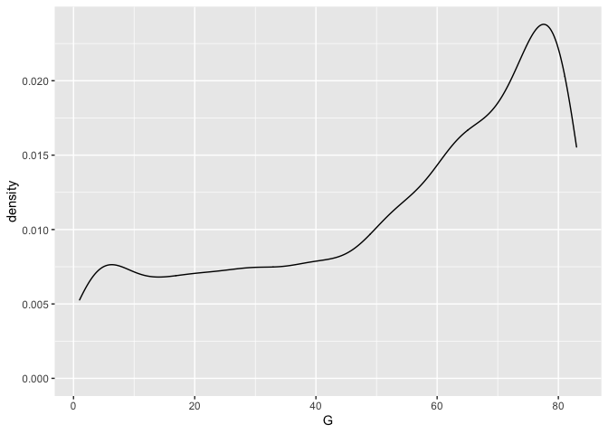
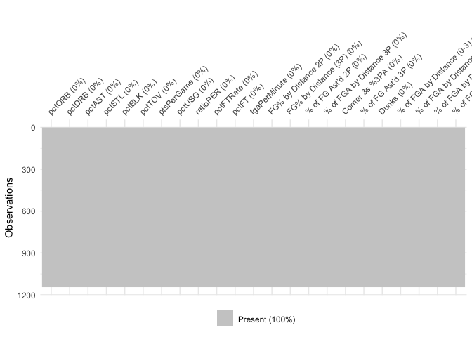

Thesis Work
================
Noah Edwards-Thro

9/21/21 - Downloaded Basketball Reference Data and set up github

603 rows of traded players, 39 double traded, 1 triple traded 603+39+1
643 +4762

5512 in the original Sloan Article. there are 5405 in ours. In data that
matters (players with more than 30 games), we have slightly 68 more
observations, likely again due to the traded feature, but working the
opposite direction now. Say a player plays 25 games with one team and 25
games with another. The Sloan article won’t pick that player up because
he didn’t play more than 30 games for either team. We will pick that
player up because it will show up as 50 games for us.

Because of the data structure (our data having one line per season even
if the player is traded vs. their data likely having multiple lines per
season if the player is traded), our density plots will be different.

Update 10/6 below

See new Geom\_density with scraped data

Used Mclust Also useful mclustBIC and mclustBICupdate mclustModel

Potentially looking into doing dimension reduction in the future?

``` r
library(tidyverse)
library(nbastatR)
library(mclust)
```

``` r
Sys.setenv("VROOM_CONNECTION_SIZE" = 131072*2)

bref_stats <- bref_players_stats(
  seasons = 2009:2018,
  tables = c("totals", "per_game", "advanced", "per_minute", "per_poss")
  )
write_csv(bref_stats, file = "bref_stats.csv")
```

``` r
bref_stats_new <- bref_players_stats(
  seasons = 2019:2021,
  tables = c("totals", "per_game", "advanced", "per_minute", "per_poss")
  )
write_csv(bref_stats_new, file = "bref_stats_new.csv")
```

``` r
bref_stats <- read_csv("bref_stats.csv")
bref_stats_new <- read_csv("bref_stats_new.csv")
```

``` r
Shooting_Scrape <- read_csv("Basketball Reference Scrape.csv")
```

    ## Rows: 6008 Columns: 29

    ## ── Column specification ────────────────────────────────────────────────────────
    ## Delimiter: ","
    ## chr  (4): Player, Pos, Tm, Year
    ## dbl (25): Age, G, MP, FG%, Dist., % of FGA by Distance 2P, % of FGA by Dista...

    ## 
    ## ℹ Use `spec()` to retrieve the full column specification for this data.
    ## ℹ Specify the column types or set `show_col_types = FALSE` to quiet this message.

``` r
Shooting_Scrape_New <- read_csv("~/Desktop/Fall 2021/Honors Thesis Work/Basketball Reference Scrape2.csv")
```

    ## Rows: 2064 Columns: 29

    ## ── Column specification ────────────────────────────────────────────────────────
    ## Delimiter: ","
    ## chr  (8): Player, Pos, Tm, Year, % of FGA by Distance (3-10), % of FGA by Di...
    ## dbl (21): Age, G, MP, FG%, Dist., % of FGA by Distance 2P, % of FGA by Dista...

    ## 
    ## ℹ Use `spec()` to retrieve the full column specification for this data.
    ## ℹ Specify the column types or set `show_col_types = FALSE` to quiet this message.

``` r
Shooting_Scrape <- Shooting_Scrape %>%
  separate(Player, c("Player_Name", "Player_ID"), sep = "\\\\")
Shooting_Scrape$yearSeason <- as.double(Shooting_Scrape$Year %>%
                                          str_extract(pattern = "[^-]+$"))
Shooting_Scrape <- Shooting_Scrape %>%
  group_by(Player_Name, Age) %>%
  filter(G == max(G))
```

``` r
Shooting_Scrape_New <- Shooting_Scrape_New %>%
  separate(Player, c("Player_Name", "Player_ID"), sep = "\\\\")
Shooting_Scrape_New$yearSeason <- as.double(Shooting_Scrape_New$Year %>%
                                          str_extract(pattern = "[^-]+$"))
Shooting_Scrape_New <- Shooting_Scrape_New %>%
  group_by(Player_Name, Age) %>%
  filter(G == max(G))
```

# Evaluate if we have the correct number of players)

``` r
not_traded <- bref_stats %>%
  filter(slugTeamBREF != "TOT")
traded <- bref_stats %>%
  filter(slugTeamBREF == "TOT")
traded_twice <- traded %>%
  filter(nchar(slugTeamsBREF) >9)
traded_thrice <- traded_twice %>%
  filter(nchar(slugTeamsBREF) > 15)
Count_Games <- bref_stats %>%
  filter(countGames > 30)
```

### Density Chart

``` r
plot1 <- ggplot(Shooting_Scrape, aes(x = G)) +
  geom_density()
plot2 <- ggplot(bref_stats, aes(x = countGames)) +
  geom_density()
plot1
```

<!-- -->

``` r
order<-c(54,55,57,58,59,60,47,61,50,53,9,73,101,106,107,100,111,108,109,96,97,98,99)
order2<-c(2,1,3,11,12)
```

``` r
master<-inner_join(
  bref_stats, 
  Shooting_Scrape, 
  by = c("yearSeason" = "yearSeason", "slugPlayerBREF"= "Player_ID")
)
nums <- unlist(lapply(master, is.numeric))
master2 <- master[nums]
master3 <- master2[order]
master4 <- master3 %>%
  na.omit()
master5 <- master3 %>%
  mutate(across(everything(), .fns = ~replace_na(., 0)))
master6 <- master[order2]
```

``` r
new_master<-inner_join(
  bref_stats_new, 
  Shooting_Scrape_New, 
  by = c("yearSeason" = "yearSeason", "slugPlayerBREF"= "Player_ID")
)
new_master2 <- new_master[nums]
new_master3 <- new_master2[order]
new_master5 <- new_master3 %>%
  mutate(across(everything(), .fns = ~replace_na(., 0)))
new_master6 <- new_master[order2]
```

``` r
library(visdat)
vis_miss(master3, cluster = TRUE)
```

<!-- -->

``` r
start_time <- Sys.time()
BIC <- mclustBIC(master5)
m <- Mclust(master5)
end_time <- Sys.time()
end_time - start_time
```

    ## Time difference of 11.05287 hours

``` r
table(m$classification)
```

    ## 
    ##   1   2   3   4   5   6   7   8   9 
    ##  62 910 772 516 394 325 631 735 415

``` r
master7 <- master5
master7$group <- m$classification
master7 <- cbind(master6, master7)
d <- purrr::map(1:9, ~ master7 %>% filter(group == {{.x}}))
```

``` r
predict(m, newdata = master5[1,])
```

    ## $classification
    ## [1] 3
    ## 
    ## $z
    ##                 1          2         3           4            5 6          7 8
    ## [1,] 8.714372e-26 0.02814626 0.8925883 0.009485135 1.589249e-20 0 0.03468208 0
    ##               9
    ## [1,] 0.03509826

``` r
m$classification
```

    ##    [1] 3 8 7 4 9 8 2 2 8 7 2 9 3 8 4 2 5 8 3 7 8 8 3 3 2 2 9 7 3 4 7 3 8 8 2 7 2
    ##   [38] 3 2 7 7 7 3 8 3 3 5 4 7 8 2 8 8 4 5 7 8 8 7 7 3 6 3 3 3 8 2 5 3 5 7 8 3 9
    ##   [75] 2 2 2 3 3 5 3 8 7 6 4 8 3 8 3 4 7 5 4 3 4 6 4 8 9 2 8 3 4 4 3 2 2 9 9 4 8
    ##  [112] 3 3 6 9 2 3 7 3 8 2 5 5 2 8 7 4 3 4 3 7 8 9 7 3 2 5 8 2 8 7 7 9 2 8 4 2 2
    ##  [149] 7 6 9 3 7 6 5 7 4 5 4 5 8 2 5 7 2 8 6 5 6 5 5 4 4 2 2 8 7 8 3 9 8 8 2 3 2
    ##  [186] 1 3 8 8 9 8 5 8 7 8 9 6 5 4 8 5 7 3 3 4 5 6 5 3 5 2 6 8 2 5 2 2 8 3 5 4 6
    ##  [223] 2 9 8 3 7 4 8 8 9 3 2 2 4 4 2 8 8 2 4 3 7 4 2 4 8 8 4 3 9 4 5 8 9 2 4 9 2
    ##  [260] 2 5 8 9 8 4 7 6 3 8 8 3 2 6 8 8 7 4 8 5 2 4 8 4 5 8 2 8 4 9 7 2 5 8 2 9 4
    ##  [297] 3 8 6 8 2 9 5 8 8 8 8 8 2 8 2 4 2 8 7 3 3 2 4 8 7 6 5 2 7 8 8 3 4 3 8 3 7
    ##  [334] 6 1 5 8 5 9 7 4 7 3 9 5 3 3 5 4 2 5 6 7 9 5 6 9 4 2 6 3 6 7 8 6 2 2 8 8 7
    ##  [371] 4 2 3 8 2 4 3 7 2 5 8 4 7 3 3 5 8 6 6 7 2 8 5 9 4 6 5 7 3 3 8 4 2 8 7 5 7
    ##  [408] 4 8 2 2 7 2 7 3 2 4 4 4 7 4 5 8 1 8 7 5 4 5 4 1 2 7 8 4 8 3 2 8 6 2 8 5 5
    ##  [445] 6 2 6 2 6 4 7 6 3 8 8 4 6 2 5 8 5 2 8 3 8 9 9 8 2 6 3 3 3 4 2 8 8 1 7 2 3
    ##  [482] 2 3 3 7 9 4 3 8 5 8 3 2 7 8 2 8 8 4 6 3 8 7 7 8 4 5 3 2 7 8 2 5 7 5 9 4 3
    ##  [519] 3 2 4 7 4 4 3 5 7 3 8 2 4 4 6 3 3 2 3 6 4 7 5 8 6 1 3 8 4 3 5 6 6 7 2 7 2
    ##  [556] 7 2 4 4 8 9 8 3 3 3 7 3 2 7 5 9 5 8 2 8 5 7 3 7 8 9 7 3 3 8 3 2 8 9 7 9 4
    ##  [593] 8 4 5 4 7 7 8 4 6 5 7 2 5 7 8 5 2 5 8 2 2 3 2 6 8 4 4 5 6 7 5 5 4 6 4 4 4
    ##  [630] 8 7 8 9 2 4 8 8 7 2 8 3 3 8 4 7 8 5 4 2 2 8 8 9 6 8 2 2 4 8 2 5 3 3 6 4 5
    ##  [667] 5 4 5 8 6 8 4 2 3 2 2 6 3 2 5 2 1 9 8 8 4 7 3 3 2 2 8 4 4 2 9 3 3 7 6 7 6
    ##  [704] 8 8 2 3 5 6 8 2 8 7 2 5 8 9 7 8 6 3 5 2 8 8 3 4 2 7 8 7 8 5 2 7 4 6 8 2 8
    ##  [741] 8 4 7 6 2 3 2 9 3 6 8 7 9 5 6 8 8 8 8 2 8 4 6 2 8 3 7 9 3 7 2 8 7 8 5 2 7
    ##  [778] 4 4 3 2 2 8 9 7 2 6 5 8 3 9 8 7 7 3 3 3 3 5 4 5 7 4 5 7 5 2 3 7 2 8 2 7 2
    ##  [815] 4 6 4 8 3 9 7 4 5 2 7 9 9 2 9 8 8 8 8 7 6 4 5 7 3 2 4 8 3 7 3 4 2 2 7 5 7
    ##  [852] 8 2 2 3 4 7 3 9 7 5 2 3 8 5 6 8 2 4 5 9 9 3 3 2 3 7 6 8 5 7 7 2 2 7 2 5 8
    ##  [889] 9 4 2 6 6 2 8 7 2 2 8 8 4 9 2 5 8 3 2 4 4 6 6 3 9 4 6 3 9 4 2 8 8 4 2 2 3
    ##  [926] 5 3 7 7 7 9 8 3 8 3 2 3 7 8 9 6 4 5 3 6 6 8 7 7 4 3 2 8 7 5 7 5 9 8 3 3 8
    ##  [963] 8 9 2 6 7 9 7 7 3 8 2 2 4 4 4 9 3 8 3 2 7 6 5 5 3 2 3 8 8 6 2 3 8 6 2 7 2
    ## [1000] 5 2 1 6 9 8 3 9 3 3 7 3 8 2 6 5 4 3 5 8 8 8 8 7 4 5 6 2 3 8 3 7 8 7 9 3 7
    ## [1037] 3 6 3 4 8 3 7 7 4 2 4 5 2 2 3 6 5 7 2 3 5 4 4 4 5 8 4 2 7 2 6 2 8 5 4 2 7
    ## [1074] 7 9 3 8 4 4 6 2 2 8 9 2 3 4 6 2 7 2 8 3 3 8 4 7 8 7 4 3 8 8 2 8 8 2 9 3 4
    ## [1111] 5 6 5 2 2 8 4 4 5 3 2 6 3 2 3 4 2 9 6 7 8 8 8 4 3 2 7 9 6 8 6 2 1 3 7 5 2
    ## [1148] 4 2 8 8 4 3 6 4 8 8 2 4 7 2 5 9 7 8 3 7 6 8 8 2 4 2 7 6 2 8 3 2 7 3 2 8 6
    ## [1185] 8 2 9 8 6 4 6 2 3 9 3 8 9 9 4 8 8 6 4 8 2 9 9 8 7 3 6 3 9 8 8 6 6 5 7 6 2
    ## [1222] 7 4 4 3 3 4 8 9 2 2 5 6 1 9 9 7 7 3 3 3 5 8 3 7 5 6 8 6 6 2 8 5 3 8 4 1 4
    ## [1259] 3 7 8 6 2 8 4 8 4 6 7 7 2 5 4 6 7 3 3 9 5 8 8 4 6 8 5 5 2 8 3 5 8 4 3 3 6
    ## [1296] 3 2 7 5 7 7 3 4 2 3 9 4 3 3 2 7 5 2 3 2 5 8 1 8 2 5 9 3 5 7 3 9 2 8 3 2 6
    ## [1333] 8 7 2 5 2 5 8 9 4 8 8 5 8 7 2 9 2 8 8 9 4 2 5 8 7 2 8 3 8 8 4 7 4 3 3 4 2
    ## [1370] 6 8 4 2 2 3 4 3 7 9 6 9 8 9 8 4 9 2 2 9 8 9 2 4 2 4 4 7 6 2 7 4 5 7 8 5 5
    ## [1407] 7 7 7 2 9 6 4 3 3 2 9 7 3 3 7 2 3 6 3 4 8 3 4 3 8 3 2 7 2 3 5 8 6 3 8 4 6
    ## [1444] 3 8 2 4 8 2 7 2 9 5 2 6 6 9 3 3 7 3 6 7 5 3 6 3 5 1 6 8 8 2 4 5 4 8 3 8 3
    ## [1481] 7 6 7 9 9 6 7 3 2 4 7 3 2 6 3 2 7 5 2 4 2 7 2 7 8 3 8 2 2 3 9 8 9 5 8 7 2
    ## [1518] 7 2 2 8 4 4 4 2 5 4 2 7 9 3 3 2 8 4 8 2 3 8 5 3 8 8 9 8 3 2 8 3 6 3 8 4 8
    ## [1555] 6 8 5 4 3 4 8 4 2 2 3 9 3 3 3 8 5 3 2 2 7 2 3 5 2 2 4 9 9 8 2 8 2 5 4 2 7
    ## [1592] 2 7 8 4 8 3 8 8 9 4 3 7 3 7 8 8 3 7 4 2 2 6 4 2 6 3 4 8 8 5 3 3 3 8 3 8 8
    ## [1629] 2 7 4 5 7 7 8 9 7 2 8 2 8 2 7 2 8 3 9 7 9 2 8 8 4 9 8 4 4 2 7 8 4 9 6 2 3
    ## [1666] 3 3 8 4 9 5 8 2 8 7 8 2 4 8 3 3 9 3 2 6 3 9 8 8 4 5 7 8 7 3 3 4 8 7 6 5 9
    ## [1703] 9 6 7 7 3 3 3 5 3 2 3 7 8 8 2 4 2 3 8 3 7 9 7 2 2 6 3 4 6 3 7 2 6 2 3 4 8
    ## [1740] 7 3 9 8 3 2 5 2 5 3 9 8 3 8 4 6 2 2 8 7 4 8 5 3 2 8 3 3 8 4 8 3 4 8 3 8 2
    ## [1777] 2 5 3 7 3 3 4 2 4 4 6 3 3 2 2 3 5 4 8 8 2 5 2 4 8 5 7 7 7 8 7 8 7 2 8 8 2
    ## [1814] 5 2 2 2 8 9 9 8 5 4 7 2 2 8 4 7 7 9 5 8 2 2 4 3 8 4 7 3 3 2 7 2 8 7 8 7 2
    ## [1851] 3 8 3 2 2 3 9 2 8 9 8 4 3 5 2 7 4 2 8 4 2 2 8 7 7 3 2 8 5 5 7 7 7 2 3 3 8
    ## [1888] 2 1 7 2 3 8 7 4 2 2 3 6 3 6 3 6 9 7 2 5 3 2 8 4 6 3 4 7 8 8 6 2 3 7 5 6 5
    ## [1925] 2 6 9 3 6 3 4 7 9 2 7 5 4 7 5 7 8 4 5 8 8 6 3 4 9 3 9 3 8 7 9 2 3 2 4 5 7
    ## [1962] 7 2 9 6 3 2 3 9 8 6 2 4 7 2 4 2 7 2 8 2 5 3 8 5 2 4 5 9 4 2 4 4 8 7 6 8 5
    ## [1999] 7 6 4 6 9 8 3 2 8 3 3 2 8 6 2 2 2 6 4 4 2 2 5 7 3 2 3 6 1 5 3 9 2 2 8 4 9
    ## [2036] 5 7 2 8 9 2 2 7 9 2 1 7 2 4 9 8 8 1 2 8 3 6 8 4 2 5 2 9 3 7 8 8 2 9 4 3 7
    ## [2073] 4 2 2 4 8 7 3 5 3 6 4 8 2 3 3 6 9 3 8 2 9 7 8 7 7 7 8 3 7 7 4 8 2 7 8 7 7
    ## [2110] 6 3 9 7 6 7 2 8 6 3 3 2 2 7 4 8 4 2 4 2 9 7 3 8 8 9 5 8 8 2 6 8 8 2 4 3 3
    ## [2147] 3 7 4 3 9 8 8 2 5 2 6 6 7 3 3 3 7 1 6 9 6 8 2 9 2 9 3 3 3 3 6 3 7 6 3 6 8
    ## [2184] 7 8 8 5 4 2 3 8 3 4 7 3 1 2 2 3 8 3 7 4 2 3 2 8 4 7 7 8 6 8 3 2 6 7 4 3 9
    ## [2221] 2 3 2 7 8 3 4 4 8 2 8 7 8 7 3 9 7 8 4 3 8 8 3 8 8 8 3 8 7 6 5 5 5 5 2 2 3
    ## [2258] 6 7 3 9 7 5 5 8 7 8 2 5 2 9 2 3 7 7 2 8 7 3 7 7 2 9 8 2 8 8 9 8 8 5 2 7 2
    ## [2295] 2 8 2 7 7 9 2 5 8 2 7 8 2 8 9 8 8 9 9 3 9 4 7 2 2 4 2 2 3 4 3 5 2 7 2 2 6
    ## [2332] 3 8 8 9 2 3 6 9 8 2 8 4 2 5 6 7 4 3 3 3 8 3 7 7 3 5 2 2 7 2 8 3 3 3 7 4 7
    ## [2369] 7 5 7 3 8 2 1 9 7 3 4 3 4 3 2 5 9 8 9 3 5 3 2 8 4 1 5 8 9 7 2 2 8 2 2 3 8
    ## [2406] 3 5 5 2 4 7 2 3 8 7 8 7 5 6 7 5 6 6 4 3 8 3 2 8 4 3 4 3 7 3 4 3 8 2 7 6 3
    ## [2443] 5 4 5 2 5 4 3 8 6 4 2 3 5 4 9 8 7 2 5 7 2 2 7 2 4 6 7 5 2 2 2 3 6 7 6 2 8
    ## [2480] 4 8 5 5 3 8 4 6 2 7 8 3 3 3 8 6 2 2 7 6 4 7 7 5 6 3 3 3 8 6 5 9 7 6 2 9 9
    ## [2517] 3 7 2 7 2 7 4 2 6 9 4 8 2 8 2 8 8 3 2 2 2 5 7 8 8 6 9 7 4 3 3 4 2 4 8 2 6
    ## [2554] 2 7 1 5 3 2 4 8 5 3 2 3 8 2 3 7 8 5 9 7 8 3 7 2 3 7 4 7 2 7 9 7 7 3 7 9 2
    ## [2591] 3 2 4 6 8 8 7 3 7 2 7 2 8 4 4 2 6 3 4 6 3 9 4 3 4 6 9 5 9 8 8 6 3 2 6 8 2
    ## [2628] 4 9 9 7 2 3 8 8 2 1 8 8 7 3 6 3 9 3 3 7 8 2 4 5 7 4 3 3 2 3 3 6 3 9 7 3 9
    ## [2665] 8 7 8 9 4 7 7 8 3 6 4 7 3 8 2 2 9 3 1 8 6 7 8 2 7 4 4 6 6 3 8 2 8 5 4 7 3
    ## [2702] 3 9 7 3 9 6 9 5 6 4 7 8 7 8 7 9 9 7 8 2 5 8 8 3 8 6 8 9 8 7 8 1 5 7 5 5 3
    ## [2739] 2 3 1 1 7 2 5 1 1 9 7 7 9 2 3 4 7 8 3 2 8 6 7 3 5 5 8 8 2 2 8 8 9 8 8 8 5
    ## [2776] 8 2 2 8 2 7 2 5 2 5 8 9 7 2 8 3 8 7 8 3 3 4 7 7 4 5 2 3 3 4 2 7 2 7 1 2 2
    ## [2813] 1 8 8 4 3 3 3 9 8 9 2 4 5 5 6 7 3 9 3 2 4 5 7 9 3 7 7 2 7 3 9 4 3 3 7 3 8
    ## [2850] 7 2 3 7 3 8 7 9 6 4 9 5 9 9 3 2 5 8 9 3 5 7 2 5 2 2 2 6 5 8 9 9 2 4 8 8 9
    ## [2887] 2 8 9 7 5 4 2 9 8 3 9 3 2 9 8 7 2 7 5 2 3 5 2 3 2 4 3 3 8 6 3 2 9 2 7 9 1
    ## [2924] 3 3 8 7 7 3 9 2 5 4 5 7 4 8 3 8 7 2 2 9 4 7 8 7 2 7 2 3 5 6 7 3 2 6 7 9 2
    ## [2961] 2 9 5 2 9 7 9 2 2 2 8 5 8 5 6 8 8 6 2 3 4 7 3 3 2 8 7 2 2 9 2 6 4 7 2 3 5
    ## [2998] 3 3 8 5 4 2 7 9 3 2 9 2 7 2 7 3 2 2 9 7 2 2 6 8 3 8 4 7 2 8 4 6 6 3 9 8 6
    ## [3035] 7 8 3 2 3 3 4 7 8 6 2 2 4 7 5 3 6 2 8 2 5 1 9 3 8 7 2 9 9 6 5 7 8 3 7 8 3
    ## [3072] 7 2 9 6 8 7 4 4 9 6 7 7 3 6 9 2 3 2 2 2 8 8 3 1 3 7 5 7 2 4 7 6 2 3 3 3 4
    ## [3109] 8 8 6 9 4 6 4 2 5 2 8 8 3 9 5 9 7 2 3 2 3 8 8 2 8 8 9 2 2 3 3 3 3 7 6 6 6
    ## [3146] 5 9 9 3 3 3 2 3 7 3 8 3 5 7 3 9 4 8 2 2 8 3 5 7 2 8 3 7 3 2 7 3 3 8 3 7 4
    ## [3183] 2 3 7 4 8 9 3 6 1 8 8 3 2 7 3 9 9 2 7 5 7 4 1 7 8 5 8 7 9 7 1 9 3 8 3 8 8
    ## [3220] 3 7 4 2 5 7 7 3 3 3 2 3 6 2 3 2 5 8 2 2 9 3 7 4 5 2 3 9 2 8 4 6 7 5 7 5 5
    ## [3257] 4 8 2 6 8 9 8 8 4 6 8 2 2 8 2 9 2 2 2 9 2 6 5 8 6 7 2 8 9 6 9 2 7 9 4 7 2
    ## [3294] 5 8 3 3 4 2 5 2 9 1 2 8 2 8 4 3 5 9 4 7 5 2 5 7 6 7 3 7 3 2 5 7 7 3 3 7 5
    ## [3331] 9 4 3 7 7 8 3 7 3 7 6 3 8 6 2 1 5 9 3 6 3 9 9 6 5 2 7 5 7 2 9 3 5 7 2 8 6
    ## [3368] 8 7 1 3 7 5 2 2 6 3 3 4 7 9 8 7 5 9 9 7 3 2 3 2 3 8 4 9 8 8 3 7 3 3 1 2 5
    ## [3405] 3 6 4 4 5 4 5 8 3 8 4 3 2 9 8 6 2 3 2 2 9 7 2 2 5 6 7 7 4 9 5 2 9 8 3 7 9
    ## [3442] 2 4 4 2 6 5 2 8 2 8 8 6 7 6 2 9 3 5 7 8 2 2 7 2 8 3 4 4 9 4 7 2 7 3 5 3 3
    ## [3479] 5 8 6 7 9 3 9 2 2 2 7 2 7 2 2 2 4 9 2 3 6 3 4 2 4 9 8 2 4 7 5 9 8 7 2 3 4
    ## [3516] 5 3 2 8 2 5 4 2 5 3 2 4 2 4 2 5 2 3 8 3 8 9 8 3 7 7 2 2 3 5 3 4 2 9 4 8 7
    ## [3553] 9 7 9 8 6 5 7 3 9 3 2 5 7 6 8 6 2 8 3 2 7 7 4 3 4 2 2 2 3 3 3 3 4 8 2 2 9
    ## [3590] 2 8 6 4 4 4 5 2 7 4 3 2 3 2 7 2 3 2 3 3 8 8 2 4 8 8 2 2 2 2 2 3 3 3 4 5 5
    ## [3627] 9 8 2 3 2 3 2 4 8 3 5 2 9 3 9 9 3 8 2 3 2 2 2 8 3 2 4 8 7 3 3 4 3 7 2 2 3
    ## [3664] 9 2 6 7 3 8 6 8 3 2 8 3 9 7 7 5 9 9 2 5 8 7 7 2 2 7 2 4 3 8 8 3 7 7 2 5 7
    ## [3701] 5 7 5 5 2 3 6 3 2 5 8 6 5 9 8 3 7 4 3 2 9 7 8 4 2 8 4 3 9 3 7 5 2 8 7 2 8
    ## [3738] 9 8 8 2 8 2 2 6 9 2 2 9 5 5 8 7 2 8 3 9 4 4 3 9 7 2 3 2 2 4 8 2 5 2 2 9 2
    ## [3775] 9 4 6 2 2 8 2 4 5 9 8 2 5 2 7 2 3 3 4 9 2 2 7 9 7 5 9 3 7 7 8 2 7 2 4 8 8
    ## [3812] 7 2 8 3 7 7 9 3 8 5 9 9 5 2 9 9 9 7 2 7 5 9 5 8 8 8 2 9 3 2 5 8 4 2 3 3 5
    ## [3849] 4 7 9 3 5 9 4 7 2 5 2 3 3 4 8 9 2 9 8 3 3 2 9 7 9 3 2 4 7 6 5 4 2 6 1 5 4
    ## [3886] 9 4 3 8 4 2 7 8 4 2 3 7 2 9 2 7 5 2 4 7 5 2 9 4 3 7 7 6 2 6 3 4 4 5 3 8 2
    ## [3923] 2 2 8 7 2 3 6 2 9 3 2 2 2 7 2 1 6 9 4 2 4 4 2 7 3 2 5 6 1 3 3 5 8 4 9 3 2
    ## [3960] 2 1 2 7 2 2 7 2 6 8 4 9 2 3 8 3 2 2 9 2 7 3 9 8 7 2 7 9 7 7 3 2 3 8 2 5 9
    ## [3997] 4 7 2 5 5 4 4 2 4 4 5 5 6 3 2 3 3 8 4 6 2 9 2 4 2 5 3 2 2 9 6 7 7 3 4 9 2
    ## [4034] 6 3 7 9 3 6 2 2 8 2 7 2 7 2 8 3 4 3 3 2 4 3 4 6 3 4 9 2 8 8 2 1 2 8 2 2 2
    ## [4071] 6 8 7 2 6 6 7 8 8 2 9 3 3 7 3 7 9 3 2 9 8 8 8 8 2 4 5 2 7 9 4 2 9 3 2 5 9
    ## [4108] 4 7 7 3 2 3 2 8 3 3 5 2 3 3 9 7 5 2 6 2 3 5 4 4 2 9 8 3 7 2 2 9 2 3 7 2 7
    ## [4145] 4 4 7 9 6 6 3 4 6 4 3 9 2 7 5 7 7 5 8 3 6 2 9 4 7 2 2 3 3 4 4 7 4 8 4 2 2
    ## [4182] 2 3 5 3 5 5 2 3 4 2 5 2 3 8 5 9 8 9 4 5 2 3 2 9 3 8 6 9 8 4 7 9 7 2 8 8 8
    ## [4219] 9 8 7 7 8 8 9 6 4 4 6 3 2 2 2 9 6 5 4 7 9 7 4 9 8 3 9 9 3 4 3 3 4 5 3 7 4
    ## [4256] 2 5 2 2 7 8 2 9 2 2 8 4 8 2 2 3 5 6 3 7 4 6 5 2 1 7 6 2 3 3 7 3 1 4 2 9 4
    ## [4293] 2 1 4 7 3 3 5 3 2 3 7 3 8 2 2 2 3 2 2 9 3 8 9 2 9 5 9 4 2 4 2 3 8 3 4 9 9
    ## [4330] 8 6 5 7 7 4 3 9 7 2 5 9 5 8 8 2 7 3 3 6 5 8 2 3 9 7 9 6 5 9 8 2 5 5 4 4 7
    ## [4367] 5 2 3 3 6 5 3 8 2 3 8 3 2 7 7 9 7 3 3 7 6 4 7 2 4 2 5 1 9 2 3 8 2 7 8 7 4
    ## [4404] 3 9 7 2 7 2 2 5 1 7 5 2 6 3 7 9 2 3 3 2 7 4 9 6 1 2 2 7 4 2 4 7 6 3 3 6 5
    ## [4441] 7 3 2 2 7 6 4 4 2 4 9 1 4 2 2 3 4 2 5 2 7 3 4 6 2 9 3 5 3 8 4 9 7 2 8 8 2
    ## [4478] 9 9 7 7 2 2 8 4 4 3 8 3 7 8 7 6 9 2 3 9 9 8 7 1 2 5 3 4 3 2 4 7 7 4 4 4 2
    ## [4515] 4 3 2 5 4 6 2 4 4 2 3 9 1 2 3 9 8 2 8 4 2 3 6 7 2 9 7 5 3 6 2 9 6 7 1 4 2
    ## [4552] 4 7 8 2 5 7 9 9 3 2 2 5 1 3 8 6 1 7 8 4 5 2 6 4 4 3 7 6 2 7 2 3 2 3 3 3 6
    ## [4589] 8 8 2 2 3 8 2 2 2 2 9 8 4 5 2 6 7 2 8 9 6 2 9 7 7 1 4 3 4 3 3 2 6 6 9 6 8
    ## [4626] 8 2 3 2 2 5 2 2 4 2 6 9 4 6 8 4 5 9 9 9 4 7 3 3 2 6 7 3 4 2 3 3 3 2 2 7 3
    ## [4663] 5 9 2 7 4 3 2 6 6 7 4 4 3 5 3 7 4 6 9 9 9 7 1 9 1 2 2 3 3 4 9 7 3 9 2 9 7
    ## [4700] 5 8 2 9 2 7 2 2 8 3 4 3 3 7 2 2 3 3 5 3 2 9 8 5 9 4 4 4 5 9 4 4 3 4 7 4 4
    ## [4737] 8 2 6 5 2 1 2 2 9 2 4 6 8 3 9 2 3 7 2 4 4 2 8 8
